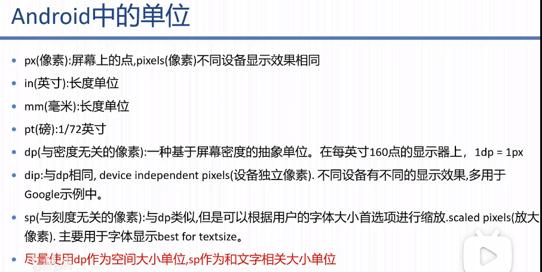

# 	Android

## 一、Android-studio工具

安装Android Studio ~ 
[官网 ](https://developer.android.google.cn/studio)   [参考网址](https://androidsdkmanager.azurewebsites.net/SDKPlatform)
创建项目
构建项目
创建手机模拟器 <下载SDK>

gradle自动下载失败问题：
改成手动下载（[下载地址](https://services.gradle.org/distributions/)） 找到如gradle-5.4.1-all.zip点击下载
-> 复制到C/user/.gradle/wrapper/dists/(eg: gradle-5.4.1)

android studio运行模拟器一直：waiting for target device to come online
解决：打开AVD Manager  点击Wipe Data，重新运行

## 二、开发

### 2.1 TextView的使用

2.1.1 android:属性：

> id="@+id/main_tv_test" # 元素的id名
> text: 内容
> autoLink: 设置内容为链接(取值<email,>)
> textIsSelectable: true # 设置可复制
> 超过文本范围实现跑马灯效果：
> --      1. singleLine: true:   内容全在一行展示；false:  内容超过文本范围自动换行；
> ----              		当true时，可以设置跑马灯效果：
> ----    2. ellipsize="marquee"
> ----    3. marqueeRepeatLimit="marquee_forever" # 一致跑马灯
> ----    4. 代码：`tv = findViewById(R.id.main_tv_test);    tv.setSelected(true);`

2.1.2 事件：
> setOnClickListener：点击事件
> setOnLongClickListener：长按事件
> setView()：改变文本内容
> setOnTouchListener：触摸事件

### 2.2 Button的使用

2.2.1 android:属性：

> 新建自定义布局shape_button：在res/drawable/下右键新建-> new draw Resource File -->名称 shape_button；根目录为shape	
> stroke:描边 
> solid: 填充颜色 <solid android:color="#9C27B0"/>
> corners: 圆角大小设置  <corners android:radius="30dp" />
> activity的Button中引用 按钮背景 android:background="@drawable/shape_button" 
>
> - 在AndroidManifest.xml中，哪个activity节点下由intent-filter就可以作为默认启动窗口

### 2.3 EditText的使用

2.3.3 android:属性：

> 新建自定义文件shape_button：在res/drawable/下右键新建-> new draw Resource File -->名称 shape_button；根目录为shape	
> stroke:描边 
> solid: 填充颜色 <solid android:color="#9C27B0"/>
> corners: 圆角大小设置  <corners android:radius="30dp" />
> activity的Button中引用 按钮背景 android:background="@drawable/shape_button" 
>
> - 在AndroidManifest.xml中，哪个activity节点下由intent-filter就可以作为默认启动窗口

> * 引用组件 市面上好看的输入框TextInputLayout+TextInputEditText
>   在Module的build.gradle中引入第三方组件
>   build.gradle:
>
>    ```cassandra
>     // 输入框
>     //noinspection GradleCompatible
>     implementation 'com.android.support:appcompat-v7:27.1.1'
>     //noinspection GradleCompatible
>  implementation 'com.android.support:design:27.+'
>    ```
> ```
> 
> activity.xml
> ​```xml
>    <com.google.android.material.textfield.TextInputLayout
>         android:layout_margin="10dp"
>         android:padding="10dp"
>         app:passwordToggleEnabled="true"
>         android:layout_width="match_parent"
>      android:layout_height="wrap_content">
>    
>         <com.google.android.material.textfield.TextInputEditText
>             android:layout_width="match_parent"
>             android:layout_height="wrap_content"
>             android:inputType="textEmailAddress"
>             android:maxLines="1"
>             android:singleLine="true"
>          android:hint="提示"/>
>    
>  </com.google.android.material.textfield.TextInputLayout>
> ```

### 2.4 Checkbox和RadioButton的使用

- 属性

  text:内容
  checked：勾选状态

- 方法
  setChecked：设置选中状态
  isChecked：获取当前选中状态

- 事件

  Radio Button-：
  ^ setOnCheckedChangeListener：获取选中的单选框

  [device](https://blog.csdn.net/Carson1145/article/details/105252454?utm_medium=distribute.pc_relevant_t0.none-task-blog-BlogCommendFromMachineLearnPai2-1.edu_weight&depth_1-utm_source=distribute.pc_relevant_t0.none-task-blog-BlogCommendFromMachineLearnPai2-1.edu_weight)

### 2.5、窗体调用

窗体跳转的三种显示调用：

```
# 目标窗体
<activity android:name=".activities.SecondActivity">
    <intent-filter> # 意图过滤
        <action android:name="android.intent.action.MAIN" /> ## 行为名称
        <category android:name="android.intent.category.Default" /> ## LAUNCHER表示该意图为桌面创建图标，Default不创建 
    </intent-filter>
</activity>
```

```
# 调用方窗体事件中写
// 显式调用写法一：类class
Intent intent = new Intent(this, SecondActivity.class);
this.startActivity(intent);

Intent intent = null;
// 显示调用写法二：包名+类名
/*intent = new Intent();
intent.setClassName(this,"com.zzz.app.myapplication.activities.SecondActivity");
this.startActivity(intent);*/

// 显示调用写法三：ComponentName
intent = new Intent();
ComponentName cname = new ComponentName(this, SecondActivity.class);
intent.setComponent(cname);
this.startActivity(intent);
```

隐式调用：

```
# 目标窗体
<activity android:name=".activities.SecondActivity">
    <intent-filter> # 意图过滤
        <action android:name="action.nextActivity" /> ## 行为名称（多个Activity的行为名称一致，会提示用户选择打开哪一个）
        <category android:name="android.intent.category.Default" /> ## LAUNCHER表示该意图为桌面创建图标，Default不创建 
    </intent-filter>
</activity>
```

```
# 调用方窗体事件中写
 // 隐式调用 写法1
 intent = new Intent();
 intent.setAction("action.nextActivity");
 this.startActivity(intent);
 // 隐式调用 写法2
 intent = new Intent("action.nextActivity");
 this.startActivity(intent);
```

* 当多个Activity的行为名称一致时，当被隐式调用时会同时调起窗口由用户选择打开哪一个；

### 2.6、Activity 的生命周期

- 生命周期：

- 创建销毁全过程：

```mermaid
graph RL
0[Start]-->A[onCreate] -->B[onStart] -->C[onResume] -->C1[Running] -.anotherActivity comes-->D[onPause] -.unvisible-->E[onStop] -.finishing-->F[onDestory] -->END[Shutdown]
D[onPause] -.memory out-.->Z[App killed] -.user navigate-.->A[onCreate]
D[onPause] -.user return-.->C[onResume]
E[onStop] -.memory out-.->Z[App killed]
E[onStop] -.user navigate-.->G[onRestart] -.->B[onStart]
```

### 	2.7、

> 

## 三、布局

> 1、线性布局：LinearLayout
> 2、相对布局：RelativeLayout
> 3、表格布局：TableLayout
> 4、网格布局：GridLayout
> 5、帧布局    ：FrameLayout 

### 3.1、线性布局-LinearLayout

```xml-dtd
<LinearLayout xmlns:android="http://schemas.android.com/apk/res/android" <!--android命名空间 -->
	xmlns:app="http://schemas.android.com/apk/res-auto" <!--app命名空间 -->
    xmlns:tools="http://schemas.android.com/tools" <!--tools命名空间 -->
	android:layout_width="match_parent" <!-- required -->
    android:layout_height="wrap_content" <!-- required -->
    android:orientation="vertical"	<!-- orientation代表方向（vertical垂直，horizontal水平）-->
	android:layout_gravity="left|center" <!-- 布局在父级窗体的位置，多个值|隔开 -->
    android:gravity="bottom|center_horizontal" <!-- 内部在本布局的位置： -->
    tools:context=".activities.EditActivity"> <!-- 对应的窗体类 -->


<Button
        android:layout_width="wrap_content"
        android:layout_height="wrap_content"
        android:text="发送"
        android:layout_weight="1"  <!-- 按钮元素所在布局的比重 -->
        android:onClick="sendMessage"/>

```

### 3.2、帧布局
> 相当于叠加布局

阿斯蒂芬

### 3.3、相对布局

```xml
<RelativeLayout xmlns:android="http://schemas.android.com/apk/res/android"
    xmlns:tools="http://schemas.android.com/tools"
    android:layout_width="match_parent"
    android:layout_height="match_parent"
    tools:context=".activities.CheckboxActivity">
    <TextView
        android:id="@+id/chk_view_tv03"
        android:layout_width="match_parent"
        android:layout_height="wrap_content"
        android:text="相对布局"
        android:textSize="50sp"
        android:textAlignment="center"
        />
    <EditText
        android:id="@+id/chk_edit_et03"
        android:layout_width="match_parent"
        android:layout_height="wrap_content"
        android:layout_below="@+id/chk_view_tv03"
        android:hint="请输入..."
        android:textSize="50sp"
        android:background="@drawable/shape_edit_et"
        />
    <Button
        android:id="@+id/chk_btn_ok"
        android:layout_width="wrap_content"
        android:layout_height="wrap_content"
        android:text=" OK "
        android:textSize="30sp"
        android:layout_below="@+id/chk_edit_et03"
        android:layout_alignParentRight="true"
        android:layout_marginRight="20dp"
        android:layout_marginTop="2dp"
        />
    <Button
        android:layout_width="wrap_content"
        android:layout_height="wrap_content"
        android:text="Cancel"
        android:textSize="30sp"
        android:layout_below="@+id/chk_edit_et03"
        android:layout_toLeftOf="@+id/chk_btn_ok"
        android:layout_marginRight="10dp"
        android:layout_alignTop="@+id/chk_btn_ok"
        />
    <!--layout_below在某的下方 -->
    <!--layout_toLeftOf在某的左方 -->
    <!--layout_alignTop顶对齐 -->
    <!--layout_alignParentRight 与父容器右对齐 -->
</RelativeLayout>
```

### 3.4、表格布局- TableLayout

```xml
<?xml version="1.0" encoding="utf-8"?>
<TableLayout xmlns:android="http://schemas.android.com/apk/res/android"
    xmlns:app="http://schemas.android.com/apk/res-auto"
    xmlns:tools="http://schemas.android.com/tools"
    android:layout_width="match_parent"
    android:layout_height="match_parent"
    android:shrinkColumns="2" <!--表示TableRow内容溢出时第几+1个表格被压缩-->
    tools:context=".activities.ButtonActivity">
    <Button
        android:id="@+id/button_btn2"
        android:layout_width="200dp"
        android:layout_height="100dp"
        android:text="@string/button_anniu"
        android:textColor="#22FF98"
        android:background="@drawable/shape_button"
        />
    <TableRow android:layout_height="100dp" android:layout_weight="100dp">
        <Button android:layout_weight="wrap_content"
            android:layout_height="100dp"
            android:layout_marginRight="3dp"/>
        <Button android:layout_weight="wrap_content"
            android:layout_height="100dp"
            android:layout_marginRight="3dp"/>
		<Button android:layout_weight="wrap_content"
            android:layout_height="100dp"
            android:layout_marginRight="3dp"/>
        <Button android:layout_weight="166dp"
            android:layout_height="100dp"
            android:layout_marginRight="3dp"/>
        <Button android:layout_weight="166dp"
            android:layout_height="100dp"
            android:layout_marginRight="3dp"/>
    </TableRow>
</TableLayout>
```


-- -------------------------
### 3.3、单位
