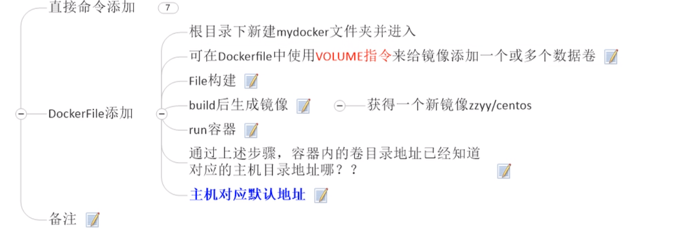
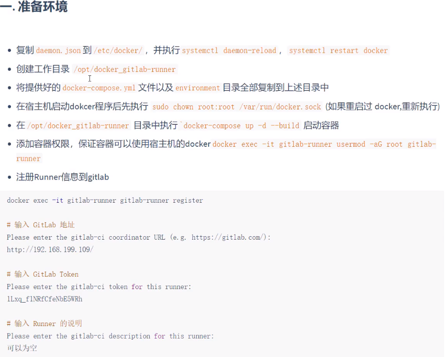
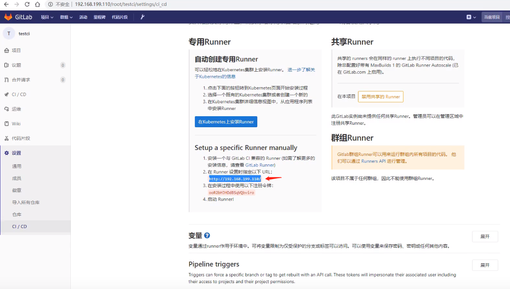
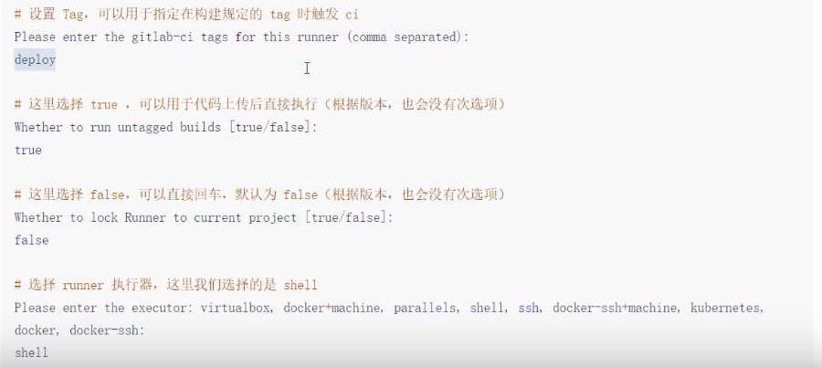
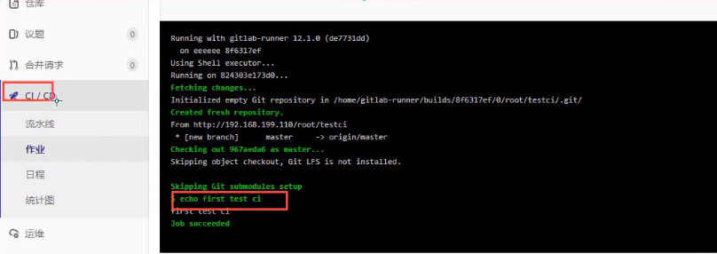
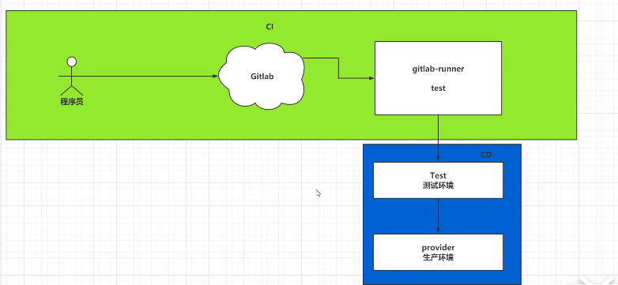
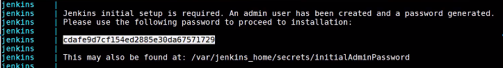

# 												Docker手册

## 一、基本命令

* win安装docker和docker-compose [教程][https://blog.csdn.net/xiayu204575/article/details/100187557]

### 1）帮助命令

```sh
docker -- help 
docker version
docker info
```

### 2）docker 镜像命令 

http://hub.daocloud.io/

#### 1.2.1 查看本地镜像 

```shell
docker images [-aq] [--digests] [--no-trunc ]
		-a # 全部镜像
		-q # 只显示镜像ID
		--digests # 镜像的摘要写信息
		--no-trunc # 镜像的完整信息
```

#### 1.2.2 搜索镜像

```sh
## docker search [image name]
# eg 搜索不低于3星的python：
docker search --filter=stars=3 python
```

#### 1.2.3 下载镜像
```shell
## docker pull [image name]
# eg 下载最新python：
docker pull python 或 docker pull python:latest 
```

#### 1.2.4 删除镜像
```shell
## dockers rmi [-f] [image id|name]
# 删除单个：
docker rmi -f 镜像ID
# 删除多个：
docker rmi -f 镜像名1:tag 镜像名2:tag
# 删除全部：
docker rmi -f $(docker images -qa)

```

### 3）docker 容器命令 

#### 1.3.1 创建并启动容器

```yml
1.下载镜像: docker pull [image name] 
2.启动容器: docker run [OPTIONS] IMAGE [COMMAND] [ARG...]
	[OPTIONS]:
	--name 容器新名字：为容器起的一个名称
	-d: 后台运行容器，并返回容器ID，也即启动守护式容器；
	-i: 以交互模式运行容器，通常与-t同时使用；进入docker并返回一个命令终端方便交互
	-t: 为容器重新分配一个伪输入终端，
	-P：随机端口映射
3. 两种启动模式：
	docker run -it 表示以交互模式启动
   	docker run -d  表示以后台守护模式启动
   	
eg1: run -it 0d120b6ccaa8  [centos的imageID=0d120b6ccaa8]
eg2: docker run -it  --name mycentos001 centos
eg3: docker run -d -p 8081:8080 myweb/tomcat8.5:1.2
	重进tomcat->docker exec -it a49fe28c4109 /bin/bash 操作tomcat部署文件
```

#### 1.3.2 列出当前容器

```less
docker ps [OPTIONS]
	-l 最近容器
	-a 当前运行和历史运行的
	-n [n] 前n次
	-q 静默模式，只显示容器编号
	--no-trunc  不截断输出(显示完整containerID)
```

#### 1.3.3 退出和进入运行中容器

​	1.3.3.1 交互启动模式下--两种：

 	1. `exit`  容器内执行，容器停止并退出
 	2. 快捷键：`ctrl+P+Q  ` 容器不停止退出

#### 1.3.4  停止容器

1. 慢慢停止 `docker stop [containerID]`

 	2. 强制停止 `docker kill[containerID]`

#### 1.3.5  启动和重启容器

​	`docker start [containerID]`

​	`docker restart [containerID]`

#### 1.3.6  删除已停止容器

```shell
docker rm [-f] [containerID]  # 删除某容器,不加-f只能删已停止的
```
* 一次行删除多个容器:

```shell
docker rm -f $(docker ps -a -q) # 删除所有容器
docker rm -f $(docker ps -a |grep Exited) # 删除不运行的容器
docker ps -a -q|xargs docker rm # 同1
```

#### 1.3.7  查看容器日志

```shell
docker logs -f -t --tail [容器ID]
    -t # 是加入时间戳
    -f # 是跟随最新的日志打印
    --tail [n] # 显示最后n条
```
#### 1.3.8   查看容器内运行的进程

​	`docker top 容器ID`

#### 1.3.9   查看容器内部细节

​	`docker inspect 容器ID`

#### 1.3.10  进入正在运行的容器并以命令交互

* docker exec -it 容器ID [执行的命令]
  ```shell
  docker exec -it 容器ID [执行的命令]
  1. docker exec -it xxx /bin/bash
  	# 跟attach一样进入了容器shell终端
  2. docker exec -it xxx ls -l /tmp
  	# 直接返回了tmp下的文件列表并退出容器 
  3. docker exec -it a49fe28c4109 /bin/bash 重进tomcat操作部署文件
  ```
* docker attach [容器ID]
  	直接进入容器启动命令的终端，不产生新的进程

#### 1.3.11  从容器内拷贝文件到主机上

```turtle
docker cp 容器ID:/tmp/a.txt /root
# 将容器ID中的a.txt拷贝到本机/root下
```

## 二、自定义本地镜像
### 2.1） 命令格式

* 使用docker commit 提交容器的副本使之成为一个新的镜像
* <u>docker commit -m="提交的描述信息" -a="作者" 被复制的容器ID 要创建的目标镜像名</u>:

#### 2.1.1 将一个tomcat容器发布为本地镜像

1.下载tomcat镜像到本地运行

``` less
1. 下载tomcat镜像 docker pull tomcat:8.5
2. 创建容器并启动 docker run -it -p 8080:8080 tomcat:8.5 
```
2.故意删除上一步镜像的tomcat/webapps下的内容/或放入自己的war包

```
docker exec -it a49fe28c4109 /bin/bash 
	重进tomcat修改部署文件，
eg: 上传部署包 webapps/ROOT/xxx.war
```
3.将它作为新的镜像 myweb/tomcat8.5

```less
docker commit -a="ice" -m="myweb" a49fe28c4109 myweb/tomcat8.5:1.2
	用容器a49fe28c4109新建一个myweb/tomcat8.5的镜像tag=1.2
```

4.新的镜像启动容器

```
docker run -it -p 8081:8080 myweb/tomcat8.5:1.2
	启动了一个新的tomcat
```

***

## 三、Docker容器数据卷

### 1）做什么

   * <u>容器的数据持久化</u>
     
   * 容器间继承共享数据

#### 1.1  数据卷特点

1. 容器之间共享数据
2. 卷中的更改可以直接生效
3. 数据卷的更改不会包含在镜像的更新中
4. 数据卷的生命周期一直持续到没有容器用它为止

### 2）向容器添加数据卷

#### 2.1 直接命令添加

命令：

`docker run -v /宿主机绝对目录:/容器内目录  镜像名`

命令(带权限)：

```docker run -v /宿主机绝对目录:/容器内目录:ro  镜像名```

```turtle
eg: 1、宿主机D:/work/test/zhuji下的文件与容器/data/volume/container下的文件同步共享： 
docker run -it -v D:/work/test/zhuji:/data/volume/container centos

eg: 2、但容器下权限时readonly操作，增加ro：
docker run -it -v D:/work/test/zhuji:/data/volume/container:ro centos
```

#### 2.2 DockerFile添加


- Dockerfile中使用VOLUME指令来给镜像添加一个或多个数据卷:

  ```less
  VOLUMN["/dataValume/container1/","/dataValume/container2/","/dataValume/container3/"]
  ```

  [^注]: Dockerfile只是容器内部的数据卷映射，不支持宿主机和容器的数据卷映射

  
  
  
  
  

## 四、Dockerfile

Dockerfile是用来构建Docker镜像的构建文件，是有一系列命令和参数构成的脚本

### 1）Dockerfile体系结构(保留字指令)

```	scss
FROM 基础镜像，当前镜像是基于哪个镜像
	FROM scratch # scratch是最基础的镜像
MAINTAINER 镜像维护者的姓名和邮箱 
	MAINTAINER wuxw <928255095@qq.com>
RUN 容器构建时需要执行的命令
	RUN groupadd redis
EXPOSE 当前容器对外暴露的端口号
WORKDIR 指定在创建容器后，终端默认登录进来的工作目录，
	WORKDIR /data
ENV 用来在构建镜像过程中设置环境变量
	ENV MY_PATH /usr/mypath
		#声明了/usr/mypath目录的环境变量￥MY_PATH
ADD 将宿主机目录下的文件拷贝到镜像且ADD命令自动处理URL和解压tar包
COPY 类似ADD命令，不解压等操作，将从构建上下文目录<源路径>的文件/目录复制到新的一层镜像的<目标目录>位置
	COPY src dest
	COPY ["src","dest"]
VOLUME 容器数据卷，用于数据持久化和容器间共享
CMD 指定一个容器启动时要运行的命令
	Dockerfile可以有多个CMD，但最后一个为准
	CMD会被docker run之后的参数命令替换：
		Dockerfile中:CMD {"catalina.sh","run"]
		docker run tomcat:22 ls -l
		第一个命令就被ls-l替换执行了，导致tomcat未启动
ENTRYPOINT 指定一个容器启动时要运行的命令
	与CMD不同的是docker run 后的参数命令不对其替换
		Dockerfile配置的:ENTRYPOINT {"catalina.sh","run"]
		docker run tomcat:1.0 ls -l
		Dockerfile命令执行完后再执行 ls-l
ONBUILD 当构建一个被继承的Dockerfile时运行命令，父镜像在被子继承后，父镜像的onbuild被触发
```

### 2）3步骤

 1. 创建一个Dockerfile文件，并且指定自定义镜像信息
 ```dockerfile
 # Dockerfile 中常用的内容
 from 指定当前自定义镜像依赖的环境
 copy 将相对路径下的内容复制到自定义镜像中
 workdir 声明镜像的默认工作目录
 cmd 需要执行的命令```
 ```
 2. 执行docker build 命令，构建一个自定义镜像
 ```scss
 docker build -f /data/web/cloud/docker/Dockerfile -t mycentos:1.1 .<最后的点表示当前目录上下文找Dockerfile>
 ```
 3. docker run
 ```scss
 docker run -it mycentos:1.1
 ```

### 3）自定义tomcat案例

#### 	3.1、编写Dockerfile文件

```dockerfile
FROM centos
MAINTAINER ice<icesummer_u@qq.com>
# 把宿主机当前上下文的c.txt拷贝到容器/usr/local/路径下
COPY c.txt /usr/local/cincontainer.txt
# 把宿主机jdk包tomcat包添加到容器中
ADD jdk-8u171-linux-x64.tar.gz /usr/local/
ADD apache-tomcat-9.0.8.tar.gz /usr/local/
# 安装vim编辑器 
RUN yum -y install vim
# 设置默认访问的WORKDIR目录，登陆落脚点
ENV MYWORKDIR /usr/local
WORKDIR $MYWORKDIR
# 配置java与tomcat环境变量
ENV JAVA_HOME /usr/local/jdk.1.8.0_171
ENV CLASSPATH $JAVA_HOME/lib/dt.jar:$JAVA_HOME/lib/tools.jar
ENV CATALINA_HOME /usr/local/apache-tomcat-9.0.8
ENV CATALINA_BASE /usr/local/apache-tomcat-9.0.8
ENV PATH $PATH:$JAVA_HOME/bin:$CATALINA_HOME/lib:$CATALINA_HOME/bin
# 容器运行时监听的端口
EXPOSE 8080
# 启动时运行tomcat
# ENTRYPOINT ["$CATALINA_BASE/bin/startup.sh"]
# CMD ["$CATALINA_BASE/bin/catalina.sh","run"]
CMD $CATALINA_HOME/bin/startup.sh && tail -F $CATALINA_HOME/bin/logs/catalina.out

```

#### 3.2、执行build构建镜像
```scss
	docker build -t mytomcat9
```

#### 3.3、docker run启动容器

```scss
docker run -d -p 9090:8080 --name myweb -v /data/docker/tomcat9/myweb:/usr/local/apache-tomcat-9.0.8/webapps/myweb -v /data/docker/tomcat9/logs:/usr/local/apache...9.0.8/logs --privileged=true mytomcat9
```

## 五、Docker-Compose

> 优点
> * 方便配置参数；
> * 批量管理容器；

### 1）下载安装


``` scss
1、[下载地址][https://github.com/docker/compose] docker-compose-Linux-x86_64
2、传至linux，/data/installs/docker-compose/ 修改名称为docker-compose
​	chmod 755 docker-compose
3、增加配置环境变量
vim /etc/profile
export $PATH:/data/installs/docker-compose
source /etc/profile
```

### 2）管理Mysql和Tomcat容器

> 常规方法：安装mysql5.7

```powershell
docker run -p 3306:3306 --name mysql-57 - v /my/mysql/data:/var/lib/mysql -e MYSQL_ROOT_PASSWORD=xxx -d centos/mysql-57-centos7
--------------
-v /mydata/mysql/conf:/etc/mysql # 将配置文件夹挂在到主机
-v /mydata/mysql/log:/var/log/mysql # 将日志文件夹挂载到主机
-v /mydata/mysql/data:/var/lib/mysql # 将配置文件夹挂载到主机
----
mysql/mysql-server
```

> 安装mariadb（docker pull mariadb）

```sh
docker run -v /my/mariadb/:/var/lib/mariadb -p 3309:3309 -e MYSQL_ROOT_PASSWORD=xxx --privileged=true --restart unless-stopped --name mariadbs -d mariadb:latest
```

#### 	2.1、docker-compose-yml 编辑

> 维护myql8和tomcat8：

#####        1. 首先创建一个外部网络		

```sh
docker network create myout-network # 创建外部网络 # 统一使用该网络容器间可以用服务名代替ip访问
docker network list # 查看已存在的网络
```

```yml
version: '3.7'
services:
  mysqldb:                      # 服务的名称
    restart: always           # 总是随容器启动；unless-stopped:当正常退出时，下次不在随docker启动，其它同always
    image: mysql # 镜像的位置 
    container_name: mysqldb   # 容器的名称
    ports:                    # 映射容器端口
      - 8817:3306
    environment:
      MYSQL_ROOT_PASSWORD: 'roto-123456'
      TZ: 'Asia/Shanghai'                # 时区
    command:
      --default-authentication-plugin=mysql_native_password
      --character-set-server=utf8mb4
      --collation-server=utf8mb4_general_ci
      --explicit_defaults_for_timestamp=true
      --lower_case_table_names=1
    volumes:
      - /data/web/cloud/docker/mysql/data:/var/lib/mysql  #映射数据卷
      #- /data/web/cloud/docker/mysql/conf:/etc/mysql/conf.d 
      #- /data/web/cloud/docker/mysql/logs:/logs
    networks:
      - default
      - myout-network
  tocmat:                      # 服务的名称
    restart: always            # 总是随容器启动
    image: dordoka/tomcat      # 镜像的位置
    container_name: tomcat8    # 容器的名称
    ports:                     # 映射容器端口
      - 8816:8080
    environment:
      TZ: Asia/Shanghai
    volumes:
      - /data/web/cloud/docker/tc8/webapps:/opt/tomcat/webapps
      - /data/web/cloud/docker/tc8/logs:/opt/tomcat/logs
    networks:
      - default
networks:
  myout-network:
    external: true  # 使用外部网络true
```

​		2. 后台启动

``` sh
docker-compose up -d # -d后台启动
```

#### 2.2、docker-compose命令管理容器

> 使用docker-compose时，默认会在当前命令下找docker-compose.yml文件

```sh
mkdir /data/docker/mysql /data/docker/tc8
#1. 基于docker-compose.yml启动管理容器
docker-compose up -d # -d后台启动
#2. 关闭并删除容器
docker-compose down
#3. 开启或关闭已经存在的由docker-compose维护的容器
docker-compose start|stop|restart [xx]
#4. 查看由docker-compose维护的容器
docker-compose ps
#5. 查看日志
docker-compose logs -f 
#6. 重新构建自定义镜像
docker-compose build
```

### 3）docker-compose配合Dockerfile

> 使用docker-compose.yml文件和Dockerfile在生成自定义镜像的同时启动当前镜像，并且由docker-compose去管理容器

[docker-compose.yml]()

```yml
# yml文件
version: '3.7'
services:
  ssm:
    restart: always    # 总是随容器启动
    build:             # 构建自定义镜像
      context: .     # 指定Dockerfile所在路径
      dockerfile: Dockerfile    # 指定Dockerfile的文件名称
    image: sms:1.0.1   # 来自Dockerfile的镜像命名
    container_name: ssm
    ports:
      - 8081: 8080
    environment:
      TZ: Asia/Shanghai
```

[Dockerfile]()

```dockerfile
#Dockerfile:
from dordoka/tomcat
copy ssm.war /opt/tomcat/webapps   # 将本地war包发布到容器中
```

```sh
# 可以直接启动基于docker-compose.yml和Dockerfile构建的自定义镜像
docker-compose up -d
# 可以重新构建自定义镜像 
docker-compose build
# 运行前，重新构建
docker-compose up -d --build
```

### 4）容器间的网络通信 - Network设置

#### 4.1 同宿主机下 容器间如何互相通信

* 默认compose会为每个容器创建一个默认网络便于容器和宿主的通信(名称：{project_name}_default)，相当于式不同的局域网
* 容器间无法直接通信(只能把端口通过暴露到宿主机，然后通过宿主ip+外端口访问)
* 解决：不同容器统一使用相同的外部局域网实现容器间的通信；
* 需求：1. Mysql处于安全考虑不开放端口，2. Mysql也不支持Tomcat直接用IP形式的连接 

> 解方：
> 1、先创建外部网络，在不同容器中都使用该网络；
> 2、docker-compose都统一使用该网络
> 3、tomcat程序的数据库连接IP使用容器服务名代替：

```yaml
# 1. 创建一个外部局域网
docker network create myout-network # 创建外部网络 # 统一使用该网络容器间可以用服务名代替ip访问
docker network list # 查看已存在的网络
 
# 2. mysql 不expose端口 的docker-compose.yml
version: '3.7'
services:
  mysql_db:
    image: mysql
    restart: always
    container_name: 'mysql_db'
    # ports: 屏蔽掉暴露端口
    environment:
      MYSQL_ROOT_PASSWORD: 'roto-123456'
      TZ: 'Asia/Shanghai'                # 时区
    command:
      --default-authentication-plugin=mysql_native_password
      --character-set-server=utf8mb4
      --collation-server=utf8mb4_general_ci
      --explicit_defaults_for_timestamp=true
      --lower_case_table_names=1
    volumes:
      - /data/web/cloud/docker/mysql/data:/var/lib/mysql  #映射数据卷
networks:
  default: # 默认网络
    external: # 外部网络
      name: myout-network # 把该局域网声明为默认网络

# 3. ssm的程序使用该局域网 docker-compose.yml:
version: '3.7'
services:
  ssm:
    networks:
      - myout-network # 下方声明的网络非默认,需要显式配置
    volumes:
      - ./webapps:/opt/tomcat/webapps
      - ./logs:/opt/tomcat/logs
    ... # 其它配置
networks:
  myout-network:
    external: true  # 生命使用该网络作为外部网络 
    
# 4. 修改ssm连接数据库的
   ## application-db.yml: # 使用服务名mysql_db代替IP
   jdbc:mysql://mysql_db:3306/myshop?useUnicode=true&...
# 5. 启动 docker-compose up -d
```

#### 4.2 终极问题：不同宿主机下，怎么实现容器间网络通信

- 使用K8s解决 


### 5）docker-compose搭建Nexus

* 搭建Maven私服Nexus   ： docker-compose.yml
* [docker-compse搭建Nexus.md](./mynexus/docker-compose-Nexus.md "docker-compse搭建Nexu")

```yml
version: '3.7'
services:
  nexus:
    image: 'sonatype/nexus3'
    container_name: 'nexus'
    ports:
      - 8081:8081
    volumes:
      - ./data:/nexus-data
# 给./data赋予读写权限
# 登录http://ip:port/nexus  # 默认账户admin,密码在/nexus-data/admin.password on the server.

# Pom配置私服地址：
## 1.配置代理仓库：<repositories> 详略
## 2. 配置代理仓库插件 <pluginRepositories> 祥略
## 如上就可以从私服拉取依赖，（过程：pom文件先从私服仓库下载，如果没有再仓中央仓库拉取）
### 执行命令 mvn clean package -Dmaven.test.skip=true即可拉取依赖

# 发布jar到私服
## 1. 在本地maven的settings中配置Server节点(发行版和快照版)
<server><id>nexus=releases</id><username>admin</username><password><admin123</password></server>
<server><id>nexus-snapshots</id><username>admin</username><password><admin123</password></server>
## 2. 在项目pom中配置<distributionManagment>
<repository><id>nexus-release</id><name>x</name><url>http://ip:8081/repository/maven-release/</url></repository>
<snapshotRepository><id>nexus-snapshots</id><name>x</name><url>http://ip:8081/repository/maven-release/</url></snapshotRepository>
# 执行命令： mvn deploy -Dmaven.test.skip=true     # (install and upload)

# 手动上传第三方依赖(Nexus3.1+支持) 或者pom下执行如下：
# 如第三方jar包 aliyun-sdk-oss-2.2.3.jar
mvn deploy:deploy-file
    -DgroupId=com.aliyun.oss
    -DartifactId=aliyun-sdk-oss
    -Dversion=2.2.3
    -Dpackaging=jar
    -Dfile=D:\jar\aliyun-sdk-oss-2.2.3.jar
    -Drepository=nexus-releases
```


***

## 六、搭建Docker私服 Harbor

- 上传本地镜像到私服
- 标记镜像：docker tag nginx tagname[eg:192.168.xx/myshop/nginx:latest]
- 登录Harbor：docker login [ip] -u admin -p pwd
- 推送镜像到Harbor： docker push tagname
- 从私服下载：docker pull tagname

[asd ](./daemon.json.txt)

## 七、Docker CI、CD

> 实现docker自动化部署项目，一次构建到处执行

### 1）部署项目过程的问题

```turtle
# 发布过程：
1. 将项目通过maven进行编译打包
2. 将文件传到指定的服务中
3. 将war包放到tomcat中
4. 通过Dockerfile和tomcat和war包转成一个镜像，由docker-compose运行容器
# 项目更新： 
	将上述步骤再来一遍？
缺点：重复，频繁更新耗时
解决：CI持续集成，只要修改就
```

### 2）CI介绍

> CI(continuous intergration) 持续集成
>
> 持续集成：编写代码时，完成了一个功能后，立即提交代码到git仓库，CI自动将项目重新构建；
>
> * 快速发现错误
> * 防止代码偏离主分支

###  3）实现持续集成

#### 3.1、搭建gitlab服务器

> 1. 创建一个虚拟机，并至少指定4G的运行内存
>
> 2. 安装docker以及docker-compose
>
> 3. 将ssh的默认22端口修改为60022
>
>    ```sh
>    # 修改ssh连接端口
>    vim /etc/ssh/sshd_config
>    # Port 22 -> Port 60022
>    systemctl restart sshd
>    # 安装Ruby环境(gitlab是Ruby on Rains写的)
>    # 官方镜像 store/gitlab/gitlab-ce:11.10.4-ce.0
>    # 中文镜像 twang2218/gitlab-ce-zh:11.1.4'
>    # https://hub.docker.com/r/twang2218/gitlab-ce-zh
>    ```
>
> 4. 使用docker-compose.yml文件安装gitlab 

[docker-compose.yml]()

```yml
# cd /data/web/docker_gitlab
# mkdir /data/web/docker_gitlab
# vim docker-compose
version: '3.7'
services:
  gitlab:
    images: 'twang2218/gitlab-ce-zh:11.1.4'
    container_name: 'gitlab'
    restart: always
    privileged: true
    hostname: 'gitlab' 
    environment:
      TZ: 'Asia/Shanghai'
      GITLAB_OMNIBUS_CONFIG: |
        external_url: 'http://192.168.199.110'   # 访问地址
        gitlab_rails['time_zone']='Asia/Shanghai'
        gitlab_rails['smtp_enable']=true
        gitlab_rails['gitlab_shell_ssh_port']=60022
        gitlab_rails['listen_port']=80 
    ports:
      - '80:80'
      - '443:443'
      - '60022:22'
    volumes:
      - ./config:/etc/gitlab
      - ./data:/var/opt/gitlab
      - ./logs:/var/log/gitlab
```

```sh
# docker-compose 启动
docker-compose up -d && docker-compose logs -f 
# 访问gitlab
# http://192.168.199.110:80
# 并设置密码并登录：root/设置的密码
# 登录并创建一个testci工程
```

#### 3.2、GitLab-Runner 



---



---





^[上述过程将runner与gitlab的testci工程结合了起来]

- 测试

> 1. 创建maven工程，添加web.xml文件，编写html
>
> 2. 编写gitlab-ci.yml文件（在工程目录）
>
>    ```
>    stages:
>      - test
>    test:
>      statge: test
>      script:
>        - echo first test ci # 输入的命令
>        - /usr/local/maven/apache-maven-3.6.3/bin/mvn package
>    ```
>
> 3. 将maven工程推送到gitlab中testci
> 4. 可以再gitlab看到gitlab-cli.yml的内容



[^运行命令：]: docker run --rm -t -id -v ~/data/gitlab-runner/config:/etc/gitlab-runner gitlab/gitlab-runner:v12.6.0


### 4）CICD介绍

> CI   -->   开发人员------> 提交到gitlab------->gitlab-runner自动部署到测试环境 >-->[称之为(持续集成)]
>
> CD -->   将开发环境CI到-- > 测试环境---->生产环境
>
> ``` 
> * 持续交付：将代码交付给专业的测试团队去测试
> * 持续部署：将测试通过的代码，发布到生产环境
> ```



### 5）CICD_JenKins

> [教学视频][https://www.bilibili.com/video/BV1sK4y1s7Cj?p=24]

#### 5.1 安装Jenkins

> 官网：genkins.io/zh/            doc： https://www.jenkins.io/zh/doc/book/installing/
>
> 推荐配置： * 1GB+可用内存   * 50GB+可用磁盘空间
>
> ```sh
> # linux：
> docker pull jenkinsci/blueocean
> docker run \
>   -u root \
>   --rm \  # （可选） jenkinsci/blueocean 关闭时自动删除Docker容器（下图为实例）。如果您需要退出Jenkins，这可以保持整洁。
>   --name jenkins-blueocean \
>   -d \ 
>   -p 8080:8080 \ 
>   -p 50000:50000 \ 
>   -v jenkins-data:/var/jenkins_home \ 
>   -v /var/run/docker.sock:/var/run/docker.sock \ 
>   jenkinsci/blueocean 
> ```
>
> ---
>
> ```sh
> # windows：
>   docker run -u root  --rm  --name jenkins  -d -p 8080:8080  -p 50000:50000  -v jenkins-data:/var/jenkins_home  -v /var/run/docker.sock:/var/run/docker.sock jenkins
> ```
>
> [docker-compose.yml]()
>
> ```yml
> # mkdir jenkins_home
> # chmod 755 jenkins_home/*
> # cd jenkins_home
> version: '3.7'
> services:
>   jenkins:
>     images: jenkinsci/blueocean
>     restart: always
>     container_name: jenkins
>     ports: 
>       - 8888: 8080
>       - 50000: 50000
>     volumes:
>       - ./data:/var/jenkins_home
> 
> # docker-compose up -d & docker-compose logs
> # 第一次运行./data目录没有权限，导致失败：[chmod 755 ./data -- > docker-compose restart]
> # 访问： 127.0.0.1:8888
> # * 输入密码<在logs日志中有初始密码>
> # 登陆后安装插件git，publish
> ```
>
> 

#### 5.2、配置目标服务器及Gitlab免密码登录

> Gitlab -> Jenkins -> 目标服务器
>
> ```
> 1. Jenkins去连接目标服务器
> 	打开gitlab网址[http:///:8888/manage] ->Manage Jenkins->Configure System
> 	-> Publish over SSH ->add SSH Server
> 	->   * name: jenkins-193.15555  * hostname: 193.155x?? username:root Remote Dir:/usr/xxx
> 2. 
> ```
>
> 

#### 5.3 Jenkins配置Gitlab免密码登录

```
1. 登录Jenkins容器内部
2. 输入生成SSH密钥的命令
3. 复制到gitlab的ssh中
```


> 上个目录对应该主机数据卷地址：./data/下的.ssh 可以拿到密钥
>
> ```sh
> cd .ssh ;cat id_rsa.pub 复制到gitlab网页中的settings->ssh密钥
> ```

#### 5.4  配置jdk和Maven

```
1. 复制本地jdk和maven的压缩包到jenkins-data目录	,手动解压 
2. 在jenkins监控页面配置jdk和maven<位置：settings->Manage Jenkins ->Global Tool Configuration ->1.Add Jdk(JAVA_HOME);2.Add Maven(MAVEN_HOME)
```

#### 5.5 Jenkins(真实学不动了)

* [后续课程][https://www.bilibili.com/video/BV1sK4y1s7Cj?p=25?]

* <a href="https://www.bilibili.com/video/BV1sK4y1s7Cj?p=25" target="_blank">后续课程</a>

## END

***

