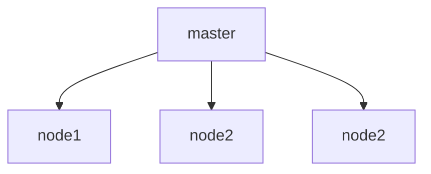
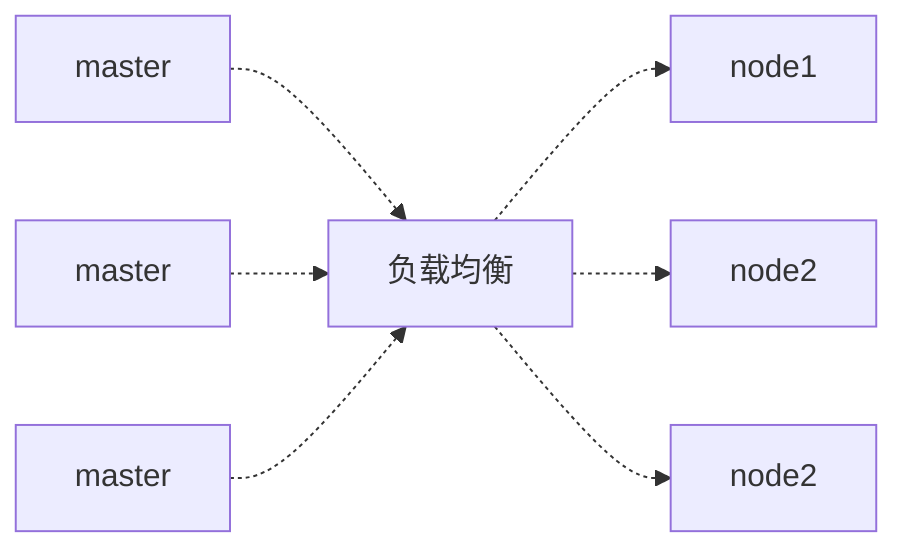
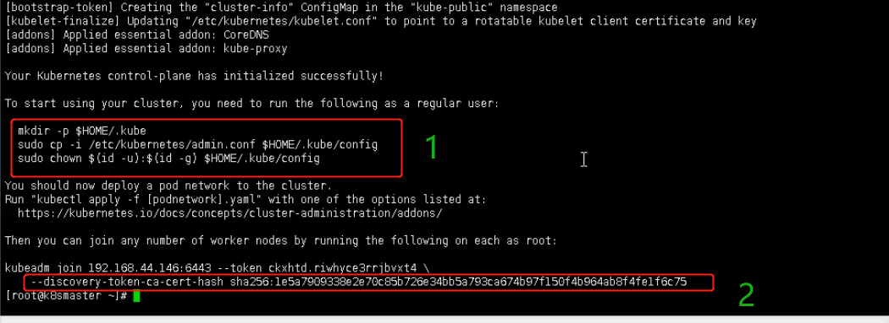

# Kubernetes
## 一、介绍

```sh
# 开源容器编排框架，解决裸跑Docker的若干痛点
# 官网：https://kubernetes.io
# Github：https://github.com/kubernetes/kubernetes
```

Docker的若干痛点

```sh
# 单机使用，无法有效集群
# 随着容器数量上升，管理成本上升
# 没有有效容灾/自愈机制
# 没有统一的配置管理中心工具,生命周期管理工具,图形化运维管理工具
...
```

K8S优势

```sh
# 自动装箱，水平扩展，自动修复
# 服务发现和负载均衡
# 自动发布和回滚
# 集中化配置管理和密钥管理
# 存储编排
# 任务批处理
```

## 二、K8S入门

### 2.1 四组基本概念

#### 2.1.1、Pod/Pod控制器

```shell
# Pod: k8s最小的部署单元，一个Pod是一组容器的集合，其中的容器共享网络，生命周期短暂
# Controller: 确保预期的pod的副本数量；管理定时任务
# Service: 定义一组Pod的访问规则
# 整体过程：
# 通过Service统一入口访问--> 由Controller创建Pod进行部署
```

#### 2.1.2、Name/Namespace

#### 2.1.3、Label/Label选择器

#### 2.1.4、Service/Ingress

## 三、搭建K8S集群

###   3.1 搭建k8s环境平台规划

```sh
# Master 调度整个集群
# Nodes 负责运行应用
```

​		2.1.1 单master集群：一个master节点，多个Node节点《一旦master挂掉，node节点无法管理》

​		2.1.2  多master集群：多个master节点，中间通过负载均衡调配<高可用>



### 3.2 服务器硬件要求

```shell
# 硬件要求：
# master节点: CPU 2核; Mem：4G+; Disk: 20G+;
# node  节点: CPU 4核; Mem：8G+; Disk: 40G+;

# 生产环境
# master节点: CPU 8核; Mem：16G+; Disk: 100G+;
# node  节点: CPU 16核; Mem：64G+; Disk: 500G+;
```


### 3.3 k8s集群部署方式


```shell
# 方式1： (minikube) ## 一般用于本地开发、测试和学习，不能用于生产环境，可以快速搭建一个运行在本地的单节点的Kubernetes
# 方式2：（kubeadm） ## kubeadm init 以及 kubeadm join 这两个命令可以快速创建 kubernetes 集群；要求Kubernetes 1.4+
# 方式3：（二进制包）## 前两者是自动化，这种是手动部署，适用于大型生产环境
```

### 3.4 k8s集群部署方式-kubeadm方式
``` shell
# 大概目标步骤
# 1. 创建一个Master节点：
	Kubeadm init
# 2. 将Node节点加入到当前集群中 
	$ kubeadm join <Master节点的IP和端口>
```
#### 3.4.1 安装要求

```sh
# 1 一台或多台机器Centos7.x；
# 2 Mem:2G+ ；CPU：2+；Disk：30G+
# 3 所有机器网络互通，可访问外网，需要拉取镜像
# 4 禁止swap分区
```

- ###### 最终目标

```shell
# 1 在所有节点安装Docker和Kubeadm
# 2 部署Kubernetes Master
```

#### 3.4.2 安装过程

##### 1）安装3个虚拟机和安装操作系统centos7.x；

##### 2） 将所有操作系统初始化

```shell
# 1. 关闭防火墙
systemctl stop firewalld
systemctl disable firewalld
# 2. 关闭selinux
sed -i 's/enforcing/disabled/' /etc/selinux/config # 永久
setenforce 0 # 临时
# 3. 关闭swap：
swapoff -a # 临时
sed -ri 's/.*swap.*/#&/' /etc/fstab # 永久
# 4. 根据规划设置主机名
hostnamectl set-hostname <hostname> # eg: hostname=k8s-master;hostname=k8s-node1
# 5. 在Masster添加hosts  (>>表示追加)
cat >> /ect/hosts <<EOF
192.168.100.120 k8s-master
192.168.100.121 k8s-node1
192.168.100.122 k8s-node2
EOF
# 6. 将桥接的IPv4流量传递到iptables的链
cat > /etc/sysctl.d/k8s.conf <<EOF
net.bridge.bridge-nf-call-ip6tables = 1
net.bridge.bridge-nf-call-iptables = 1
EOF
sysctl --system # 生效
# 7. 时间同步
yum install ntpdate -y
ntpdate time.windows.com
```

##### 3） 所有节点安装Docker，kubeadm、kubelet

- kubernets默认CRI(容器运行时)是Docker，先安装Docker

> ```shell
> # 安装Docker
> $ wget https://mirrors.aliyun.com/docker-ce/linux/centos/docker-cerepo -O /etc/yum.repos.d/docker-ce.reop
> $ yum -y install docker-ce-18.06.1.ce-3.e17
> $ systemctl enable docker && systemctl start docker
> $ docker --version
> 
> $ cat > /etc/docker/daemon.json << EOF
> {
>     "registry-mirrors":["https://b??.mirror.aliyuncs.com"]
> }
> EOF
> systemctl restart docker
> ```
>
> ```shell
> # 添加阿里云YUM软件源
> $ cat > /etc/yum.repos.d/kubernetes.repo << EOF
> [kubernetes]
> name=Kubernetes
> baseurl=https://mirrors.aliyun.com/kubernetes/yum/repos/kubernetes-e17-x86_64 
> enable=1
> gpgcheck=0
> repo_gpgcheck=0
> gpgkey=https://mirrors.aliyun.com/kubernetes/yum/doc/yum-key.gpg https://mirrors.aliyun.com/kubernetes/yum/doc/rpm-package-key.gpg
> EOF
> ```
>
> ```shell
> # 安装kubeadm，kubelet和kubectl
> # 由于版本更新频繁，此处指定版本号部署
> yum install -y kubelet-1.18.0 kubeadm-1.18.0 kubectl-1.18.0
> sysemctl enable kubelet
> ```

---

##### 4） 部署Kubernetes Master

（在192.168.100.120 k8s-master执行kubeadm init）

> ```shell
> kubeadm init \
> --apiserver-advertise-address=192.168.100.120 \ # 当前节点IP
> --image-repository registry.aliyun.com/google_containers  \ # 阿里镜像源
> --kubernetes-version v1.18.0 \ # 版本
> --service-cidr=10.96.0.0/12 \ # ip没特定要求，不冲突即可
> --pod-network-cidr=10.244.0.0/16
> # kubeadm 以后将会在 /etc 路径下生成配置文件和证书文件
> ```
>
> 
>
> -  由于默认拉取镜像的地址是k8s.gcr.io，这里指定阿里云镜像仓库地址，使用kuberctl工具：本地化
>
>   ```shell
>   # 来自上个步骤的日志1处的复制
>   mkdir -p $HOME/.kube
>   cp -i /etc/kubernetes/admin.conf $HOME.kube/config
>   chown $(id -u):(id -g) $HOME/.kube/config
>   kubectl get nodes # 查看当前节点列表
>   
>   # 加入节点：（复制上图第2处红线(包含其上一行)完整命令在Node节点执行）
>   ```

##### 5）加入Kubernetes Node 
> * kubeadm join将Node节点加入Master
>
> ```shell
> # 在Node1节点执行：
> # 复制上图第2处红线(包含其上一行)完整命令在Node节点执行
> eg: kubeadm join 192.168.100.120:6443 --token esce21.q6xxx.. --discovery-token-ca-cert-hash sha256:xxx..
> # 在Node2节点重复上述命令
> # <the end.>
> -- ------------------------------------------------------------
> # 在回到master节点查看
> $ kubectl get nodes # 查看Node节点是否已经加入master# 但状态为NotReady，需要网络组件
> ## 默认toen有效期是24小时，当过期之后，该token不可用，就需要重新创建token，操作如下：
> kubeadm token create --print-join-command 
> ```

##### 6） 安装Pod网络插件（CNI）
> ```shell
> # <master节点操作>
> # $ wget https://raw.githubusercontent.com/coreos/flannel/master/Documentation/kube-flannel.yml
> # if 默认地址没法访问，sed命令修改docker hub镜像仓库
> $ kubectl apply -f https://raw.githubusercontent.com/coreos/flannel/master/Documentation/kube-flannel.yml
> $ kubectl get pods -n kube-system # 查看组件及其状态变为running
> # 等组件启动后，再查看节点状态是否都为Ready：
> $ kubectl get nodes
> ```

##### 7） 测试Kubernetes集群

```shell
# kubectl get pod # 查看Pod，目前啥也没有
# 在Kubernetes集群中创建一个Pod，验证是否正常运行
$ kubectl create deployment nginx --image=nginx
$ kubectl expose deployment nginx --port=80 --type=NodePort # 对外暴露端口 
$ kubectl get pod.svc
# .访问地址： http://NodeIp:Port；# eg:http://192.168.100.121:32753 # <32753是node1的nginx端口>
```

### 3.5 k8s集群部署方式-二进制方式

#### 3.51 安装要求 同kubeadm

#### 3.52 安装参考

**end.**

- [参考网址](https://www.cnblogs.com/zgqbky/p/12149753.html)

---

```flow
st=>start: 开始
e=>end: 登录
io1=>inputoutput: 输入用户名密码
sub1=>subroutine: 数据库查询子类
cond=>condition: 是否有此用户
cond2=>condition: 密码是否正确
op=>operation: 读入用户信息

st->io1->sub1->cond
cond(yes,right)->cond2
cond(no)->io1(right)
cond2(yes,right)->op->e
cond2(no)->io1
```
---


![alt] (URL title)

