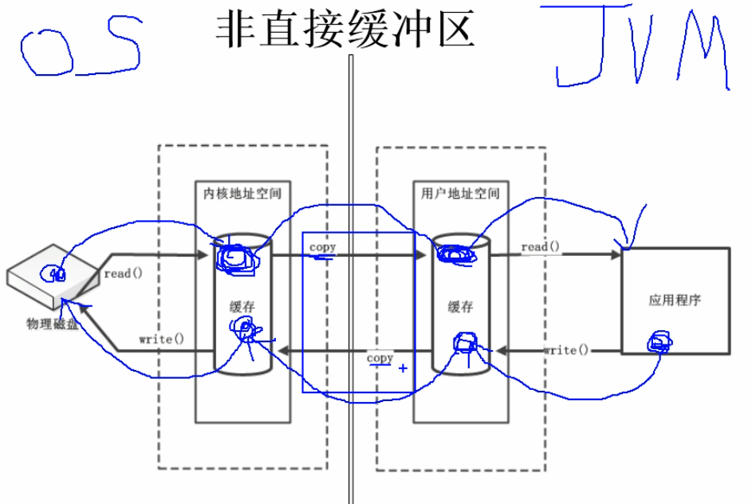
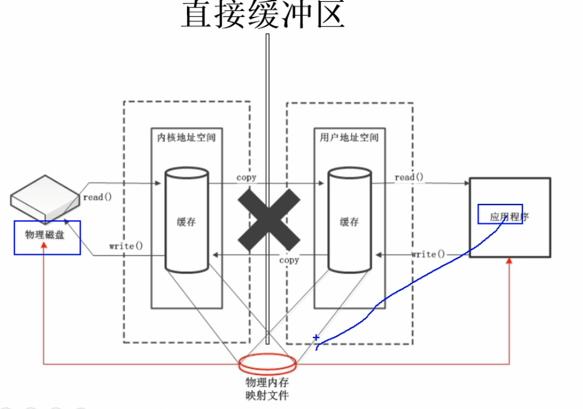
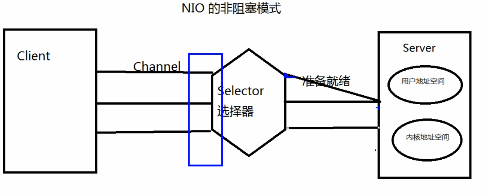
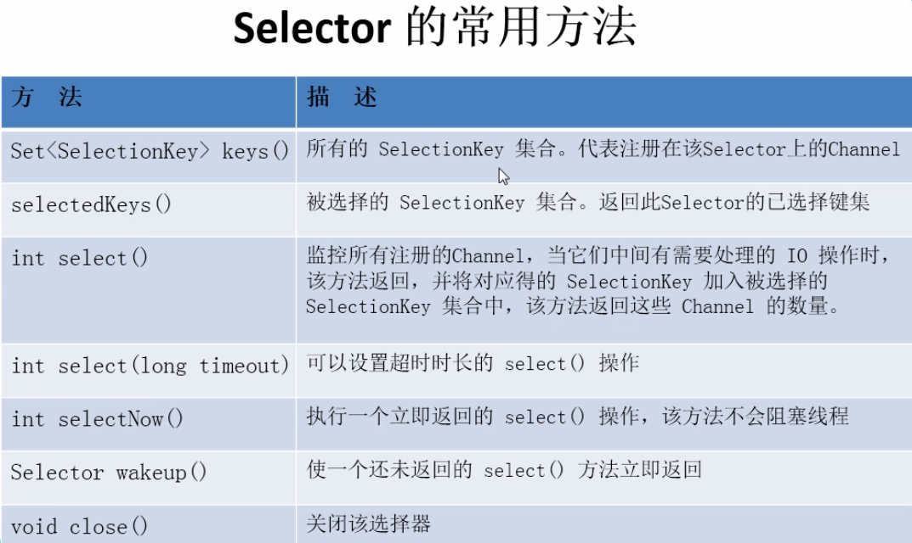

# Java NIO

> NIO(New I O) 支持面向缓冲区的，基于通道的IO操作，更加高效的进行文件读写操作；

# IO与NIO区别

| IO                            | NIO                         |
| ----------------------------- | --------------------------- |
| 面向流(Stream Oritented),单向 | 面向缓冲区(Buffer Oriented) |
| 阻塞(Blocking IO)             | 非阻塞IO(Non Blocking IO)   |
|                               | 选择器（Selectors)          |

面向流：程序直接面向数据流(水流)，分输入流I，输出流O，单向；

面向缓冲区：程序和数据建立通道，在通道内通过建立缓冲区进行存取，双向

阻塞：网路IO中，

# 通道(Channel),缓冲区(Buffer)

> Java Nio的核心在于：通道（Channel）和缓冲区（Buffer）：：**Channel负责传输，Buffer负责存储**
>
> **通道表示打开IO设备（文件，套接字）的连接；**
>
> **缓冲区用于容纳数据**
>
> 使用NIO，需要获取连接IO的通道和用于容纳数据的缓冲区，**操作缓冲区对数据进行处理**

## Buffer类型，属性：

Java中的Buffer 负责数据的存取，NIO中缓冲区就是数组，用于存储不同的数组

* 根据类型不同，提供了相应类型的缓冲区（基本类型boolean除外）

  ```java
  //以下缓冲区管理都是通过allocate()获取缓冲区
  * ByteBuffer
  * CharBuffer
  * ShortBuffer
  * IntBuffer
  * LongBuffer
  * FloatBuffer
  * DoubleBuffer
  ```

* Buffer的4个核心属性

  ```sh
  capacity ## 表示缓冲区中最大存储的容量,一旦声明不能改变
  limit    ## 界限：缓冲区可以操作数据的大小,默认等于capacity，超过该大小不能读写
  position ## 表示缓冲区正在操作数据的位置
  mark	 ## 标记，用户记录当前position位置，可通过reset()恢复到mark位置；
  
  ## 大小规律 mark<= position <= limit <= capacity #见下解
  
  ```

## Buffer方法：

存取数据的两个核心方法**put()和get()**

* allocate 分配一个指定大小的缓冲区

```java
// 分配一个指定大小的缓冲区----------------------------
ByteBuffer buf = ByteBuffer.allocate(1024);
System.out.println("allocate() - >   "+buf);// 初始化lim等于最大容量capacity
```

put()：存入数据到缓冲区，， pos位置后移到最后，limit大小为数据的容量、

flip()：切换到读模式，，pos位置移动到开始读的位置，lim=待读取数据最大容量

get()：获取缓冲区的数据，，$pos从[pos0,lim]区间的指定位置开始读，并根据读取大小后移$pos，

rewind()：重新读，，$pos重新回到上次读取的位置，

clear()：清空缓冲区，，数据依然存在，处于“被遗忘”状态，pos，lim都回到最初状态

mark()：标记position，标记当前位置，之后用reset()恢复到该位置

reset()：重置到mark标记，pos回到mark标记的位置

hasRemaining()：判断缓冲区是否还有数据 (pos<lim?true:false)

remaining()：查看缓冲区还有多少数据

```java
// 存数据------------------put(.)---------------------
buf.put(data.getBytes());// 存数据 pos位置后移到最后
System.out.println("put() - >   "+buf);;

// 切换到读----------------flip()----------------------------
buf.flip();// 切换到读// pos位置移动到开始读的位置，lim=待读取数据最大容量
System.out.println("flip() - >   "+buf);;

// get(.)读数据------------get(.)---------------------------
byte[] dist = new byte[buf.limit()];
buf.get(dist);// pos位置移动到最后读位置(limit)
String res = new String(dist,0,dist.length);
System.out.println("get() - >   "+buf);

// 重新切换到读-----------rewind()---------------------------------
buf.rewind();
System.out.println("rewind() - >   "+buf);

// 清空缓冲区-----------clear()---------------------------------
buf.clear(); // 清空缓冲区，数据依然存在，处于“被遗忘”状态，
System.out.println("clear() - >   "+buf);


// 标记position-----------mark()---------------------------------
buf.mark();
buf.get(dist,2,2);// $pos从[pos0,lim]区间的指定位置开始读，并根据读取大小后移$pos，
res = new String(dist,2,2);
System.out.println("mark  get() - >   "+buf + " >> "+ res);

// 重置到mark标记-----------reset()---------------------------------
buf.reset();
System.out.println("reset  - >   "+buf + " >> ");

// 缓冲区是否还有数据----------hasRemaining() remaining()-----------------------
System.out.println("缓冲区是否还有数据："+buf.hasRemaining());
if(buf.hasRemaining()){
    System.out.println("缓冲区剩余数据大小："+buf.remaining());
}
```


```java

```

## (直接,非直接)缓冲区

> 非直接缓冲区：通过allocate(size)分配缓冲区，**将缓冲区建立在JVM内存中**
>
> 直接缓冲区：通过allocateDirect()分配直接缓冲区，**将缓冲区建立在操作系统的物理内存映射文件中**，某种情况下提高效率

* 优点：效率高，适合长时间在内存中的数据
* 缺点：直接写到物理内存中，耗费资源大；物理内存的映射文件后不再受应用程序控制，操作系统决定何时写入物理磁盘；需要通过垃圾回收机制才能释放应用程序与物理映射的关系；
* 建议：建议将直接缓冲区主要分配给那些易受基础系统的本机I/O操作影响的大型、持久的缓冲区；

 ```java
  // 分配直接缓冲区
 ByteBuffer buf = ByteBuffer.allocateDirect(1024);
 
 // 判断是否直接缓冲区
 System.out.println("是否直接缓冲区："+buf.isDirect());
 ```

> 非直接缓冲区内存视图



> 直接缓冲区内存视图



## Channel(通道)

> java.nio.channels包，**Channel表示IO源和目标文件的连接**，不能直接访问数据，只能通过Buffer交互；
>
> 物理设备中，Channel专门用于IO操作，附属但独立于CPU；


> 通道（Channel）：**用于源节点和目标节点的连接，在Java NIO中负责Buffer中数据的传输；**

## 1. Channel主要实现类

```java
//java.nio.channels.Channel接口:
* FileChannel           - (本地io)
* SocketChannel         - (TCP)
* ServerSocketChannel   - (TCP)
* DatagramChannel       - (UDP)
```

## 2. 获取Channel和传输数据

> 获取Channel三种方式：、
>
> 1. Java针对支持通道的类提供了getChannel()的方法
>
> 2. NIO2针对各个通道提供了静态方法open(); （jdk1.7+中，）
>
> 3. Files工具类中的newByteChannel()创建Channel (jdk1.7+)

### 1.1 ）Java针对支持通道的类提供了getChannel()的方法

1. 本地IO：FileInputStream，FileOutputStream， RandomAccessFile
2. 网络IO：Socket，ServerSocket，DatagramSocket


```java
@Test
public void testChannelFile() throws IOException {
    FileInputStream fis = new FileInputStream("src/main/resources/app.json");
    FileOutputStream fos = new FileOutputStream("src/main/resources/app2.json");
    // 1. 获取通道
    FileChannel inChannel = fis.getChannel();
    FileChannel outChannel= fos.getChannel();
    // 2. 分配指定大小缓冲区
    ByteBuffer buffer = ByteBuffer.allocate(1024);
    // 3. 将通道数据存入缓冲区
    while (inChannel.read(buffer)!=-1){
        buffer.flip();// 读取模式
        // 4. 将缓冲区数据写入通道；
        outChannel.write(buffer);
        buffer.clear();// 清空缓冲区
    }
    outChannel.close();
    inChannel.close();
    fos.close();
    fis.close();
}
```

### 1.2）NIO2针对各个通道提供了静态方法open()  (jdk1.7+);

* NIO2 非直接缓冲区FileChannel.open方法


```java
// NIO2 非直接缓冲区FileChannel.open方法
@Test
public void testChannelFile2() throws IOException {
    // 1. 获取通道
    FileChannel inChannel = FileChannel.open(Paths.get("src/main/resources/","app.json"), StandardOpenOption.READ);// 读取模式
    FileChannel outChannel= FileChannel.open(Paths.get("src/main/resources/","app3.json"),StandardOpenOption.WRITE,StandardOpenOption.CREATE);// 写入覆盖模式
    // 2. 分配指定大小缓冲区
    ByteBuffer buffer = ByteBuffer.allocate(1024);
    // 3. 将通道数据存入缓冲区
    while (inChannel.read(buffer)!=-1){
        buffer.flip();// 读取模式
        // 4. 将缓冲区数据写入通道；
        outChannel.write(buffer);
        buffer.clear();// 清空缓冲区
    }
    outChannel.close();
    inChannel.close();
}
```

* NIO2 使用直接缓冲区，通过FileChannel的map()方法将文件区域直接映射到内存中创建Channel，
  * 仅byteBuffer支持 ，返回类型是MapperByteBuffer
  * 速度更快，但是垃圾回收机制不会及时释放资源
```java
// NIO2 使用直接缓冲区，直接使用内存映射文件完成复制 -- 仅byteBuffer支持 
@Test
public void testChannelFile2Direct() throws IOException {
    // 1. 获取通道
    FileChannel inChannel = FileChannel.open(Paths.get("src/main/resources/","app.json"), StandardOpenOption.READ);// 读取模式
    FileChannel outChannel= FileChannel.open(Paths.get("src/main/resources/","app4.json"),StandardOpenOption.WRITE,StandardOpenOption.READ,StandardOpenOption.CREATE);// 写入覆盖模式
    // 2. 直接为内存映射文件(在物理内存中)，不再需要通过通道去读和写，
    MappedByteBuffer inMappedBuffer = inChannel.map(FileChannel.MapMode.READ_ONLY,0,inChannel.size());
    MappedByteBuffer outMappedBuffer = outChannel.map(FileChannel.MapMode.READ_WRITE, 0, inChannel.size());
    // 3. 直接对缓冲区进行读写操作
    byte[] dst = new byte[inMappedBuffer.limit()];
    inMappedBuffer.get(dst,0,dst.length);
    outMappedBuffer.put(dst,0,dst.length);

    outChannel.close();
    inChannel.close();
}
```

### 1.3）NIO2的Files工具类中的newByteChannel()创建Channel (jdk1.7+)

```java
// NIO2 使用NIO2的Files工具类中的newByteChannel()创建Channel
@Test
public void testNewByteChannel() throws IOException {
    // 1. 获取通道
    SeekableByteChannel inChannel = Files.newByteChannel(Paths.get("src/main/resources/","app.json"),StandardOpenOption.READ);
    SeekableByteChannel outChannel= Files.newByteChannel(Paths.get("src/main/resources/","app5.json"),StandardOpenOption.WRITE,StandardOpenOption.READ,StandardOpenOption.CREATE);// 写入覆盖模式
    // 2. 分配指定大小缓冲区
    ByteBuffer buffer = ByteBuffer.allocate(1024);
    // 3. 将通道数据存入缓冲区
    while (inChannel.read(buffer)!=-1){
        buffer.flip();// 读取模式
        // 4. 将缓冲区数据写入通道；
        outChannel.write(buffer);
        buffer.clear();// 清空缓冲区
    }
    outChannel.close();
    inChannel.close();
}
```

> 通道之间的数据传输

### 2.4）通道之间的数据传输（直接缓冲区）

```java
 // 通道之间的数据传输
@Test
public void testChannelTransfor() throws IOException {
    // 1. 获取通道
    FileChannel inChannel = FileChannel.open(Paths.get("src/main/resources/","app.json"), StandardOpenOption.READ);// 读取模式
    FileChannel outChannel= FileChannel.open(Paths.get("src/main/resources/","app6.json"),StandardOpenOption.WRITE,StandardOpenOption.CREATE);
    // 2. 传输数据
    // 法 01. inChannel -> outChannel
    inChannel.transferTo(0,inChannel.size(),outChannel);
    // 法 02. outChannel <- inChannel
    // outChannel.transferFrom(inChannel,0,inChannel.size());
    outChannel.close();
    inChannel.close();
}
```

### 2.5）分散读取与聚集写入

> 分散读取：(Scatering Reads) ：将Channel中的数据分散到多个Buffer中；
>
> 聚集写入：(Gathering Writes)：将多个Buffer中的数据聚集到Channel；

```java
// 分散读取与聚集写入
@Test
public void testChannelScaterAndGather() {
    //String path = "E:/summer/mylearn/spring/lean/spring+jdbc";
    String path = "E:/summer/mylearn/nginx/nginx.conf.txt";
    FileChannel inChannel = null;
    // 1. 获取通道
    try {
        RandomAccessFile randomAccessFile = new RandomAccessFile(path,"rw");
        inChannel = randomAccessFile.getChannel();
        // 2. 分配指定缓冲区
        ByteBuffer buf = ByteBuffer.allocate(100);
        ByteBuffer buf2 = ByteBuffer.allocate(1024);
        // 3. 分散读取
        ByteBuffer[] bufArr = {buf,buf2};
        inChannel.read(bufArr);
        for (ByteBuffer bf : bufArr){
            bf.flip();
            System.out.println(new String(bf.array(),0,bf.limit()));
            System.out.println("----------------------------------------------------");
            //bf.clear();
        }

        // 4. 聚集写入
        RandomAccessFile raf2 = new RandomAccessFile("src/main/resources/nginx.conf","rw");
        FileChannel outChannel = raf2.getChannel();
        outChannel.write(bufArr);

    } catch (IOException e) {
        e.printStackTrace();
    } finally {
        try {
            inChannel.close();
        } catch (IOException e) {
            e.printStackTrace();
        }
    }
}
```

### 2.6）字符集（Charset）转换

> 编码：将字符串转换成字节数组
>
> 解码：字节数组转为字符串

```java
// 查看支持的编码集
SortedMap<String, Charset> map = Charset.availableCharsets();
Set<Map.Entry<String, Charset>> entries = map.entrySet();
entries.forEach(en -> System.out.println(en.getKey()+" = "+en.getValue()));
```

> 字符集转换

```java
@Test
public void testCharset() throws IOException {
    // 声明UTF8字符集
    Charset ch = Charset.forName("UTF-8");
    // 声明编码器
    CharsetEncoder ce = ch.newEncoder();
    // 声明解码器
    CharsetDecoder cd = ch.newDecoder();

    String src= "哈哈哈摸摸大 >>> ";
    System.out.println(src);
    CharBuffer charbf = CharBuffer.allocate(10250);
    charbf.put(src);
    charbf.flip();
    // 编码
    System.out.println("编码为UTF8：");
    ByteBuffer bbuf = ce.encode(charbf);
    System.out.println("(byte0,1,2)->("+bbuf.get()+"."+bbuf.get()+"."+bbuf.get()+")");

    // 解码
    System.out.println("解码为UTF8：");
    bbuf.rewind();// 重新读
    CharBuffer chardf = cd.decode(bbuf);
    System.out.println(chardf.toString()+",pos:"+chardf.position()+",lim:"+chardf.limit());
    System.out.println(chardf.position()+","+chardf.limit());

    System.out.println("解码为GBK：");
    bbuf.rewind();
    CharsetDecoder cd2 = Charset.forName("GBK").newDecoder();
    CharBuffer chardf2 = cd2.decode(bbuf);
    System.out.println(chardf2.toString());

}
```

# **NIO网络通信**

## NIO的阻塞与非阻塞

> NIO非阻塞：selector负责实时监控channel的就绪状态，当客户端发送的channel的数据完全准备就绪，selector才会分配到服务端的一个或多个线程上；未准备就绪不影响服务端的线程操作；



## NIO完成网络通信的3个核心	

> 1. 通道（channel）：负责连接
>
> 2. 缓冲区（buffer）：负责数据存取
>
> 3. 选择器（Selector）：
>
>    Selector是SelectableChannel的多路复用器，用于监控SelectableChannel的IO状况；
>
>    **可实现应用程序通过一个阻塞对象监听多路连接请求**；
>    
>    3.1 相关实现类：
>    
>    ```java
>    java.nio.channels.Channel 接口:
>              |-- SelectableChannel
>                    |-- SocketChannel
>                    |-- ServerSocketChannel
> 	                |-- DatagramChannel
>                 |-- Pip.SinkChannel     // 单向存管道channel
>                    |-- Pip.SourceChannel   // 单向取管道channel
>    ```
>     3.2 选择器监听的Channel的事件类型：
>    
>    > 每次向选择器注册通道时，就指定一个监听事件
>    
>    * 读：SelectionKey.OP_READ（1）
>    * 写：SelectionKey.OP_WRITE（4）
>    * 连接：SelectionKey.OP_CONNECT（8）
>    * 接收：SelectionKey.OP_ACCEPT（16）
>    
>     3.2.1 如果监听多个事件，可以用“位或”操作连接符：
>    
>    ```java
>    int interestSet = SelectionKey.OP_READ|SelectionKey.OP_WRITE
>    ```
>    
>     流行的Reactor框架：[@Netty](JavaNetty.md)
>    
>     **Reactor对象通过Select监控客户端请求事件，收到事件后通过Dispatch进行分发；如果是建立连接请求事件，则由Reactor通过Accept处理连接请求，然后建立一个Handler对象处理连接完成后的后续业务；如果不是连接事件，则Ractor会分发调用连接对应的Handler响应；Handler会完成Read->完成业务->Send的完整业务流程；**


阻塞式案例(需要手动告知发送完毕，否则一直等待接收)

```java
// 阻塞式收发消息
public class TestSocketBlocking2 {
    /** 客户端发送代码**/
    @Test
    public void client() throws IOException {
        // 建立客户端通道
        SocketChannel skChannel = SocketChannel.open(new InetSocketAddress("127.0.0.1",8888));
        // 本地读取Channel
        FileChannel inChannel = FileChannel.open(Paths.get("E:/summer/mylearn/java/typora-user-images","cas-ABA问题.jpg"), StandardOpenOption.READ);

        // 分配指定大小的缓冲区
        ByteBuffer buffer = ByteBuffer.allocate(1024);
        // 读取本地文件并发送到服务端
        while (inChannel.read(buffer)!=-1){
            buffer.flip();// 读模式
            skChannel.write(buffer);// 写入SocketChannel
            buffer.clear();
        }
        // 告诉服务端接收完成，阻塞式
        skChannel.shutdownOutput();
        // 接收反馈数据：
        while (skChannel.read(buffer)!=-1){
            buffer.flip();
            System.out.println(new String(buffer.array(),0,buffer.limit()));
            buffer.clear();
        }

        // 关闭Channel
        inChannel.close();
        skChannel.close();
    }

    /** 服务端接收代码**/
    @Test
    public void server() throws IOException {
        // 建立ServerSocket获取通道
        ServerSocketChannel ssChannel = ServerSocketChannel.open();
        ssChannel.bind(new InetSocketAddress(8888));

        // 接收客户端连接的通道
        SocketChannel sChannel = ssChannel.accept();
        // 保存到本地的通道
        FileChannel fileChannel = FileChannel.open(Paths.get("src/main/resources","cas-aba.jpg"),StandardOpenOption.WRITE,StandardOpenOption.CREATE);
        // 分配指定大小的Buffer
        ByteBuffer buffer = ByteBuffer.allocate(1024);
        // 接收客户端的数据并并保存到本地
        while (sChannel.read(buffer)!=-1){
            buffer.flip();
            fileChannel.write(buffer);
            buffer.clear();
        }
        // 发送接收结果
        buffer.put("接收数据成功！".getBytes());
        buffer.flip();
        sChannel.write(buffer);

        // 关闭Channel
        fileChannel.close();
        sChannel.close();
        ssChannel.close();
    }
}
```

非阻塞式

使用socketChannel.configureBlocking(false); // 切换至非阻塞模式

> Selector的常用方法



 

非阻塞式案例(选择器监听事件类型)

```java
/**非阻塞式*/
public class TestSocketNonBlocking {
    @Test
    public void client() throws IOException {
        // 建立客户端通道
        SocketChannel skChannel = SocketChannel.open(new InetSocketAddress("127.0.0.1",9999));
        // 切换成非阻塞模式
        skChannel.configureBlocking(false);
        // 分配指定大小的缓冲区
        ByteBuffer buffer = ByteBuffer.allocate(1024);
        // 发送到服务端10次
        LocalDateTime now = LocalDateTime.now();
        buffer.put(now.toLocalDate().toString().getBytes());
        for (int i=0;i<10;i++){
            buffer.rewind();
            skChannel.write(buffer);
            buffer.clear();
        }
        // 关闭Channel
        skChannel.close();
    }
    @Test
    public void server() throws IOException {
        // 1. 获取通道
        ServerSocketChannel ssChannel = ServerSocketChannel.open();
        // 2. 切换成非阻塞模式
        ssChannel.configureBlocking(false);
        // 3. 绑定连接
        ssChannel.bind(new InetSocketAddress(9999));
        // 4. 获取选择器
        Selector selector = Selector.open();
        // 5. 将通道注册到选择器，指定监听事件类型为接收Accept
        ssChannel.register(selector, SelectionKey.OP_ACCEPT);//选择器，第二个参数ops：选择器监测通道的事件状态（接收状态，）
        // 6. 轮询式地获取选择器上已经“准备就绪”的事件
        while (selector.select()>0){
            // 7. 选择器上注册的所有已就绪的监听事件
            Set<SelectionKey> selectionKeys = selector.selectedKeys();
            Iterator<SelectionKey> iterator = selectionKeys.iterator();
            while (iterator.hasNext()){
                // 8. 获取准备就绪的事件
                SelectionKey next = iterator.next();
                // 9. 判断本Key是什么事件准备就绪
                if(next.isAcceptable()){// 如果接收就绪
                    // 10. 如果接收就绪，得到客户端的socketChannel
                    SocketChannel skChannel = ssChannel.accept();
                    // 11. 再将skChannle切换为非阻塞
                    skChannel.configureBlocking(false);
                    // 12. 将该通道注册到选择器上，事件类型为读就绪
                    skChannel.register(selector,SelectionKey.OP_READ);
                }else if (next.isReadable()){
                    // 13. 获取当前选择器上状态是“读就绪”的通道
                    SocketChannel channel = (SocketChannel) next.channel();
                    // 14. 读取数据
                    ByteBuffer dst = ByteBuffer.allocate(1024);
                    while (channel.read(dst)!=-1){
                        dst.flip();
                        System.out.println(new String(dst.array()));
                        dst.clear();
                    }
                }
                // 15. 取消selectionKey，否则会一直存在
                iterator.remove();
            }

        }

        ssChannel.close();
    }
}
```

UDP非阻塞案例

```java
/**UDP非阻塞案例*/
public class TestUdpNonBlocking {

    @Test
    public void send() throws IOException {
        DatagramChannel dc = DatagramChannel.open();
        dc.configureBlocking(false);// 非阻塞式I/O
        ByteBuffer buffer = ByteBuffer.allocate(1024);
        buffer.put("Hello here!".getBytes());
        buffer.flip();
        dc.send(buffer,new InetSocketAddress("127.0.0.1",9999));
        buffer.clear();

        dc.close();
    }
    @Test
    public void receive() throws IOException {
        DatagramChannel dc = DatagramChannel.open();
        dc.configureBlocking(false);
        dc.bind(new InetSocketAddress(9999));
        // 选择器
        Selector selector = Selector.open();
        // 注册到选择器
        dc.register(selector, SelectionKey.OP_READ);
        // 轮询问
        while (selector.select(/*60*1000*/)>0){// 60s外不获取
            Iterator<SelectionKey> keyIterator = selector.selectedKeys().iterator();
            while (keyIterator.hasNext()){
                SelectionKey selectionKey = keyIterator.next();
                if(selectionKey.isReadable()){
                    DatagramChannel channel = (DatagramChannel) selectionKey.channel();
                    ByteBuffer dst = ByteBuffer.allocate(1024);
                    channel.receive(dst);
                    dst.flip();
                    System.out.println(new String(dst.array(),0,dst.limit()));
                    dst.clear();
                }
                keyIterator.remove();
            }

        }
    }
}
```

Pip

> Java NIO 管道是2个线程之间的**单向数据连接**。Pipe有一个source通道和一个sink通道。数据会被写到sink通道，从source通道读取

```java
@Test
public void testPip() throws IOException {
    // 1. 获取管道
    Pipe pipe = Pipe.open();
    // 1.2 获取一个Sink管道用于写入数据
    Pipe.SinkChannel sink = pipe.sink();
    // 2. 分配一个指定大小的缓冲区,并写入Sink通道
    ByteBuffer buffer = ByteBuffer.allocate(1024);
    buffer.put("通过单向管道发送数据".getBytes());
    buffer.flip();
    // 2.1 数据写入Sink通道
    sink.write(buffer);

    // 3. 从source通道读取数据
    Pipe.SourceChannel source = pipe.source();
    buffer.flip();
    int len = source.read(buffer);
    System.out.println(new String(buffer.array(),0,len));
    buffer.clear();
}
```


## 群聊代码

> GroupChatServer

```java
/**NIO群聊服务端*/
public class GroupChatServer {
    ServerSocketChannel ssChannel;
    Selector selector = null;
    private static Integer PORT = 9999;
    /**
     *  初始化服务端
     */
    public GroupChatServer(){
        try {
            // 获取服务端通道
            ssChannel = ServerSocketChannel.open();
            ssChannel.configureBlocking(false);// 设置非阻塞模式
            ssChannel.bind(new InetSocketAddress(PORT));
            // 获取选择器
            selector = Selector.open();
            // 将监听通道注册进选择器
            ssChannel.register(selector, SelectionKey.OP_ACCEPT);
            System.out.println("服务端准备就绪 - > > > ");
            listen();
        } catch (IOException e) {
            e.printStackTrace();
            System.out.println("服务端启动失败");
        }
    }
    /**监听客户端信息*/
    public void listen(){
        try {
            while (true){
                int channels = selector.select(2000);
                if(channels>0){ // 有就绪事件
                    Iterator<SelectionKey> iterator = selector.selectedKeys().iterator();
                    while (iterator.hasNext()){
                        SelectionKey key = iterator.next();
                        // if监听到accept
                        if (key.isAcceptable()) {
                            SocketChannel channel = ssChannel.accept();// 获取连接的chennel
                            channel.configureBlocking(false);
                            // 将channel注册进selector
                            channel.register(selector,SelectionKey.OP_READ);
                            // 消息提醒：
                            System.out.println(channel.getRemoteAddress()+" 上线了 - > > > ");
                        }
                        if (key.isReadable()){
                            readData(key);
                        }
                        // 移除当前key，防止重复操作
                        iterator.remove();
                    }
                }
            }

        } catch (IOException e) {
            e.printStackTrace();
        } finally {

        }
    }

    /**解析客户端信息并调用消息分发*/
    private void readData(SelectionKey key)  {
        ByteBuffer dst = null;
        SocketChannel channel = null;

        try {
            channel = (SocketChannel)key.channel();
            dst = ByteBuffer.allocate(1024);
            int read = channel.read(dst);
            dst.flip();
            String msg = new String(dst.array(),0,dst.limit()).trim();
            System.out.println("from client : "+ msg);
            // 想其它客户端转发消息
            distributeMsg(channel,msg);
        } catch (IOException e) {
            try {
                System.out.println(channel.getRemoteAddress().toString()+"下线了..."+ LocalDateTime.now().toLocalTime());
                key.cancel();// 取消注册
                channel.close();// 关闭通道
            } catch (Exception ex) {
                ex.printStackTrace();
            }
        }
        dst.clear();
    }

    /** 将消息分发给其它客户端*/
    private void distributeMsg(SocketChannel currChannel, String msg) throws IOException {
        System.out.println("服务器转发消息中...");
        // 遍历所有注册到selector的socketChannel，并排除当前channnel
        Iterator<SelectionKey> iterator = selector.keys().iterator();
        while (iterator.hasNext()) {
            //SelectionKey key = iterator.next();
            Channel channel = iterator.next().channel();
            if(channel instanceof SocketChannel && channel!=currChannel){// 排除消息发送者
                SocketChannel targetChannel = (SocketChannel)channel;
                ByteBuffer buf = ByteBuffer.wrap(msg.getBytes());
                // 写入客户端通道
                targetChannel.write(buf);
            }
        }
        //iterator.remove(); // 不需要删
    }
    
    public static void main(String[] args) {
        GroupChatServer chatServer = new GroupChatServer();
        chatServer.listen();
    }
}
```

> GroupChatClient

```java
/**NIO群聊客户端*/
public class GroupChatClient {
    private static Integer SERVER_PORT= 9999;
    private static String SERVER_HOST= "127.0.0.1";
    SocketChannel clentChannel= null;
    Selector selector = null;
    private String username;
    /** 初始化客户端*/
    public GroupChatClient(){
        try {
            // 获取一个同奥
            clentChannel = SocketChannel.open(new InetSocketAddress(SERVER_HOST,SERVER_PORT));
            // 非阻塞模式
            clentChannel.configureBlocking(false);
            // 获取选择器
            selector = Selector.open();
            // 将通道注册进选择器，用于接收消息
            clentChannel.register(selector, SelectionKey.OP_READ);
            username = clentChannel.getLocalAddress().toString().substring(1);
            System.out.println(username+" 上线成功 > > ");
        } catch (IOException e) {
            e.printStackTrace();
        }
    }
    /** 发送消息*/
    public void sendInfo(String info){
        info = username+" > 说："+info;
        try {
            ByteBuffer buffer = ByteBuffer.wrap(info.trim().getBytes());
            clentChannel.write(buffer);
            buffer.clear();
        } catch (IOException e) {
            e.printStackTrace();
        }
    }
    /** 接收群消息*/
    public void receiveInfo(){
        try {
            if (selector.select(/*2000*/)>0) {// 有可用的通道
                Iterator<SelectionKey> iterator = selector.selectedKeys().iterator();
                while (iterator.hasNext()) {
                    SelectionKey key = iterator.next();
                    if (key.isReadable()){
                        SocketChannel channel = (SocketChannel)key.channel();
                        ByteBuffer dst = ByteBuffer.allocate(1024);
                        channel.read(dst);
                        String info = new String(dst.array());
                        System.out.println("> > "+info.trim());
                    }
                    iterator.remove();// 要移除当前selectkey
                }
            }
        } catch (IOException e) {
            e.printStackTrace();
        }
    }

    public static void main(String[] args) {
        GroupChatClient chatClient = new GroupChatClient();
        // 实时读取群消息
        new Thread(() -> {
            while (true){
                chatClient.receiveInfo();
                try {
                    Thread.currentThread().sleep(3000);
                } catch (InterruptedException e) {
                    e.printStackTrace();
                }
            }
        }).start();
        // 发送消息给群聊服务器
        Scanner scanner = new Scanner(System.in);
        while (scanner.hasNextLine()){
            String msg = scanner.nextLine();
            if(msg!=null&&msg.trim().length()>0){
                chatClient.sendInfo(" " +msg.trim());
            }

        }
    }
}
```


## NIO与零拷贝

> 零拷贝是性能优化的关键，特指操作系统中不经过CPU的拷贝
>
> Java中常用的零拷贝：有1.mmap(内存映射)，2. sendFile

> 传统IO的网络传输：需要经过4次拷贝，3次切换（4次拷贝，3次切换）
>
> mmap的优化：mmap通过内存映射，将文件映射到内核缓冲区，同时，用户空间可以共享内核空间的数据；这样在网络传输中，就可以减少内核空间到用户空间的拷贝次数，比传统的i/o减少了1次拷贝（3次拷贝，3次切换）；
>
> sendfile优化：
>
> ​	linux2.1中支持；基本原理是数据根本不经过用户态，直接从内核缓冲区进入到SocketBuffer，由于和用户态完全无关就又减少了一次上下文切换（3次拷贝，2次切换）不是真正的零拷贝
>
> ​	linux2.4+中优化，避免了从内核缓冲区拷贝到SocketBuffer的操作，（真正的零拷贝）（2此拷贝，2次切换）
>
> ​	；


# Netty

> 异步的基于事件驱动的网络应用框架
>
> 官网：(https://netty.io)


# 

---

# end

