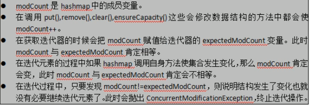
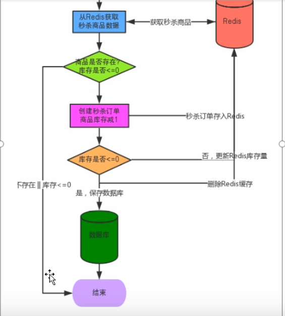

# Java多线程基础

## 线程的创建

> Java中，每次程序运行至少启动2个线程，一个是main线程，一个是垃圾收集线程；

### 1. 继承Thread类

> ```java
> /**Java多线程**/
> public class Thread01 extends Thread{
>     @Override
>     public void run() {
>         for (int i = 0; i < 10; i++) {
>             System.out.println(Thread.currentThread().getName()+"  - "+i+"   T "+new Date().getTime());
>         }
>     }
>      public static void main(String[] args) {
>         // 创建自定义线程对象
>         Thread th = new Thread01();
>         // 启动线程
>         th.start();
>         th = new Thread01();
>         // 启动线程
>         th.start();
> 
>         for (int i = 0; i < 10; i++) {
>             System.out.println("Main主线程执行： "+i +"   "+Thread.currentThread().getName());
>         }
>      }
> }
> ```
>
> 

### 2. 实现Runnable接口

> ```java
> public class Thread01MyRunnable implements Runnable {
>     @Override
>     public void run() {
>         for (int i = 0; i < 10; i++) {
>             System.out.println("MyRunnable： "+i +"   "+Thread.currentThread().getName());
>         }
>     }
> 
>     public static void main(String[] args) {
>         Thread01MyRunnable myRunnable = new Thread01MyRunnable();
>         Thread th = new Thread(myRunnable,"myRunnable");
>         th.start();
>     }
> ```
>
> 

### 3. 实现Callable接口

>
> Callable需要使用FutureTask类帮助创建和执行，其特点：

 ```java
 impl自java.util.concurrent.Future的基接口：
     1. 判断任务是否完成（isDone).
     2. 能够中断任务：cancel()
     3. 能够获取任务执行结果: get();
 和impl自java.lang.Runnable
 ```
> java.util.concurrent.FutureTask 类结构：

```java
java.util.concurrent.FutureTask impl RunnableFuture<V> extends Runnable, Future<V>
```

 ```mermaid
    graph LR
 	pA[FutureTask] -.-> 1[RunnableFuture接口]
 	1[RunnableFuture接口]  -->A[Future接口]
   	1[RunnableFuture接口]  -->B[Runnable接口]
 ```
> 案例步骤：
 ```java
  public class MyCallable01 implements Callable<Object> {
     @Override
     public Object call() throws Exception {
         for (int i = 0; i < 10; i++) {
             System.out.println("MyCallable01： "+i +"   "+Thread.currentThread().getName());
         }
         return "执行结果：ok!";
     }
     public static void main(String[] args) throws ExecutionException, InterruptedException {
         // 1. 创建的类实现Callable接口，实现call()方法
         // 2. 创建FutureTask实例，
         FutureTask<Object> futureTask= new FutureTask<>(new MyCallable01());
         // 3. 创建Thread实例，执行FutureTask；
         Thread th = new Thread(futureTask,"myCallable");
         th.start();
         // 4. 获取并打印MyCallable结果
         Object o = futureTask.get();
         System.out.println(o);
     }
 }
 ```


### 4. 线程池创建线程

> 线程池类关系图

```java
java.util.Executor<interface>
    ExecutorService<interface>
    	AbstractExecutorServeice
    		ThreadPoolExecutor			// (线程池实现类)
    			ScheduleThreadPoolExecutor // (定时任务线程池)
    	ScheduleExecutorService<interface>
    			ScheduleThreadPoolExecutor // (定时任务线程池)
java.util.Executors<工具类> // 封装了创建线程池的工具类
```

1. 创建MyRunnable实现Runnable接口
2. 使用Executors获取线程池对象
3. 通过线程池对象获取线程并执行Runnable实例；
4. 输出主线程信息和MyRunnable线程信息
5. 关闭线程池

```java
public static void main(String[] args) throws ExecutionException, InterruptedException {
    // 创建MyRunnable实现Runnable接口的对象
    MyRunnable myRunnable = new MyRunnable();
    // Executors获取线程池对象，// 固定数量的线程池
    ExecutorService executorService = Executors.newFixedThreadPool(3);
    // 并执行Runnable实例
    executorService.execute(myRunnable);
    //System.out.println(futureTask.get());
    // 关闭线程池
    executorService.shutdown();
}
```

### 5. 小结

> 建议使用接口的形式创建线程

1. 便于资源共享，资源在多个线程共享
2. 避免单继承的局限性
3. 线程池只支持实现了Runnable或Callable接口的实现类创建线程；

> Runnable和Callable比较

1. 相同点：都是接口，都需要Thrad.start()启动线程
2. Callable需要用FutureTask配合实现线程
3. Callable可以获取执行结果，取消自行，判断isDone
4. Callable的call()允许抛出异常，Runnable的run()不允许抛异常，
5. Callable可以用Future.cancel()线程；

> Java中，每次程序运行至少启动2个线程，一个是main线程，一个是垃圾收集线程；
>
> Callable支持返回执行结果，调用FutureTask.get()方法实现，此方法调用时会阻塞主线程，不调用不阻塞


## 线程生命周期


> Thread.resume()；Thread.stop()，Thread.suspend()都已过时，存在安全问题；
>
> eg: 调用suspend()方法时，cpu资源被释放，但是当前线程持有的锁不会释放，这就很容易导致程序卡死，无法执行

### 新建

* new关键字创建了一个线程后，该线程就处于新建状态；
* JVM为线程分配内存，初始化成员变量；

### 就绪

* 调用Thread.start()后线程进入继续状态，等待执行
* JVM为线程创建方法栈和程序计数器，等待线程调度器调度

### 运行

* 就绪状态的线程获取到CPU资源，开始运行run()方法，该线程处于运行状态

### 阻塞

> 当发生如下情况，线程将进入阻塞状态：

1. 线程调用了sleep()主动放弃所占用的CPU资源；
2. 线程调用了一个I/O方法，该线程被阻塞
3. 线程视图获取一个同步锁（同步监视器），但该同步锁正被其他线程所持有；
4. 线程在等待某个透支（notify）
5. 线程调用了线程的suspend()方法将该线程挂起，但这个方法容易导致死锁，尽量避免使用该方法；
6. thread.join();// 表示如果线程是alive状态，就等待线程终止后，再执行Main后面的方法 

### 消亡

* 正常结束：run或call方法执行结束
* 线程抛出未捕获的异常Exception或Error
* 调用了Thread.stop()结束线程；此方法容易导致死锁；

## 线程安全问题

> 如果又多个线程运行同一个Runnable接口的实例，程序运行结果同单线程结果总是一致，就是线程安全，反之线程不安全；

### 售票案例

* 超卖原因：多个线程对共享数据有写操作

### **解决方案-线程同步**

> 当某个线程修改共享资源时，其它线程不能修改该资源，等修改完后才能去抢夺CPU资源操作，保证数据的同步性；
>
> 同步方案：

1. 同步代码块（synchronized）
2. 同步方法（synchronized）[@ReenreantLock](#线程安全解决-同步锁(Lock))
3. 同步锁（ReenreantLock|ReentrantReadWriteLock）
4. 特殊域变量（volatile）[@volatile](#volatile)
5. 局部变量（Thread Local）[@ThreadLocal](#ThreadLocal)
6. 阻塞队列（LinkedBlockingQueue）
7. 原子变量（Atomic*）[@原子类](#原子类Atomic)

### 线程安全解决-同步锁(Lock)

#### ReenreantLock可重入的同步锁

[@ReentrantLock](#ReentrantLock)

```tex
Java.util.concurrent.locks.Lock机制提供了比synchronized更广泛的锁定操作；
ReenreantLock implement Lock # 可重入锁
同步锁方法
Lock.lock():加同步锁
Lock.unlock():释放同步锁

```

```java
private int ticketStock = 100;
Lock lock = new ReentrantLock(true);// true表示公平锁，fasle不公平即由某个线程独占
@Override
public void run() {
    while (true) {
        lock.lock();
        try {
            if(ticketStock>0){
                try {
                    Thread.currentThread().sleep(100);
                    ticketStock -- ;
                    //https://www.cnblogs.com/fsmly/p/10721433.html
                    //ReentrantReadWriteLock 可重入的读写锁
                } catch (InterruptedException e){
                    e.printStackTrace();
                }
                System.out.println(Thread.currentThread().getName()+"剩余票数"+ticketStock);
            }else break;
        } finally {
            lock.unlock();
        }

    }
}
```


#### ReentrantReadWriteLock 读写锁

[@ReentrantReadWriteLock](#ReentrantReadWriteLock)

```java
ReentrantReadWriteLock implements ReadWriteLock // 可重入的读写锁
    Lock readLock()
    Lock writeLock()
//https://www.cnblogs.com/fsmly/p/10721433.html
```

### 小结

* synchronized 与Lock的区别

| synchronized                         | Lock                                                         |
| ------------------------------------ | ------------------------------------------------------------ |
| jvm内置的关键字                      | Lock是java类                                                 |
| 无法判断是否获取到锁                 | isLocked 是否获取到锁                                        |
| 自动释放锁                           | 手动调unlock()释放                                           |
| 可重入，不可中断，非公平锁，阻塞等待 | 可重入，可中断，支持公平和非公平，阻塞不一定等待(非公平时，中断) |


### 线程死锁

> 多个线程因竞争资源而造成的一种互相等待的僵局状态

> 死锁条件
>
> 1. 互斥：资源某时间段内只能有一个进程占有
> 2. 不可剥夺：进程所获得资源在未使用完毕前，不能被其他进程强行抢走
> 3. 请求与保持：进程已持有了一个资源，又发起新的资源请求，但该资源正被其它占有，此时该请求进程被阻塞，同时不释放以获得的资源
> 4. 循环等待：循环等待链，其中每个进程已获取的资源同时被下一个进程所请求，又没有其它获取资源的途径，就产生死锁；

```java
@Override
public void run() {
    if (flag==1){
        synchronized (obj1){
            System.out.println(Thread.currentThread().getName()+" 获取到了资源obj1");
            synchronized (obj2){
                System.out.println(Thread.currentThread().getName()+" 获取到了资源obj1和obj2");
            }
        }
    }
    if (flag!=1){
        synchronized (obj2){
            System.out.println(Thread.currentThread().getName()+" 获取到了资源obj2");
            synchronized (obj1){
                System.out.println(Thread.currentThread().getName()+" 获取到了资源obj2和obj1");
            }
        }
    }
}
```


### 处理死锁

* 预防死锁：设置限制条件，破坏产生死锁的4个条件
* 避免死锁：合理动态分配资源
* 检测死锁：允许死锁产生，但设置检测死锁机制检测死锁的发生
* 解除死锁：当检测到死锁产生，采取适当措施从死锁中解除；

#### 预防死锁

> 破坏“请求与保持”的条件：
>
> 1. ~~一次性分配足够的资源~~，
> 2. 每个进程请求新的资源前，释放当前占有的资源
>
> 破坏“不可抢占”条件：
>
> 1. 允许资源抢夺，A可以抢占B正在占有的资源
>
> 破坏“循环等待”条件：将系统中资源按顺序编号获取，并及时释放

#### 避免死锁

> 1）有序资源分配法

1. 为所有资源统一编号
2. 同类资源按一次申请完，不同类资源按顺序申请

* 有两个线程p1，p2，两个资源R1，R2，
* p1和p2都按一样顺序申请r1和r2，当p1申请r1，r2时，如果p2也申请就等待
* 需要资源一次性分配，不太实用；


> 2）银行家算法
>
> 避免死锁以银行借贷系统的分配策略为基础，判断并保证系统的安全运行，设计的一种避免死锁产生的算法


* 说明

  ```java
  1. 如果请求资源数Request[i]<需要的资源数Need[i,j]，则2，否则出错
  2. 如果请求资源数Request[i]<可用的资源数Need[i,j]，则3，否则出错
  3. **系统试探分配资源**，修改相关数据
     1. available[j]-request[i]=剩下的可用资源
     2. allocation[i,j]+request[i]=已分配的资源
     3. need[i,j]-request[j]=剩余需要的资源
  4. 系统进行安全性检查，如安全则分配成立，否则试探性分配作废，系统恢复原状，进程等待；
  ```

> 3） 限时加锁
>
> * 线程获取到锁资源需要在一定时间内释放
> * 要处理线程执行超时后释放的锁是自己的锁，
> * synchronized不能设置超时时间，可以适用java.util.concurrent.*包的工具类

#### 死锁检测

> 原理

​	

* 就是找到正在请求矩阵中的资源，执行放到已分配中矩阵中，剩下的就是死锁的进程

#### 死锁恢复

1. 添加资源：
2. 回滚恢复：周期性将进程的状态备份，当发现deadlock后，根据备份将进程恢复到一个更早的未获取资源的状态；
3. 杀死进程


## 线程通讯

> 什么是线程通讯

* 多个线程并发执行时，在默认情况下CPU是随机切换线程的，有时我们**希望CPU按照我们的规律执行线程**，此时就需要线程之间的协调通讯

### 1）线程通讯的方式

1. 休眠唤醒方式
   * Object的wait，notify，notifyAll ；分别对应：(等待)，(通知等待获取当前锁的其他线程执行)，(通知所有等待的线程执行)
   * Condition的await，signal，signalAll，分别对应：[等待，通知其他线程，通知所有等待线程]] - -同步锁机制
2. CountDownLatch
   * 用于某个线程A等待其它若干个线程执行完之后，他才执行   是一次性的
   * CountDownLatch.await()判断并等待唤醒
   * CountDownLatch.countDown() 计数器操作减1
3. CyclicBarrler
   * **让一组线程等待某个状态之后再全部同步执行**，即**适用于让多个线程同时执行某个操作**是是可循环利用的，
   * 基于ReenTrantLock和Condition实现
4. Semaphore
   * 用于控制对某组资源的访问权限,即**控制有限资源给多少个线程使用**


### 1.1 休眠唤醒的2种方式

> 使用多线程打印奇偶数：奇数线程打印奇数，偶数线程打印偶数
>
> 1. Object.wait()方式：必须在synchronized这个同步锁下使用，同时wati()必须要notify()唤醒
> 2. Condition.await()方式，必须和Lock（互斥锁/共享锁）配合使用，Condition.await()必须通过siginal()唤醒；

* Object方式：Object的wait，notify和notifyAll，该方式依赖synchronized

```java
private int index = 0;
private Object obj = new Object();
/**奇数打印方法，有奇数线程调用**/
public void odd(){
    while (index<10){
        synchronized (obj) {
            if(index % 2==1){// 是奇数
                System.out.println("打印奇数："+index);
                index++;
                obj.notify();// 唤醒偶数线程打印
            }else {
                try {// 是偶数则等待唤醒
                    obj.wait();
                } catch (InterruptedException e) {
                    e.printStackTrace();
                }

            }
        }
    }
}

/**偶数打印方法，有偶数线程调用**/
public void even(){
    while (index<10){
        synchronized (obj){
            // 是偶数则等待
            if(index % 2==0){// 是偶数
                System.out.println("打印偶数："+index);
                index++;
                obj.notify();// 唤醒奇数线程打印
            }else {
                try {// 是奇数则等待唤醒
                    obj.wait();
                } catch (InterruptedException e) {
                    e.printStackTrace();
                }
            }
        }
    }
}

public static void main(String[] args) {
    OddEvenDemo oddEvenDemo = new OddEvenDemo();
    // 调用偶数线程
    new Thread(() -> {oddEvenDemo.even();}).start();
    // 调用奇数线程
    new Thread(()->{oddEvenDemo.odd();}).start();
}
```

* Condition方式：Condition的await，signal，signalAll

```java
private int index = 0;
private Lock lock = new ReentrantLock(false);// 使用非公平锁
private Condition condition =  null;

public OddEvenConditionDemo() {
    condition = lock.newCondition();
}

/**奇数打印方法，有奇数线程调用**/
public void odd(){
    while (index<10){
        lock.lock();
        try {
            if(index % 2==1){// 是奇数
                System.out.println("打印奇数："+index);
                index++;
                // 唤醒偶数线程
                condition.signal();
            }else {
                try {
                    // 等待唤醒
                    condition.await();
                } catch (InterruptedException e) {
                    e.printStackTrace();
                }
            }
        } finally {
            lock.unlock();
        }
    }
}

/**偶数打印方法，有偶数线程调用**/
public void even(){
    while (index<10){
        lock.lock();
        try {
            // 是偶数则等待
            if(index % 2==0){// 是偶数
                System.out.println("打印偶数："+index);
                index++;
                // 唤醒奇数线程打印
                condition.signal();
            }else {
                try {
                    // 是奇数则等待唤醒
                    condition.await();
                } catch (InterruptedException e) {
                    e.printStackTrace();
                }
            }
        } finally {
            lock.unlock();
        }

    }
}

public static void main(String[] args) {
    OddEvenConditionDemo oddEvenDemo = new OddEvenConditionDemo();
    // 调用偶数线程
    new Thread(() -> {oddEvenDemo.even();}).start();
    // 调用奇数线程
    new Thread(()->{oddEvenDemo.odd();}).start();
}	
```

### 1.2 CountDownLatch方式

> Java1.5+引入，在java.util.concurent包下	，
>
> CountDownLatch用于使某个线程A等待其它线程执行完各自任务之后，他才执行   
>
> CountDownLatch通过计数器来实现的，计数器的初始值为线程的数量
>
> 1次性的

 

* 初始化计数器cnt为3，当前线程TA调用awaite() 此时会判断当前cnt是否为0，不为0就阻塞；
* 其它3个线程启动并调用countDown()将计数器cnt减1，TA线程检测cnt是否为0，直到为0才开始唤醒；

> <u>CountDownLatch唤醒案例</u>

* 需求：教练带领运动员训练，运动员全部到位教练才开始训练工作

```java
// countDownLatch设置要等待3个线程(等待3个运动员到场)
private CountDownLatch countDownLatch = new CountDownLatch(3);
/**教练方法：由教练线程调用*/
private void coach(){
    // 1. 教练线程名称
    String name = "教练-"+Thread.currentThread().getName();
    // 2. 教练等待所有运动员准备完毕()
    System.out.println(name+"：正在等待所有运动员到场... ");
    // 3. 点名等待：调用countDownLatch的awite()方法等待其它线程执行完毕
    try {
        countDownLatch.await();
    } catch (InterruptedException e) {
        e.printStackTrace();
    }
    // 4. 所有运动员已就绪，开始训练
    System.out.println(name+"：所有运动员就绪，开始训练! ");
}
/**运动员方法：由运动员线程调用*/
private void racer(){
    // 1. 运动员线程名称
    String name = "运动员-"+Thread.currentThread().getName();
    // 2. 运动员开始准备(线程睡眠1s表示正在准备)
    System.out.println(name+"：正在准备... ");
    try {
        Thread.sleep(1000);
    } catch (InterruptedException e) {
        e.printStackTrace();
    }
    // 3. 运动员准备完毕，计数器减1，打印准备完备信息
    System.out.println(name+"：准备完毕! ");
    countDownLatch.countDown();

}

public static void main(String[] args) {
    final CoachRacerCountDownLatch coachRacer = new CoachRacerCountDownLatch();
    // 创建1个教练线程对象调用coach()
    new Thread(() -> {coachRacer.coach();},"coach00").start();
    // 创建3个运动员线程对象调用racer()
    new Thread(() -> { coachRacer.racer();},"racer01").start();
    new Thread(() -> {coachRacer.racer();},"racer02").start();
    new Thread(() -> {coachRacer.racer();},"racer03").start();
}
/*
结果：
教练-coach00：正在等待所有运动员到场... 
运动员-racer01：正在准备... 
运动员-racer02：正在准备... 
运动员-racer03：正在准备... 
运动员-racer03：准备完毕! 
运动员-racer02：准备完毕! 
运动员-racer01：准备完毕! 
教练-coach00：所有运动员就绪，开始训练! 
*/
```

### 1.3 CyclicBarrier方式

>Java1.5+引入，在java.util.concurent包下	

* CyclicBarrler **让一组线程等待至某个状态之后再全部同时执行**，即适用于**让多个线程同时执行某个操作**

* CyclicBarrler基于ReenTrantLock(共享/重入锁) 和 Condition实现

> **CyclicBarrier多线程同时执行案例**
>
> 需求：运动员听口令同时起跑

```java
// CyclicBarrier指定参与的线程数
CyclicBarrier cyclicBarrier = new CyclicBarrier(3);// 参与的线程数
public void start(){
    // 打印线程准备启动
    String name = Thread.currentThread().getName();
    System.out.println(name+"正在准备。。。");
    // 调用CyclicBarrier的await()阻塞等待所有线程准备完成
    try {
        cyclicBarrier.await();
    } catch (InterruptedException e) {
        e.printStackTrace();
    } catch (BrokenBarrierException e) {
        e.printStackTrace();
    }
    System.out.println(name+"此时启动。在此时："+new Date().getTime());
}

public static void main(String[] args) {
    ThreeThreadStartCyclicBarrier cyclicBarrier = new ThreeThreadStartCyclicBarrier();
    // 创建3个运动员线程同时起跑
    new Thread(() -> { cyclicBarrier.start();},"runner01").start();
    new Thread(() -> { cyclicBarrier.start();},"runner02").start();
    new Thread(() -> { cyclicBarrier.start();},"runner03").start();
}
/**
runner01正在准备。。。
runner02正在准备。。。
runner03正在准备。。。
runner03此时启动。在此时：1607264185201
runner01此时启动。在此时：1607264185201
runner02此时启动。在此时：1607264185201
*/
```

### 1.4 Semaphore方式

>Java1.5+引入，在java.util.concurent包下	

* Semaphore用于控制对某组资源的访问权限，即**Semaphore控制有限资源给多少个线程使用**

> 需求：8个工人使用3台机器工作，机器为互斥资源(1人只能用1台)，轮流使用

```java
/**
 * Semaphore控制有限资源给多个线程适用
 * 需求：8个工人适用3台机器工作，机器为互斥资源(1人只能用1台)，轮流使用
 */
public class SemaphoreDemo {
    static class Work implements Runnable{
        private Semaphore semaphore = null;// 机器数
        public Work(Semaphore semaphore) {
            this.semaphore = semaphore;
        }
        @Override
        public void run() {
            try {
                // 1. 工人要去获取资源
                semaphore.acquire();
                // 2. 打印工人获取到的机器
                String name = Thread.currentThread().getName();
                System.out.println(name+"获取到机器开始工作");
                // 3. 工人使用中<线程睡眠1000ms>
                Thread.sleep(1000);
                // 4. 工人使用完毕释放机器线程
                System.out.println(name+"使用完毕释放机器");
                semaphore.release();
            } catch (InterruptedException e) {
                e.printStackTrace();
            }
        }
    }

    public static void main(String[] args) {
        int workerNum = 8 ; // 8个工人
        Semaphore semaphore = new Semaphore(3); // 代表3台机器
        // new Semaphore(8,true);// 参数1表示资源限制数量，参数2表示是否公平锁
        for (int i = 0; i < workerNum; i++) {
            new Thread(new Work(semaphore),"worker"+(i+1)).start();
        }
    }
}
/*
worker5获取到机器开始工作
worker3获取到机器开始工作
worker1获取到机器开始工作
worker5使用完毕释放机器
worker2获取到机器开始工作
worker1使用完毕释放机器
worker4获取到机器开始工作
worker3使用完毕释放机器
worker6获取到机器开始工作
worker4使用完毕释放机器
worker6使用完毕释放机器
worker7获取到机器开始工作
worker2使用完毕释放机器
worker8获取到机器开始工作
worker7使用完毕释放机器
worker8使用完毕释放机器
*/
```

### 小结

1. sleep和wait的区别

|            | wait                                                         | sleep                                           |
| ---------- | ------------------------------------------------------------ | ----------------------------------------------- |
| 同步       | 只能在同步上下文中使调用wati()，否则IllegalMonitorStateException | 不需要再synchronized中使用                      |
| 作为对象   | wait()定义再Object类中，作用于对象本身                       | sleep()定义在java.lang.Thread中，作用域当前线程 |
| 释放锁资源 | 是                                                           | 否                                              |
| 唤醒操作   | 其它线程调用对象的notify()或notifyAll()                      | 超时或调用interrupt()中断                       |
| 方法属性   | wait()是实例方法                                             | wait()是静态方法                                |


# Java多线程进阶

* Java内存模型
* 线程三大特性
* 多线程控制类
* 容器类
* 四大线程池

## Java内存模型

* 参考[Jvm](Jvm.md)

> Java内存模型位于Java程序执行流程中的Runtime Data Area的位置


* Java内存共分为虚拟机栈，堆，方法区，程序计数器，本地方法栈五个部分构成，结构如图：


> 堆：先进先出

* 方法区(永久区,相对稳定) [@方法区(MethodArea)](#方法区MethodArea)
  * 常量池(Runtime Constant Pool) :存放运行去的静态常量 [@常量池(ConstantPool)](#常量池ConstantPool)
* Heap(会频繁GC)
  * java中的引用对象都放在堆中

> 栈：先进后出

* [JVM 栈](#JVM栈)
  * 每个线程都会创建一个JVM栈，每一JVM栈中的栈帧代表一个方法
  * 栈帧：每一JVM栈中的栈帧代表一个方法，包含：局部变量区，操作数栈，动态链接，方法的返回地址

* 本地方法栈(Native Method Stack) [@本地方法栈(Native Method Stack)](#本地方法栈Native Method Stack)
  * 本地方法栈，native方法用于调用底层方法

> [程序计数器](#程序计数器)

* 帮助执行栈帧的方法，奇数方法个数位置等

### 程序计数器

* 每个线程对应一个程序计数器，**为线程私有**，互不影响，线程安全
* 程序计数器**记录线程正在执行的内存地址，以便被中断线程(cpu切换资源到其它线程)恢复执行时间时再次按照中断时的指令地址继续执行**

### JVM栈

* 又叫JAVA栈，
* **每个线程对应一个JVM栈，每个JVM栈由若干个栈帧组成，每个方法对应一个栈帧**
* 栈帧在方法运行时，创建并入栈；方法执行完，该栈帧弹出栈帧中的元素作为该方法返回值，该栈帧被清除；
* 栈顶的栈帧叫活动栈，表示当前执行的方法，活动栈才可以被CPU执行；
* 线程请求的栈深度大于JVM所允许的深度，就抛出StatckOverFlowError异常；太多嵌套执行
* 栈扩展时无法申请到足够的内存，就会抛出OutOfMemoryError异常；
* 栈帧结构：(其中局部变量表为基本类型[引用类型的变量在栈帧结构里，但具体引用对象在堆Heap里])


### 方法区(MethodArea)

* 方法区是Java堆的永久区（PermanetGeneration）
* 方法区存放了要加载的类的信息（名称，field，方法，参数，返回值，修饰符等）、类中的静态变量，类中定义为final类型的常量
* 方法区是Java线程共享的，在堆中
* 方法区要使用的内存超过其允许的大小，会抛出OutOfMemoryError：PermGen space的错误；

### 常量池(ConstantPool)

* 常量池是方法区的一部分
* 常量池中存储两类数据：字面量和引用量
  * 字面量：字符串，final变量等
  * 引用量：类/接口、方法和字段的名称和描述符
* 常量池在编译期间被确定，并保存在已编译的.class文件中

### 本地方法栈(Native Method Stack)

* 本地方法栈为JVM提供调度服务，为java中最底层的部分

> 图例


---

## 多线程三大特性

> 多线程编程要满足3大特性：**原子性，可见性，有序性**；

### [原子性](#原子类Atomic)

> 原子性，即一个或多个操作要么全部执行并且执行过程不会被打断，要么就都不执行；**操作的最小单位，具有不可分割性**
>
> ​	Java 中 synchronized 和在 lock、unlock 中操作保证原子性。Atomic*等类可实现原子性

### 可见性

> 多线程访问同一个变量时，一个线程改变了变量值，其它线程必须马上同步到最新的值；
>
> ​	在 Java 中 volatile、synchronized 和 final 实现可见性

### 有序性

> 即程序执行的顺序按照代码的先后顺序执行
>
> Java 语言提供了 volatile 和 synchronized 两个关键字来保证线程之间操作的有序性；
>
> ​	volatile 是因为其本身包含“禁止指令重排序”的语义，synchronized 是由“一个变量在同一个时刻只允许一条线程对其进行 lock 操作”这条规则获得的，此规则决定了持有同一个对象锁的两个同步块只能串行执行。


## 多线程相关控制类

> 为了满足多线程的3大特性，Java引入了很多线程控制机制，常见如下：

* [TheadLocal](#ThreadLocal)：线程本地变量 
* [原子类](#原子类Atomic)：保证变量原子操作(写) 
* Lock类：保证线程有序性
* volatile关键字：保证线程变量可见性

### 1.ThreadLocal

> 作用：ThreadLocal为使用相同变量的每一个线程维护一个变量副本，该变量副本值只在该线程起作用；
>
> ThreadLocal中填充的变量属于**当前**线程，该变量对其他线程而言是隔离的
>
> 当某些数据是以线程为作用域并且不同线程具有不同的数据副本的时候，就可以考虑采用ThreadLocal；比如数据库连接Connection，每个请求处理线程都需要，但又不相互影响，就是用ThreadLocal实现

#### 常用方法

* initialValue：副本创建方法
* get：获取副本方法
* set：设置副本方法

#### 原理

* 在ThreadLocal中定义了一个ThreadLocalMap，
* **每一个Thread都有一个自己的ThreadLocalMap类型的变量threadLocals** <Thread.ThreadLocal.ThreadLocalMap threadLocals>
* threadLocals内部有一个Entry，Entry的key是ThreadLocal的对象实例，value就是共享变量副本
* ThreadLocal的get()方法就是根据ThreadLocal的对象实例获取共享变量副本
* ThreadLocal的set()方法就是根据ThreadLocal的对象实例保存共享变量副本

```java
// ThreadLocal.class:
static ThreadLocalMap createInheritedMap(ThreadLocalMap parentMap) {
    return new ThreadLocalMap(parentMap);
}
private ThreadLocalMap(ThreadLocalMap parentMap) {
    Entry[] parentTable = parentMap.table;
    int len = parentTable.length;
    setThreshold(len);
    table = new Entry[len];

    for (int j = 0; j < len; j++) {
        Entry e = parentTable[j];
        if (e != null) {
            @SuppressWarnings("unchecked")
            ThreadLocal<Object> key = (ThreadLocal<Object>) e.get();
            if (key != null) {
                Object value = key.childValue(e.value);
                Entry c = new Entry(key, value);
                int h = key.threadLocalHashCode & (len - 1);
                while (table[h] != null)
                    h = nextIndex(h, len);
                table[h] = c;
                size++;
            }
        }
    }
}

void createMap(Thread t, T firstValue) {
    t.threadLocals = new ThreadLocalMap(this, firstValue);
}

ThreadLocalMap getMap(Thread t) {
    return t.threadLocals;
}

```


> 示例：两个线程模拟分别转账

```java
public class ThreadLocalBankDemo {
    // 1. 创建银行对象：金额，存款，取款
    static class Bank{
        private ThreadLocal<Integer> threadLocal = ThreadLocal.withInitial(() -> {
            // 初始化账户金额0
            return 0;
        });
        /**存钱*/
        public void set(Integer value) {
            threadLocal.set(threadLocal.get()+value);
        }

        /**取钱*/
        public Integer get() {
            return threadLocal.get();
        }
    }
    // 2. 创建转账对象：从银行取钱，转账，保存到账户
    static class Transfer implements Runnable{
        private Bank bank;

        public Transfer(Bank bank) {
            this.bank = bank;
        }

        @Override
        public void run() {
            // 循环转账
            for (int i = 0; i < 10; i++) {
                bank.set(10);// 存款10元
                String name = Thread.currentThread().getName();
                System.out.println(String.format("%s存入%d元，账户余额：%d",name,10,bank.get()));
            }
        }
    }

    public static void main(String[] args) {
        Bank bank = new Bank();
        Transfer transfer = new Transfer(bank);
        Thread thread1 = new Thread(transfer,"账户1");
        Thread thread2 = new Thread(transfer,"账户2");
        thread1.start();thread2.start();
    }
}
/**
... 
账户1存入10元，账户余额：80
账户2存入10元，账户余额：80
账户1存入10元，账户余额：90
账户1存入10元，账户余额：100
账户2存入10元，账户余额：90
账户2存入10元，账户余额：100
*/
```


### 2.原子类(Atomic*)

> 
>
> Java的java.util.concurrent.atomic包里提供了很多可以进行原子操作的类，分为以下四类：
>
> * 原子更新基本类型（AtomicInteger,AtomicBoolean,AtomicLong）
>
> * 原子更新数组类型（AtomicInteger Array，AtomicLongArray）
> * 原子更新引用类型（AtomicReference，AtomicStampedReference）
> * 原子更新属性类型（AtomicIntegerFieldUpdater，AtomicLongFieldUpdater）
>
> 提供这些原子类的目的：就是为了解决基本类型操作的非原子性导致在多线程并发下引发的问题；**保证原子性**
>
> * 在没有锁的情况下保证多个线程对同一个值的更新（自旋锁）

> i++不是原子操作，由3个步骤组成
>
> tp=i;   tp2=tp+1;   i=tp2;

#### 原子类解决非原子操作

##### AtomicInteger保证++操作的原子性

* AtomicInteger保证++操作的原子性

> AtomicInteger有四个常见方法
>
> 1. getAndIncreament -- > 对应 n++操作
> 2. incrementAndGet  -- > 对应 ++n操作
> 3. decrementAndGet -- > 对应 - -n 操作
> 4. getAndDecrement -- > 对应 n- - 操作

```java
/**AtomicInteger保证++操作的原子性*/
public class AtomicIntegerDemo {
    //private static int n ;
    static AtomicInteger atomicInteger = null;
    public static void main(String[] args) throws InterruptedException {
        int j = 0; // 执行次数
        while (j<10){
            j++;
            //n = 0;
            atomicInteger = new AtomicInteger(0);
            Thread thread = new Thread(() -> {
                for (int i = 0; i < 1000; i++) {
                    //n++;
                    atomicInteger.getAndIncrement();// 相当于 n++
                }
            });
            Thread thread1 = new Thread(() -> {
                for (int i = 0; i < 1000; i++) {
                    //n++;
                    atomicInteger.getAndIncrement();// 相当于 n++
                }
            });
            thread.start();thread1.start();
            thread.join();thread1.join();// 表示等待线程终止，Main线程再往下执行，
            //System.out.println(n);
            System.out.println(atomicInteger.get());
        }
    }
}
// 10次操作最终结果都是2000
```

#### 原子类CAS原理

CAS：compare and swap | (比较并交换/自旋锁) [@CAS](JavaMore.md)


* v1为上次获取到的最新值地址，v5为读取到的最新值，比较是否相等，
  * 不相等(说明比较期间有其它线程更新了数据)则 v1设为v5的值作为下次比较值v1，再与重新获取的v5比较v1，依次.
  * 直到相等则返回最新值v5；

##### **ABA问题**

>ABA问题：当前内存中的值一开始是A，被另外的线程先修改为B然后又修改为A，那么当前线程访问时发现仍然是A，其实已经不是原来的A了；
>ABA解决：不止比较值还要加版本比较

##### AtomicAtampedReference解决ABA问题

```
// AtomicStampedReference 用构造函数设置（初始值，时间戳）
// getStamp：获取时间戳
// getReference：获取预期值
// compareAndSet(预期值,更新值,预期时间戳,更新时间戳）：实现CAS时间戳和预期时间戳的比对
```

```java
/**AtomicStampedReference解决ABA问题*/
public class AtomicStampedReferenceABA {
    static AtomicStampedReference<Integer> atomicInteger ;
    public static void main(String[] args) throws InterruptedException {
        int j = 0; // 执行次数
        while (j<10){
            j++;
            // atomicInteger = new AtomicInteger(0);
            atomicInteger = new AtomicStampedReference(0, 0);
            Thread thread = new Thread(() -> {
                for (int i = 0; i < 1000; i++) {
                    //n++;
                    Integer reference;
                    int stamp;
                    do {
                        // 比较原理：同时比较预期时间戳和预期值是否被更新，
                        stamp = atomicInteger.getStamp();
                        reference = atomicInteger.getReference();
                    } while (!atomicInteger.compareAndSet(reference, reference + 1, stamp, stamp+1));

                }
            });
            Thread thread1 = new Thread(() -> {
                for (int i = 0; i < 1000; i++) {
                    //n++;
                    Integer reference;
                    int stamp;
                    do {
                        stamp = atomicInteger.getStamp();
                        reference = atomicInteger.getReference();
                        // compareAndSet(预期值,更新值,预期时间戳,更新时间戳）：实现CAS时间戳和预期时间戳的比对
                    } while (!atomicInteger.compareAndSet(reference, reference + 1, stamp, stamp+1));
                }
            });
            thread.start();thread1.start();
            thread.join();thread1.join();// 表示等待线程终止Main线程再往下执行，
            //System.out.println("最终值："+n);
            System.out.println("最终值："+atomicInteger.getReference()+","+atomicInteger.getStamp());
            // 最终值都是2000
        }
    }
}

```


### 3.Lock类

#### Lock类关系图

> * Lock和ReadWriteLock是两大锁的根接口
>* Lock接口支持重入、公平锁等规则：实现类有：ReentrantLock、ReadLock和WriteLock
> * ReadWriteLock接口定义读取者共享而写入者独占的锁，实现类：ReentrantReadWriteLock 可重入的读写锁
> 
> 


#### ReentrantLock

* 可重入锁，[@基本案例](#ReenreantLock可重入的同步锁)

> 可重入锁：线程可以再次进入它已拥有的锁的同步代码块中，即在本身同步块中没执行unlock前再次lock，但需保证也再次unlock；
>
> 不可重入锁：线程请求它已拥有的锁时会阻塞

```java
Java.util.concurrent.locks.Lock机制提供了比synchronized更广泛的锁定操作；
ReenreantLock implement Lock # 可重入锁
同步锁方法
Lock.lock():加同步锁
Lock.unlock():释放同步锁
```
> ReentrantLock是可重入锁
```java
// 线程可以再次进入它已拥有的锁的同步代码块中，
//         即在本身同步块中没执行unlock前再次lock，但需保证也再次unlock；
//-----ReentrantLock是可重入锁-----------------
ReentrantLock a = new ReentrantLock();
for (int i = 0; i < 10; i++) {
    System.out.println("枷锁次数"+(i+1));
    a.lock();
}
for (int i = 0; i < 10; i++) {
    try {
        System.out.println("解锁次数"+(i+1));
    } finally {
        a.unlock();
    }
}
```

#### ReentrantReadWriteLock

> 可重入的读写锁

```java
ReentrantReadWriteLock implements ReadWriteLock // 可重入的读写锁
    Lock readLock()
    Lock writeLock()
//https://www.cnblogs.com/fsmly/p/10721433.html
```
> 读写锁：
>
> * 写的时候不能读，读的时候不能写；不能同时写，可以同时读

| 是否同时 | 3读                | 4写                    |
| -------- | ------------------ | ---------------------- |
| 1读      | **可以**同时读     | 读的时候**不能**同时写 |
| 2写      | 写的时候**不能**读 | **不能**同时写         |

> 案例展示：
```java
public class ReadWriteLockDemo {
    private Map<String,String> map = new HashMap<>();
    // 声明可重入的读写锁
    ReentrantReadWriteLock reentrantReadWriteLock = new ReentrantReadWriteLock();
    // 用读写锁获取读操作锁对象和写操作锁对象
    ReentrantReadWriteLock.ReadLock readLock = reentrantReadWriteLock.readLock(); // 读操作锁对象
    ReentrantReadWriteLock.WriteLock writeLock = reentrantReadWriteLock.writeLock();// 写操作锁对象
    // 读方法
    public String read(String key){
        readLock.lock();// 获取读锁
        try {
            String name = Thread.currentThread().getName();
            System.out.println(name+"读操作已加锁，开始读...3秒");
            Thread.sleep(3000);
            return map.get(key);
        } catch (InterruptedException e) {
            e.printStackTrace();
        }finally {
            System.out.println("读操作已解锁，读取成功");
            readLock.unlock();// 释放锁
        }
        return null;
    }
    // 写方法
    public void write(String key,String value){
        writeLock.lock();// 获取读锁
        try {
            String name = Thread.currentThread().getName();
            System.out.println(name+"写操作已加锁，开始写...3秒");
            Thread.sleep(3000);
            map.put(key,value);
        } catch (InterruptedException e) {
            e.printStackTrace();
        }finally {
            System.out.println("写操作已解锁，写入成功");
            writeLock.unlock();// 释放锁
        }
    }

    public static void main(String[] args) {
        ReadWriteLockDemo readWriteLockDemo = new ReadWriteLockDemo();
        new Thread(() -> readWriteLockDemo.write("hello1","world1"),"write-1").start();
        new Thread(() -> readWriteLockDemo.write("hello2","world2"),"write-2").start();

        new Thread(() -> System.out.println(readWriteLockDemo.read("hello1")),"read-1").start();
        new Thread(() -> System.out.println(readWriteLockDemo.read("hello2")),"read-2").start();
        new Thread(() -> System.out.println(readWriteLockDemo.read("hello1")),"read-3").start();
    }
}
```


### 4.volatile关键字

> Java语言提供了一种稍弱的同步机制，即volatile变量，用来确保将变量的更新操作通知到其他线程。
>
> 当把变量声明为volatile类型后，编译器与运行时都会注意到这个变量是共享的，因此不会将该变量上的操作与其他内存操作一起重排序。

#### volatile原理：

1. volatile变量不会被缓存在寄存器或者对其他处理器不可见的地方，因此在读取volatile类型的变量时总会返回最新写入的值。

2. 在访问volatile变量时不会执行加锁操作，因此也就不会使执行线程阻塞，因此volatile变量是一种比sychronized关键字更轻量级的同步机制

1. 当对非 volatile 变量进行读写的时候，每个线程先从内存拷贝变量到CPU缓存中。如果计算机有多个CPU，每个线程可能在不同的CPU上被处理，这意味着每个线程可以拷贝到不同的 CPU cache 中。**volatile修饰的变量不会被缓存到CPU，避免了不同cpu上不同的变量副本的存在**

2. 而对**volatile 的变量，JVM 保证了每次读变量都从内存中读**，跳过 CPU cache 这一步。


> 一个共享变量被volatile修饰后就具备两层含义：

1. 保证了不同线程对这个变量操作时的可见性；

   即一个线程修改了变量的值，该新值对其它线程立即可见；**但不保证原子性**

2. 禁止指令重排，保证变量所在行的有序性

   指令重排：如CPU对int i=1;i=2;i=3的写法会忽略前2个的赋值，只有i=3有效；禁止的化就胡按照顺序依次赋值；

> volatile的使用需满足两个条件

1. 对变量的写操作不依赖于当前值  (不关心修饰的变量的具体值)

2. 该变量没有包含在具体其它变量的不变式中；如：k=j+i; i和j都不能用volatile修饰

#### volatile 性能：

　　volatile 的读性能消耗与普通变量几乎相同，但是写操作稍慢，因为它需要在本地代码中插入许多内存屏障指令来保证处理器不发生乱序执行。

**常用场景**

> 状态量标记

```java
volatile boolean flag = true;
while(!flag){
    dosomething();
}
void setFlag(){
    flag = true;
}
```
> 双重校验
```java
/**
 * volatile下单例创建的双重校验
 */
public class Singleton {
    private volatile static  Singleton singleton = null;
    private  Singleton() {
    }
    public  Singleton getInstance(){
        if(singleton == null){
            synchronized ( Singleton.class){
                if (singleton == null) {
                    singleton = new  Singleton();
                }
            }
        }
        return singleton;
    }
}
```

## 容器

### 容器类关系图

> Collection 
>
> ```java
> Collection 			      // 集合根接口
>   |--List	 			  // 子接口，有序可重复
>      |-- LinkedList	      // 接口实现类， 链表，插入删除快 无同步，线程不安全
>      |-- ArrayList 	      // 接口实现类， 数组，插入删除慢 无同步，线程不安全
>      |-- Voctor		      // 接口实现类， 数组，		     同步，线程安全
>         |--Stack		  // 继承Voctor，数组，		   同步，线程安全
> 
>   |--Set	 			  // 子接口，无序不可重复
>      |-- HashSet	      // 接口实现类， 
>      |--|-- LinkedHashSet
>      |-- TreeSet 	      // 接口实现类， 
> ```
>
> Map
>
> ```java
> Map 			           // Key-Valu对集合接口
>   |-- HashTable	           // 接口实现类， 同步，  线程安全
>   |-- HashMap	           // 接口实现类， 不同步，线程不安全
>       |-- LinkedHashMap	   // 接口实现类
>       |-- WeakHashMap	   // 接口实现类
>   |-- TreeMap 	           // 接口实现类
> ```

### HashMap实现分析

> HashMap实际是一个“链表散列”的数据结构，即**数组和链表的结合体**；
>
> * 数组：存储区间连续，占用内存严重，寻址容易，插入删除困难(中间插入值，其后的所有数据位置都要后移)
>
> * 链表：存储区间离散，占用内存叫宽裕，寻址困难，插入删除容易
>
> HashMap综合应用了这两种数据结构，实现了寻址容易，插入删除也容易
>
> 

#### Jdk1.8之前的并发问题


#### Jdk1.8之后的并发问题

HashMap中的迭代器源码：

```java
abstract class HashIterator {
    Node<K,V> next;        // next entry to return
    Node<K,V> current;     // current entry
    int expectedModCount;  // for fast-fail
    int index;             // current slot

    HashIterator() {
        expectedModCount = modCount;// modCount用来记录操作次数 --------------------
        Node<K,V>[] t = table;
        current = next = null;
        index = 0;
        if (t != null && size > 0) { // advance to first entry
            do {} while (index < t.length && (next = t[index++]) == null);
        }
    }

    public final boolean hasNext() {
        return next != null;
    }

    final Node<K,V> nextNode() {
        Node<K,V>[] t;
        Node<K,V> e = next;
        if (modCount != expectedModCount)// 说明有其它线程操作该map，抛异常 --------------------
            throw new ConcurrentModificationException();
        if (e == null)
            throw new NoSuchElementException();
        if ((next = (current = e).next) == null && (t = table) != null) {
            do {} while (index < t.length && (next = t[index++]) == null);
        }
        return e;
    }

    public final void remove() {
        Node<K,V> p = current;
        if (p == null)
            throw new IllegalStateException();
        if (modCount != expectedModCount)// 说明有其它线程操作该map，抛异常 --------------------
            throw new ConcurrentModificationException();
        current = null;
        K key = p.key;
        removeNode(hash(key), key, null, false, false);
        expectedModCount = modCount;// 将修改记录赋值给内变量 --------------------
    }
}
```




#### HashMap并发解决方案

1. synchronized关键字
2. Lock锁  --  
3. 同步类容器
4. 并发类容器

#### 同步类容器-

> 在Java中主要包括两类
>
> 1. Vector，Stack，HashTable			(可以独立创建使用)
> 2. Collections类中提供的静态工厂方法创建的类   (借助工具类创建)
>
> 1.1 Vector：
>
> * 实现了List接口，实际时一个数组，和ArrayList类似，但是Vector的方法都是synchronized同步的
>
> 1.2 Stack
>
> * 是Vector的子类，同步容器，
>
> 1.3 HashTable
>
> * 实现Map接口，和HashMap类似，但HashTable进行了同步处理，因此性能有所下降
>
> ```java
> public synchronized V put(K key, V value) { // HashMap的操作都做了同步
> ```
>
> 
>
> 2.1 Collections工具类：
>
> * 是一个工具提供类，提供了几个静态工厂方法创建同步容器类
>
> 


#### 并发容器[重点]

> 因为同步容器类几乎都用synchronized进行同步，虽然保证了线程安全性，但严重降低了并发性能，多个线程竞争容器时吞吐量严重降低。
>
> jdk5开始引入了java.util.concurrent包

#### 并发容器汇总

* ConcurrentHashMap
  * 对应非并发容器HashMap,支持复合操作
  * 原理：使用一种更加细粒度的加锁机制**jdk6中使用Segment"分段锁"**,**jdk8采用CAS无锁算法**
* CopyOnWriteArrayList
  * 对应ArrayList，代替Vector
  * 原理：利用高并发往往读多写少的特性，对读操作不加锁，对写操作先复制一份新的集合，在新的集合上修改，然后将辛几何赋值给旧的引用，并通过volatile保证可见性，当然写操作的锁必不可少
* CopyOnWriteArraySet
  * 对应非并发容器ArraySet，
  * 原理：基于CopyOnWriteArrayList实现，唯一不同的时当add时调用的是CopyOnWriteArrayList的addIfAbsent保证唯一(存在则返回，否则才插入成功) 
* ConcurrentSkipListMap
  * 对应非并发容器ListMap
  * 原理：Skip list（跳表）是一种可以代替平衡树的数据结构，默认是按照key值升序；Skip list让已排序的数据分布在多层链表中，以0-1随机数决定一个数据的向上攀升与否，通过“空间换取事件”的一个算法；ConCurrentSkipListMap提供了一种线程安全的并发访问的排序映射表，内部是Skiplist结构实现，理论上能在O(log(n))时间内完成查找，插入，删除操作
* ConcurrentSkipListSet
  * 对应非并发容器TreeSet
  * 内部基于ConCurrentSkipListMap实现
* ConcurrentLinkedQueue
  * 不会阻塞队列
  * 对应非并发容器Queue
  * 原理：基于链表实现的FIFO队列(LInkedList并发版本)，
* 其它LinkedBlockingQueue，ArrayBlockingQueue，PrirorityBlockingQueue

#### ConcurrentHashMap<以后学>

单词计数器

```java
/**
 * ConcurrentHashMap单词计数
 */
public class Test1 {
    static final String ALPHA = "abcdefghijklmnopqrstuvwxyz";
    static String folder= "src/main/resources/tmp/";
    /**生成待计数的测试文件（26个字母每个字母共出现200次，随机分散在26个文件中）*/
    @Test
    public void main() throws IOException {
        int length = ALPHA.length();
        int count = 200;
        List<String> list = new ArrayList<>(length * count);
        for (int i = 0; i < length; i++) {
            char ch = ALPHA.charAt(i);
            for (int j = 0; j < count; j++) {
                list.add(String.valueOf(ch));
            }
        }

        long time = new Date().getTime();

        Collections.shuffle(list);// 随机打乱排序?
        for (int i = 0; i < 26; i++) {
            String collect = list.subList(i * count, (i + 1) * count).stream().collect(Collectors.joining("\n"));
            /*PrintWriter out = new PrintWriter(new OutputStreamWriter(new FileOutputStream(folder+(i+1)+".txt")));
            out.print(collect);
            out.close();*/

            // filechannel 还很慢
            ByteBuffer bf = ByteBuffer.wrap(collect.getBytes());
            FileChannel outChannel= FileChannel.open(Paths.get(folder,(i+1)+".txt"),
                    StandardOpenOption.WRITE,StandardOpenOption.CREATE);// 写入覆盖模式
            //SeekableByteChannel outChannel = Files.newByteChannel(Paths.get(folder,(i+1)+".txt"),StandardOpenOption.WRITE,StandardOpenOption.CREATE);// 写入覆盖模式
            //**FileOutputStream fos = new FileOutputStream(folder+(i+1)+".txt");FileChannel outChannel = fos.getChannel();
            // */
            outChannel.write(bf);
            //outChannel.close();
        }
        long time2 = new Date().getTime();
        System.out.println(time2-time);
    }

    /**统计每个字母出现的次数（每个字母200次）*/
    @Test
    public void counter(){
        demo(()->new ConcurrentHashMap<String, /*Integer被代替：*/LongAdder>(),(map, words) -> {
            for (String word:words) {
                // key不存在的原子性 方法：如果key缺席，则将key，value放入map，否则不动
                //map.computeIfAbsent(word,(key)->1);
                // 2次优化：使用累加器<方便后续累加操作的原子性>
                LongAdder value = map.computeIfAbsent(word, (key) -> new LongAdder());
                value.increment();// 执行累加
                /*// 判断null和执行累加《下列操作存在安全问题》
                Integer counts = map.get(word);
                map.put(word,counts==null?1:counts+1);*/
            }
        });
    }
    // 计数
    public <V> void demo(Supplier<Map<String,V>> supplier, BiConsumer<Map<String,V>,List<String>> consumer){
        Map<String,V> counterMap = supplier.get();
        List<Thread> ts = new ArrayList<>();
        for (int i = 0; i < 26; i++) {
            int idx = i;
            Thread thread = new Thread(()->{
                List<String> words = readFormFile(idx+1);
                consumer.accept(counterMap,words);
            });
            ts.add(thread);
        }
        for (Thread th : ts) {
            th.start();
        }
        ts.forEach(th -> {
            try {
                th.join();
            } catch (InterruptedException e) {
                e.printStackTrace();
            }
        });
        System.out.println(counterMap);
    }

    private List<String> readFormFile(int idx) {
        List<String> list = new ArrayList<>();
        try {
            FileChannel inFileChannel= FileChannel.open(Paths.get(folder,idx+".txt"),
                    StandardOpenOption.READ);// 读取覆盖模式
            StringBuffer sb = new StringBuffer();
            ByteBuffer buf = ByteBuffer.allocate(1);
            while (inFileChannel.read(buf)!=-1){
                buf.flip();// 读取模式
                sb.append(new String(buf.array(),0,buf.limit()));
                buf.clear();// 清空缓冲区
            };
            list = Arrays.asList(sb.toString().split("\n"));
        } catch (IOException e) {
            e.printStackTrace();
        }

        return list;
    }
}
```


##### 数据结构

jdk7基于分段的数据结构


jdk8基于cas的数据结构(红黑树)


##### jdk7分段实现代码解析


Cas保证线程安全


##### jdk8代码解析

```java
/** Implementation for put and putIfAbsent */
    final V putVal(K key, V value, boolean onlyIfAbsent) {
        if (key == null || value == null) throw new NullPointerException();
        int hash = spread(key.hashCode());
        int binCount = 0;
        for (Node<K,V>[] tab = table;;) {
            Node<K,V> f; int n, i, fh;
            if (tab == null || (n = tab.length) == 0)
                tab = initTable();
            ////////--------------------------------------
            // 找该hash值对应的数组下标，得到第一个节点
            else if ((f = tabAt(tab, i = (n - 1) & hash)) == null) {
                // 如果数组位置空，用第一次CAS将新值放入即可，到最后进入下一步
                // 如果CAS失败，那就有并发问题，进到下一个循环
                if (casTabAt(tab, i, null,
                             new Node<K,V>(hash, key, value, null)))
                    break;                   // no lock when adding to empty bin
            }
            // -------------------------
            // 等于MOVED进行扩容
            else if ((fh = f.hash) == MOVED)
                tab = helpTransfer(tab, f);// 帮助数据迁移
            else {
                V oldVal = null;
                synchronized (f) {
                    if (tabAt(tab, i) == f) {
                        if (fh >= 0) {
                            binCount = 1;
                            for (Node<K,V> e = f;; ++binCount) {
                                K ek;
                                if (e.hash == hash &&
                                    ((ek = e.key) == key ||
                                     (ek != null && key.equals(ek)))) {
                                    oldVal = e.val;
                                    if (!onlyIfAbsent)
                                        e.val = value;
                                    break;
                                }
                                Node<K,V> pred = e;
                                if ((e = e.next) == null) {
                                    pred.next = new Node<K,V>(hash, key,
                                                              value, null);
                                    break;
                                }
                            }
                        }
                        else if (f instanceof TreeBin) {
                            Node<K,V> p;
                            binCount = 2;
                            if ((p = ((TreeBin<K,V>)f).putTreeVal(hash, key,
                                                           value)) != null) {
                                oldVal = p.val;
                                if (!onlyIfAbsent)
                                    p.val = value;
                            }
                        }
                    }
                }
                if (binCount != 0) {
                    if (binCount >= TREEIFY_THRESHOLD)
                        treeifyBin(tab, i);
                    if (oldVal != null)
                        return oldVal;
                    break;
                }
            }
        }
        addCount(1L, binCount);
        return null;
    }
```

## 线程池

> 为什么线程池：
>
> * 处理任务的线程创建和销毁以及多线程之间的切换 都很耗时并消耗资源
> * 使用时线程池已存在，减少了创建过程
> * 通过设置线程数目，防止资源不足

### ThreadPoolExecutor

```
* @param corePoolSize the number of threads to keep in the pool, even
*        if they are idle, unless {@code allowCoreThreadTimeOut} is set
*        线程池中核心线程的最大值
* @param maximumPoolSize the maximum number of threads to allow in the
*        pool
*        线程池中能拥有的最多线程数
* @param keepAliveTime when the number of threads is greater than
*        the core, this is the maximum time that excess idle threads
*        will wait for new tasks before terminating.
*        保持活动
* @param unit the time unit for the {@code keepAliveTime} argument
* @param workQueue the queue to use for holding tasks before they are
*        executed.  This queue will hold only the {@code Runnable}
*        tasks submitted by the {@code execute} method.
*        用于缓存任务的阻塞队列·
* @param threadFactory the factory to use when the executor
*        creates a new thread
* @param handler the handler to use when execution is blocked
*        because the thread bounds and queue capacities are reached

public ThreadPoolExecutor(int corePoolSize,
                          int maximumPoolSize,
                          long keepAliveTime,
                          TimeUnit unit,
                          BlockingQueue<Runnable> workQueue,
                          ThreadFactory threadFactory,
                          RejectedExecutionHandler handler) {
```

* corePoolSize	
  * 线程池中核心线程的最大值，使用完不会被销毁
* maximumPoolSize   
  * 线程池中能拥有的最多线程数，包含核心线程数，
* workQueue      用于缓存任务的阻塞队列
  * 当池中线程数已满，新添加的任务就会缓存入列
  * 对于不同的场景采用不同的排队策略，这就需要不同的阻塞队列，主要两种：
    *        SynchronousQueue<Runnable>:<一个任务放进去其它任务就等待放入> 此队列不缓存任何一个任务，像线程池提交任务时，如没有空闲线程来运行任务，则入列操作阻塞；当有线程来获取任务时，出列操作会唤醒执行入列操作的线程；从这个角度看SynchronousQueue<Runnable>时一个无界队列，因此当使用SynchronousQueue作为线程池阻塞队列时，参数maximumPoolSize没热河作用
    *        LinkedBlockingQueue<Runnable>j:是用链表实现的队列，可以时有界的也可无界的，Executors默认时无界的；

* 以上3个参数关系：
  * 如果没有空闲的线程执行任务且当前线程数少于corePoolSize，则添加新的线程执行该任务
  * 如果没有空闲的线程执行任务且当前线程数等于corePoolSize，同时阻塞队列未满，则任务入队列，不添加新的线程
  * 如果没有空闲的线程执行任务，同时阻塞队列已满，同时池中的线程数小于maximumPoolSize ，则创建新的线程执行任务
  * 如果没有空闲的线程执行任务，同时阻塞队列已满，同时池中的线程数等于maximumPoolSize ，则根据构造函数的handler指定的策略拒绝
* keepAliveTime：空闲线程的存活时间
* unit：表示keepAliveTime的单位
* handler：表示workQueue已满，且线程池数达到maximumPoolSize时，线程池拒绝添加新任务的策略，一般4个
  * ThreadPoolExecutor.AbortPolicy() 抛出异常
  * ThreadPoolExecutor.CallersRunsPolicy() 由向线程池提交任务的线程执行
  * ThreadPoolExecutor.DiscardOldestPolicy() 抛弃旧的任务(最先提交没得到执行的任务)
  * ThreadPoolExecutor.DiscardPolicy() 抛弃当前任务
* threadFactory
  * 指定创建线程的工厂	

### 常用四大线程池

1. newCachedThreadPool
2. newFixedThreadPool
3. newSingleThreadExecutor
4. newScheduleThreadPool

#### newCachedThreadPool

> 创建一个可缓存的线程池，如果线程池长度超过处理需要，可灵活回收空闲线程，若无可回收则创建
>
> 特点：
>
> 1. 工作线程的创建数量几乎没任何限制（可Integer.Max_VALUE)
> 2. 空闲线程会自动回收，由新任务会创建
> 3. 一定要注意控制任务的数量，否则当大量线程同时运行会拖垮系统


#### newFixedThreadPool

> 创建一个指定工作数量的线程池，如果线程池长度超过初始最大数，则将提交的任务存入池任务中
>
> 优点：
>
> 1. 具有线程节省数量和节省创建线程的消耗
> 2. 适合一直有任务执行的情景
>
> 缺点：
>
> 1. 空闲线程不会自动回收，还会占用一定的系统资源	


#### newSingleThreadExecutor

> 创建一个单线程化的Executor，即只创建唯一的工作者来执行任务，它只会用唯一的工作线程执行任务，保证所有任务都按照指定顺序(FIFO,LIFO,优先级)执行，如果这个线程异常结束，会有另一个线程代替保证顺序执行
>
> 特点：
>
> 1. 可保证顺序的执行任务，不会有多个线程活动

#### newSchedulerThreadPool

> 创建一个定长的线程池，支持定长的及周期性的任务执行，
>
> 特点：
>
> 1. 定时任务场景
> 2. 指定周期执行时间和时间单位

```java
MyRunnable myRunnable= new MyRunnable();
ExecutorService executorService = Executors.newCachedThreadPool();
executorService.execute(myRunnable);
ExecutorService executorService2 = Executors.newFixedThreadPool(6);
executorService2.execute(myRunnable);
ExecutorService executorService3 = Executors.newSingleThreadExecutor();
executorService3.execute(myRunnable);
ExecutorService executorService4 = Executors.newScheduledThreadPool(6);
executorService4.execute(myRunnable);
```


# 秒杀案例

> 秒杀商品添加到Redis缓存中

1. 使用定时任务，每天将第二天的秒杀商品从数据库刷新到redis中
2. 同时为每个商品id创建队列

* Quartz定时任务

```java
@Scheduled(cron = "0/30 * * * * ?")
public void importToRedis(){
    List<SecKillGoods> list = new ArrayList<>();
    for (SecKillGoods g: list) {
        Long goodsId = g.getId();
        // 1. 把秒杀商品放入redis
        redisTemplate.boundHashOps(SecKillGoods.class.getSimpleName()).put(goodsId,g);
        // 2. 为每一个商品创建一个队列，队列中放和库存量相同数量的商品ID
        if(g.getGoodsStock()>0){
            // 格式：
            // SEC_GOODS_1:[1,1,1,1,1,1,1,1,1] --左进右出
            // SEC_GOODS_2:[2,2,2,2,2,2,2,2,2] --左进右出
            for (int i = 0; i < g.getGoodsStock(); i++) {
                // 左进右出
                redisTemplate.boundListOps(SEC_GoodsID+goodsId).leftPush(goodsId);
            }
        }
    }
}
```

```java
// 1. 判断用户是否已有商品的秒杀 // 从商品的已秒杀用户栈set集合中判断 [{goods:[user1,user2,user3]},]
boolean ifAlready = redisBoundUserSet(SecKillConfig.Constant.SEC_G_USERIDS_PREFIX,id).isMember(userId);
if(ifAlready){ // 正在排队或有未支付的订单
    //redisTemplate.boundHashOps()
    return "您正在排队等待支付...";
}
// 从库存队列中取出一个秒杀商品id
Long goodsId = (Long) redisTemplate.boundListOps(SecKillConfig.Constant.SEC_GOODSIDS_PREFIX + id).rightPop();// 左进右出：取第一个
if(goodsId==null){// 商品id不存在，
    return "商品已售罄";
}
// 将用户放入已参与的用户栈集合，userid不重复
redisBoundUserSet(SecKillConfig.Constant.SEC_G_USERIDS_PREFIX,id).add(userId);// 将秒杀用户ID放入已秒杀用户栈
//  创建OrderRecord对象记录用户下单信息：用户ID，商品ID放到orderRecord队列中
redisTemplate.boundListOps(OrderRecord.class.getSimpleName()).leftPush(new OrderRecord(id,userId));
// 异步创建秒杀订单：
executor.execute(orderCreateThread);
// 通过线程池处理OrderRecord 返回成功
return "ok";
```


* IdWorker # twiter公司的id生成器


> 抢购流程：




// spring自带的schedule

**启动类中添加**`@EnableScheduling`**注解**

```java
@EnableScheduling   // 1.开启定时任务
@EnableAsync        // 2.开启多线程
@Component
public class MultiThreadScheduleTask {

    @Async
    @Scheduled(fixedDelay = 1000)  //间隔1秒
    public void first() throws InterruptedException {
        System.out.println("第一个定时任务开始 : " + LocalDateTime.now().toLocalTime() + "\r\n线程 : " + Thread.currentThread().getName());
        Thread.sleep(1000 * 10);
    }

    @Async
    @Scheduled(fixedDelay = 2000)
    public void second() {
        System.out.println("第二个定时任务开始 : " + LocalDateTime.now().toLocalTime() + "\r\n线程 : " + Thread.currentThread().getName());
    }
}
```

cron表达式，有专门的语法，而且感觉有点绕人，不过简单来说，大家记住一些常用的用法即可，特殊的语法可以单独去查。

cron一共有7位，但是最后一位是年，可以留空，所以我们可以写6位：

第一位，表示秒，取值0-59

第二位，表示分，取值0-59

第三位，表示小时，取值0-23

第四位，日期天/日，取值1-31

第五位，日期月份，取值1-12

第六位，星期，取值1-7，星期一，星期二...，注：不是第1周，第二周的意思 另外：1表示星期天，2表示星期一。

第七位，年份，可以留空，取值1970-2099

cron中，还有一些特殊的符号，含义如下：

```
(*)星号：可以理解为每的意思，每秒，每分，每天，每月，每年...
(?)问号：问号只能出现在日期和星期这两个位置，表示这个位置的值不确定，每天3点执行，所以第六位星期的位置，我们是不需要关注的，就是不确定的值。同时：日期和星期是两个相互排斥的元素，通过问号来表明不指定值。比如，1月10日，比如是星期1，如果在星期的位置是另指定星期二，就前后冲突矛盾了。
(-)减号：表达一个范围，如在小时字段中使用“10-12”，则表示从10到12点，即10,11,12
(,)逗号：表达一个列表值，如在星期字段中使用“1,2,4”，则表示星期一，星期二，星期四
(/)斜杠：如：x/y，x是开始值，y是步长，比如在第一位（秒） 0/15就是，从0秒开始，每15秒，最后就是0，15，30，45，60    另：*/y，等同于0/y
```

```java
"0 0 12 * * ?" 每天中午12点触发 
"0 15 10 ? * *" 每天上午10:15触发 
"0 15 10 * * ?" 每天上午10:15触发 
"0 15 10 * * ? *" 每天上午10:15触发 
"0 15 10 * * ? 2005" 2005年的每天上午10:15触发 
"0 * 14 * * ?" 在每天下午2点到下午2:59期间的每1分钟触发 
"0 0/5 14 * * ?" 在每天下午2点到下午2:55期间的每5分钟触发 
"0 0/5 14,18 * * ?" 在每天下午2点到2:55期间和下午6点到6:55期间的每5分钟触发 
"0 0-5 14 * * ?" 在每天下午2点到下午2:05期间的每1分钟触发 
"0 10,44 14 ? 3 WED" 每年三月的星期三的下午2:10和2:44触发 
"0 15 10 ? * MON-FRI" 周一至周五的上午10:15触发 
"0 15 10 15 * ?" 每月15日上午10:15触发 
"0 15 10 L * ?" 每月最后一日的上午10:15触发 
"0 15 10 ? * 6L" 每月的最后一个星期五上午10:15触发 
"0 15 10 ? * 6L 2002-2005" 2002年至2005年的每月的最后一个星期五上午10:15触发
"0 15 10 ? * 6#3" 每月的第三个星期五上午10:15触发 
每隔5秒执行一次：*/5 * * * * ?
每隔1分钟执行一次：0 */1 * * * ?
每天23点执行一次：0 0 23 * * ?
每天凌晨1点执行一次：0 0 1 * * ?
每月1号凌晨1点执行一次：0 0 1 1 * ?
每月最后一天23点执行一次：0 0 23 L * ?
每周星期天凌晨1点实行一次：0 0 1 ? * L
```


---


---

# end

