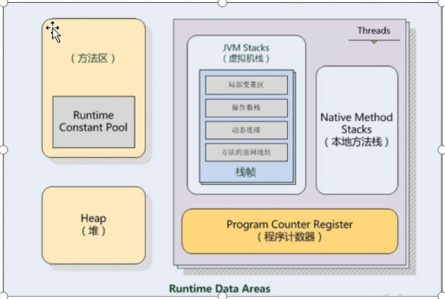

# 什么是Jvm

* 视频：https://www.bilibili.com/video/BV1yE411Z7AP?p=4

> 定义：
>
> java virtual machine - java程序运行环境（java二进制字节码的运行环境）

* jvm是一个规范， 是一个标准
  有很多实现：如 Oracle的hotspot(openjdk)

  

> 好处：

* 一次编写，处处运行；
* 自动内存管理，垃圾回收功能

* 数组下标越界检查

* 多态[jvm内部使用虚拟方法调用机制实现多态]

> 比较

## 路线

# 内存结构

## 程序计数器

program counter register

## 虚拟机栈

jvmStacks

## 本地方法栈

native method stacks

## 堆

heap

## 方法区

