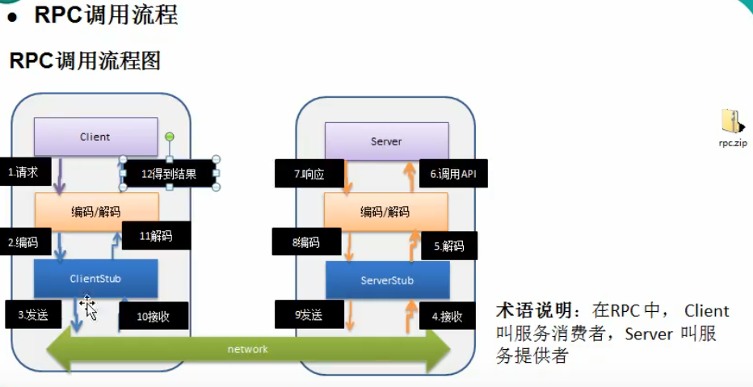

# **<Center>Netty</Center>**

> 异步的基于事件驱动的网络应用框架
>
> 官网：(https://netty.io)


## Netty线程模型

### 线程模型概述

> 当前流行的线程模型

1. 传统阻塞I/O服务模型

   * 特点：

   1. 采用阻塞IO模式获取输入数据
   2. 每个连接都需要独立的线程完成数据的输入，业务处理和是数据返回

   * 问题：不适合处理大并发的场景

   1. 当并发量大，就会创建大量线程，占用很大系统资源
   2. 连接创建后，如果当前线程暂时没有数据可读，该线程就会阻塞在read操作上，造成线程资源浪费

2. Reactor模式

   服务器端程序处理传入的多个请求，并将他们同步分配的到相应的处理线程，因此Reactor模式也叫Dispatcher模式

   Reactor使用I/O复用监听事件，收到事件后，分发给某个线程，这点就是网络服务器高并发的关键 [reactor-handler]

   核心：

   1. Reactor：独立的线程，负责监听和分发事件，
   2. Handler：处理程序执行I/O事件，Reactor通过调度适当的应用程序来响应IO事件，处理程序执行非阻塞小左

   针对传统IO模型的问题Reactor的解决方案：

   1. 基于I/O复用模型：多个连接共用一个阻塞对象，应用程序只需要在一个阻塞对象等待，当连接有数据处理，系统通知应用程序，线程从阻塞状态返回开始工作；
   2. 基于线程池复用线程资源：不必为每个连接创建线程，将连接后的业务处理任务分配给线程进行处理，一个线程也可重复使用处理多个连接业务；

   

   ****

> Reactor模式（根据Reactor的数量和处理资源池线程的数量，有3种典型实现）

* Selector是java网络编程标准api的，SelectableChannel的多路复用器，用于监控SelectableChannel的IO状况；**可实现应用程序通过一个阻塞对象监听多路连接请求**；

1. 单Reactor单线程；（Reactor-Select-Dispatch-Handler(read-dosmthing-send)）

   * 方案说明：Reactor对象通过Select监控客户端请求事件，收到事件后通过Dispatch进行分发；2. 如果是建立连接请求事件，则**由Reactor通过Accept处理连接请求**，然后建立一个Handler对象处理连接完成后的后续业务；3. 如果不是连接事件，则Reactor会分发调用连接对应的Handler响应，**Handler会完成Read->完成业务->Send的完整业务流程**；
   * 特点：NIO.md的群聊功能就是这个模式（1.性能问题：只有一个线程，Handler处理一个连接上的事务时，整个进程无法处理其它业务；2可靠性问题：线程意外终止，或者进入死循环，会导致整个通信不可用）

2. 单Reactor多线程：（Reactor-Select-Dispatch-Acceptor-Handler(read-send)-Workers）

   * 方案说明：1. Reactor通过Select监控客户端请求事件，收到事件后通过Dispatch进行分发，2. 如果是建立连接请求事件，则**由Acceptor通过accept处理连接请求，然后创建一个Handler对象处理完成连接后的其它各种事件；**3. 如果不是连接请求，则由Reactor分发调用那个连接对应的Handler处理，同单线程，**4.handler只负责响应事件，不做具体的业务处理，通过read读取出局后会分发给worker线程池的某个线程；5. worker线程池会分配独立线程完成真正的业务，同时把业务结果返回给handler，6. handler收到结果后通过send返回给client**
   * 特点：handler处理业务是多线程的 充分利用了cpu多喝处理能力，
   * 缺点：单reactor处理所有的事件的监听和响应，仍然是单线程，在高并发场景性能瓶颈问题；2 多线程的同步异步问题；
   * 模型示意图：

   

3. 主从Reactor多线程（MainReactor-Select-Acceptor-(N)[SubReactor-Handler(read-send)]-Workers）

   * 优点：父线程与子线程的数据交互简单职责明确，父线程只需要接收新连接传递给子线程完成后续业务，子线程可以直接监控并返回给client数据，扩展性好(可以根据需要增加subreactor)；充分利用cpu资源最大程度避免多线程及同步问题
   * 方案说明：（一个reactor主线程监听和分发连接事件：多个reactor子线程负责监听其它事件，读数据分配业务处理；worker线程池负责具体业务）
     * Reactor主线程MainReactor对象通过select监听连接事件，收到事件后通过Acceptor处理连接事件
     * 当Acceptor处理连接事件后，MainReactor将连接分配给一个SubReactor
     * subreactor将连接加入到连接队列进行监听(select)，并创建handler处理后续各种事件
     * handler通过read读取数据，分发给后面的worker工作线程池进行业务处理，并返回结果
     * handler收到处理结果通过send将结果返回给client；
     * MainReactor可以对应多个SubReactor

* 
* 

### Netty线程模式

> * Netty线程模式主要基于主从Reactor多线程模型做了改进，其中主从Reactor多线程模型有多个Reactor

#### Netty模型原理-简单版

1.Bootstrap线程创建Selector，只关注Accept；2当接收到Accept事件，接收到对应的SocketChannel，封装成NioSocketChannel并注册到Worker线程，进行维护；3当worker线程监听到seclector中发生事件后，就有handler进行处理（bootstrap-bossgroup[selector-accept]-NioSocketChannel-workergroup[selector-handler]）


Netty模型原理-进阶版

1. 主要基于主从Reactors多线程模型做了改进，其中主从Reactor多线程模型由多个Reactor，即Boss Group和WorkerGroup都有多个；

   

#### Netty模型原理-详细版

（bootstrap-bossgroup[{NioEventLoop{selector-taskqueue}]-NioSocketChannel-workergroup[NioEventLoop{selector-taskqueue}]-Pipeline[handlers]

1. Netty抽象出两组线程池：**BossGroup专门负责接收客户端的连接，WorkerGroup专门负责网络IO的读写**；
2. BossGroup，WorkerGroup他们的类型都是 NioEventLoopGroup，
3. NIOEventLoopGroup含有多个事件循环（含有多个线程），每个事件循环是一个NioEventLoop,
4. NioEventLoop表示一个不断循环的执行处理任务的线程，每个NioEventLoop都有一个selector，用于监听绑定在其上的socket网络通讯，一个TaskQueue|ScheduledTaskQueue
5. 每个Boss NioEventLoop循环执行的步骤3步：
   1. 轮询accept事件
   2. 处理accept事件，与client建立连接，生成NioSocketChannel，并将其注册到Worker 某个NioEventLoop上的selector
   3. 处理任务队列的任务，即runAllTasks
6. 每个Worker NioEventLoop循环执行步骤：
   1. 轮询read，write事件
   2. 处理I/O事件，即read,write事件，在对应的NIOSocketChannel处理
   3. 处理任务队列的任务，即runAllTasks
7. 每个Worker NioEventLoop处理业务时，会使用Pipeline(管道)，pipline种包含了上面注册的channel，即通过pipline可以获取到对应的通道，管道中维护了很多的处理器handler
8. Handle处理具体业务时，如果遇到耗时的处理可以将该业务传递至NioEventLoop的TaskQueue任务队列中
9. 1. NioEventLoopGroup包含多个NioEventLoop
   2. 每个NioEventLoop的selector上可以监听多个NioChannel
   3. 每个NioChannel只会绑定在一个NioEventLoop上
   4. 每个NioChannel都绑定一个自己的ChannelPipeline 

##### Netty-Reactor工作架构图


### Netty入门案例

```
<!-- https://mvnrepository.com/artifact/io.netty/netty-all -->
<dependency>
    <groupId>io.netty</groupId>
    <artifactId>netty-all</artifactId>
    <version>4.1.51.Final</version>
</dependency>
```

```java
public class NettyServer {
    public static void main(String[] args) throws InterruptedException {
        // 创建BossGroup  和WorkerGroup两个线程组
        // Boss Group只处理连接请求，WorkerGroup负责于客户端的业务处理
        // 两者都是不断循环的执行处理任务的线程，
        EventLoopGroup bossGroup = new NioEventLoopGroup(8);// 默认会创建PU核数*2个NioEventLoop线程数，
        EventLoopGroup workerGroup = new NioEventLoopGroup(16);// 默认会创建PU核数*2个NioEventLoop线程数,

        try {
            // 创建服务器端启动的对象，配置参数
            ServerBootstrap serverBootstrap = new ServerBootstrap();
            // 使用链式编程来进行设置，bossgroup 和workergroup
            serverBootstrap.group(bossGroup,workerGroup)
                    .channel(NioServerSocketChannel.class)// bossgroup使用NioServerSocketChannel作为通道实现
                    .option(ChannelOption.SO_BACKLOG,128)// 设置bossgroup线程队列得到连接个数
                    .childOption(ChannelOption.SO_KEEPALIVE,true)// 设置保持活动连接状态
                    // 给workergroup的EventLoop对应的管道设置处理器（可以用netty的也可以自定义）
                    .childHandler(new ChannelInitializer<SocketChannel>() {// 创建一个通道初始化对象（匿名对象）
                        // 给pipeline设置处理器，
                        @Override
                        protected void initChannel(SocketChannel socketChannel) throws Exception {
                            socketChannel.pipeline().addLast(new NettyServerHandler());// 将处理handle加入pipeline
                        }
                    })
                    ;
            System.out.println("服务器已准备好了...");
            // 启动服务器并绑定端口（绑定一个端口并且同步，生成了一个ChannelFuture对象）
            ChannelFuture cf = serverBootstrap.bind(6668).sync();
            cf.addListener(new ChannelFutureListener() {// 绑定端口的监听
                @Override
                public void operationComplete(ChannelFuture channelFuture) throws Exception {
                    if(channelFuture.isSuccess()){
                        System.out.println("监听宽口6668成功");
                    }else{
                        System.out.println("监听宽口6668失败..");
                    }
                    if(cf.isCancelled()){
                        System.out.println("cancelled");
                    }
                }
            });
            // 设置对关闭通道进行侦听（关闭通道的监听）
            cf.channel().closeFuture().sync();
        } finally {
            bossGroup.shutdownGracefully();// 优雅的关闭
        }
    }
}
```

```java
**自定义handler需要继承netty规定的某个Handler适配器,用于将其加入到pipeline
 * 方法：channelRead(读取客户端发送的消息)
 * */
public class NettyServerHandler extends ChannelInboundHandlerAdapter {// 入栈的handler适配器的一个实现
    /**
     * 读取客户端数据
     * <p>
     * @ ChannelHandlerContext ctx 上下文对象，含有管道pipeline，含有管道pipeline和管道channel和地址
     * </p>
     * @ Object msg ： 就是客户端发送的数据，默认Object类型
     */
    @Override
    public void channelRead(ChannelHandlerContext ctx, Object msg) throws Exception {
        System.out.println("服务器读取线程 = "+Thread.currentThread().getName());
        // 将msg转为ByteBuf ,   不是NIO的ByteBuffer
        // 处理方式1. 普通的任务普通处理
        ByteBuf buf = (ByteBuf)msg;
        String info = buf.toString(CharsetUtil.UTF_8);
        //System.out.println("客户端发送的消息是："+ info);
        String remoteAddr = ctx.channel().remoteAddress().toString();
        System.out.println("客户端信息："+ remoteAddr);
        // 处理方式2. 遇到耗时的处理可以将该处理传递至NioEventLoop的TaskQueue任务队列中
        /*ctx.channel().eventLoop().execute(()-> {
            //使用ctx.channel().eventLoop().execute(runnable);将该业务处理加入到EventLoop的eventQueue任务队列
            try {
                Thread.currentThread().sleep(5*1000);// 故意阻塞5s中
            } catch (InterruptedException e) {
                e.printStackTrace();
            }
        });*/

        // 处理方式3. 将定时任务类:事件传递至NioEventLoop的ScheduledTaskQueue任务队列中
        ctx.channel().eventLoop().schedule(()-> {
            System.out.println("3s后执行，开始分发消息：");
        },3L, TimeUnit.SECONDS); // 3秒后执行

        // 处理方式4. 消息分发给其它channel通道
        Iterator<SocketChannel> iterator = NettyServer.socketChannels.iterator();
        while (iterator.hasNext()) {
            SocketChannel channel = iterator.next();
            if(channel.equals(ctx.channel())){// 回复发信人
                // 将数据写入缓冲区并刷新到管道,一般对发送数据进行编码：Unpooled
                System.out.println("回复"+remoteAddr+"： 收到来信！");
                ctx.writeAndFlush(Unpooled.copiedBuffer(" 收到来信，~",CharsetUtil.UTF_8));
            }else {
                channel.eventLoop().execute(()->{// 转发发信人消息
                    System.out.println("消息分发给："+channel.remoteAddress().toString());
                    channel.writeAndFlush(Unpooled.copiedBuffer(remoteAddr+"说话了："+info,CharsetUtil.UTF_8));
                });
            }
        }
        System.out.println("server txt = "+ctx);
    }

    /***
     * 读取数据完毕的处理
     * @param ctx
     * @throws Exception
     */
    @Override
    public void channelReadComplete(ChannelHandlerContext ctx) throws Exception {
        // 将数据写入缓冲区并刷新到管道
        // 一般对发送数据进行编码：Unpooled
        ctx.writeAndFlush(Unpooled.copiedBuffer("hello客户端~",CharsetUtil.UTF_8));
    }

    /**
     * 处理异常：关闭通道
     * @param ctx
     * @param cause
     * @throws Exception
     */
    @Override
    public void exceptionCaught(ChannelHandlerContext ctx, Throwable cause) throws Exception {
        ctx.close();
    }
```

* 客户端

```java
public class NettyClinet {
     public static List<SocketChannel> socketChannels = new ArrayList<>();
    public static void main(String[] args) throws InterruptedException {
        System.out.println(NettyRuntime.availableProcessors());
        // 客户端只需要一个事件循环组
        // 默认会创建PU核数*2个NioEventLoop线程数
        EventLoopGroup eventLoopGroup = new NioEventLoopGroup();
        // 使用Bootstrap创建客户端启动对象，设置相关参数
        Bootstrap bootstrap = new Bootstrap();
        try {
            bootstrap.group(eventLoopGroup)
                    .channel(NioSocketChannel.class)// 设置客户端通道的实现类（反射）
                    .handler(new ChannelInitializer<SocketChannel>() {
                        @Override
                        protected void initChannel(SocketChannel sc) throws Exception {
                            socketChannel.pipeline().addLast(new NettyServerHandler());// 将处理handle加入pipeline
                            socketChannels.add(socketChannel);// 把各个事件通道放入到集合中，便于后续业务操作；如分发消息给其它客户
                        }
                    });
            System.out.println("客户端准备ok");
            // 客户端启动并连接到服务端.sync()刷新
            // 启动服务器并绑定端口（绑定一个端口并且同步，生成了一个ChannelFuture对象）
            ChannelFuture cf = serverBootstrap.bind(6668).sync();
            cf.addListener(new ChannelFutureListener() {
                @Override
                public void operationComplete(ChannelFuture channelFuture) throws Exception {
                    if(cf.isSuccess()){
                        System.out.println("监听端口6668成功");
                    }else{
                        System.out.println("监听端口6668失败..");
                    }
                }
            });
            // 设置idui关闭通道的侦听
            cf.channel().closeFuture().sync();
        } finally {
            eventLoopGroup.shutdownGracefully();
        }
    }
}
```

```java
public class NettyClinetHandle extends ChannelInboundHandlerAdapter {
    // 当通道绑定就会触发
    @Override
    public void channelActive(ChannelHandlerContext ctx) throws Exception {
        System.out.println("Client： "+ctx);
        ctx.writeAndFlush(Unpooled.copiedBuffer("hello 服务器，你好", CharsetUtil.UTF_8));
        super.channelInactive(ctx);
    }

    /**
     * 当通道又读取事件，会触发
     * @param ctx
     * @param msg
     * @throws Exception
     */
    @Override
    public void channelRead(ChannelHandlerContext ctx, Object msg) throws Exception {
        ByteBuf buf = (ByteBuf) msg;
        System.out.println("服务端回复说："+buf.toString(CharsetUtil.UTF_8));
        System.out.println("服务器端地址："+ctx.channel().remoteAddress());
    }

    /**
     * 处理异常：关闭通道
     * @param ctx
     * @param cause
     * @throws Exception
     */
    @Override
    public void exceptionCaught(ChannelHandlerContext ctx, Throwable cause) throws Exception {
        cause.printStackTrace();
        ctx.close();//关闭
    }
}
```


#### TaskQueue自定义任务

> 任务队列的Task有3种典型使用场景

1. 用户自定义的普通任务

   使用ctx.eventLoop().execute(new Runnable(){run(...)});将该业务处理加入到EventLoop的eventQueue任务队列

2. 用户自定义的定时任务

   * 将任务提交到scheduleTaskQueue中

3. 非当前Reactor线程调用Channel的各种方法

   * 如推送类业务，需要根据用户标识，找到**对应的多个channel引用**，然后调用Write类方法向该用户推送消息；最终Write会提交到任务队列中被异步消费；

   1. 服务端将pipeline关联对应SocketChannel时，可以使用一个集合管理SocketChannel；
   2. Handler处理器中推送消息到客户端时，可以将业务加入到各个channel对应的NIOEventLoop的TaskQueue或ScheduledTaskQueue中；
   3. 

   ```java
@Override
public void channelRead(ChannelHandlerContext ctx, Object msg) throws Exception {
    System.out.println("服务器读取线程 = "+Thread.currentThread().getName());
    // 将msg转为ByteBuf ,   不是NIO的ByteBuffer
    // 0. 普通的任务普通处理
    ByteBuf buf = (ByteBuf)msg;
    String info = buf.toString(CharsetUtil.UTF_8);
    System.out.println("客户端发送的消息是："+ info);
    String remoteAddr = ctx.channel().remoteAddress().toString();
    System.out.println("客户端信息："+ remoteAddr);
    // 1. 遇到耗时的处理可以将该处理传递至NioEventLoop的TaskQueue任务队列中
    /*ctx.channel().eventLoop().execute(()-> {
               //使用ctx.channel().eventLoop().execute(runnable);将该业务处理加入到EventLoop的eventQueue任务队列
               try {
                   Thread.currentThread().sleep(5*1000);// 故意阻塞5s中
               } catch (InterruptedException e) {
                   e.printStackTrace();
               }
           });*/

    // 2. 将定时任务类事件传递至NioEventLoop的ScheduledTaskQueue任务队列中
    ctx.channel().eventLoop().schedule(()-> {
        System.out.println("3s后执行，开始分发消息：");
    },3L, TimeUnit.SECONDS); // 3秒后执行

    // 3. 消息分发给其它channel通道
    Iterator<SocketChannel> iterator = NettyServer.socketChannels.iterator();
    while (iterator.hasNext()) {
        SocketChannel channel = iterator.next();
        if(channel.equals(ctx.channel())){// 回复发信人
            // 将数据写入缓冲区并刷新到管道,一般对发送数据进行编码：Unpooled
            System.out.println("回复"+remoteAddr+"： 收到来信！");
            ctx.writeAndFlush(Unpooled.copiedBuffer(" 收到来信，~",CharsetUtil.UTF_8));
        }else {
            channel.eventLoop().execute(()->{// 转发发信人消息
                System.out.println("消息分发给："+channel.remoteAddress().toString());
                channel.writeAndFlush(Unpooled.copiedBuffer(remoteAddr+"说话了："+info,CharsetUtil.UTF_8));
            });
        }
    }
    System.out.println("server txt = "+ctx);
}
   ```

## 异步模型

* Netty中的I/O操作都是异步的，包括：Bind，Write，Connect等操作都会返回一个ChannelFuture；调用者并不能立刻得到结果，而是通过Future-Listener机制，可以主动获取或通过通知机制获得IO操作的结果；
* 所以：Netty的异步模型是建立在future和callback回调之上的，Future的核心思想是：对于非常耗时的方法(如命名为fun())，不需要等待fun()的结果而是立马返回一个Future，后续通过Future去监控fun()的处理过程(即：Future-Listener机制)
* 

#### ChannelFuture接口

通过该接口我们可以添加监听器，当监听事件发生时就可以通知到监听器处理；在handler处理中可以使用callback或者future实现异步；

####  Future-Listener机制

1）当Future对象刚创建时处于非完成状态，调用者可以通过返回的ChannelFuture来获取操作执行的状态，注册监听函数来执行完成后的操作；

2）ChannelFuture的状态操作如下：

1. isDone():判断当前操作是否完成
2. isSuccess():已完成的当前操作是否成功
3. getCause():获取已完成操作的失败原因
4. isCancelled():判断已完成操作是否被取消
5. **addListener() ：注册监听器，当操作已完成isDone()，就会通知监听器；**

## Http服务简单实例

* 服务启动类

```java
public class HttpServerDemo {
    public static void main(String[] args) {
        EventLoopGroup bossGroup = new NioEventLoopGroup(1);
        EventLoopGroup workerGroup = new NioEventLoopGroup(5);

        // 创建服务器端启动的对象，配置参数
        ServerBootstrap serverBoot = new ServerBootstrap();
        try {
            serverBoot.group(bossGroup,workerGroup)// 设置父级和子级EventLoopGroup
                    .channel(NioServerSocketChannel.class)// 指定将来的实现类型
                    .childHandler(new HttpServerInitializer()) // 给workergroup的EventLoop对应的管道设置处理器（可以用netty的也可以自定义）
            ;
            // 启动绑定端口，异步处理
            ChannelFuture channelFuture = serverBoot.bind(9666).sync();// 异步处理
            channelFuture.channel().closeFuture().sync();// 监听关闭通道
        } catch (InterruptedException e) {
            e.printStackTrace();

        }finally {
            workerGroup.shutdownGracefully();
            bossGroup.shutdownGracefully();
        }
    }
}
```
* 初始化管道处理器-《Channel注册成功时会调用》
```java
public class HttpServerInitializer extends ChannelInitializer<SocketChannel> {

    /**
     * Channel注册成功时会调用,向管道中加入处理器
     * @param socketChannel
     * @throws Exception
     */
    @Override
    protected void initChannel(SocketChannel socketChannel) throws Exception {
        /** *Channel注册成功时会调用,向管道中加入处理器*/
        /* 得到管道 */
        ChannelPipeline pipeline = socketChannel.pipeline();
        // 加入一个netty提供的httpServerCodec (codec=coder+decoder)
        // 1. HttpServerCodec是netty提供的处理http的编码解码器；
        pipeline.addLast("MyHttpServerCodec",new HttpServerCodec());
        // 2. 增加一个自定义的handler到管道
        pipeline.addLast("MyTestHttpServerHandler",new HttpServerHandler());
    }
}
```

* 向管道中加入处理器《向浏览器响应》

```java
/**
 * 1. SimpleChannelInboundHandler是ChannelInboundHandlerAdapter的一个子类
 * 2. HttpObject 客户端和服务端互相通信的数据被封装成HttpObject
 */
public class HttpServerHandler extends SimpleChannelInboundHandler<HttpObject> {
    private AtomicInteger ai  = new AtomicInteger(0);
    @Override
    protected void channelRead0(ChannelHandlerContext ctx, HttpObject msg) throws Exception {
        System.out.println("服务器读取线程 = "+Thread.currentThread().getName());
        // msg是否httprequest请求
        if (msg instanceof HttpRequest) {
            Channel channel = ctx.channel();
            System.out.println(this.hashCode()+"----"+channel.hashCode()+"--------"+ctx.pipeline().hashCode()+" --------------- "+ctx.channel().pipeline().hashCode());
            // 获取request的uri|过滤客户端请求连接
            HttpRequest httpRequest = (HttpRequest) msg;
            URI uri = new URI(httpRequest.uri());
            int reqtimes = ai.incrementAndGet();
            System.out.println(reqtimes+" \t -- > 请求地址："+uri.getPath());
            if ("/favicon.ico".equalsIgnoreCase(uri.getPath())) {
                System.out.println("静态资源：/favicon.icon 不做处理！");
                return;
            }
            // 得到客户端IP地址
            SocketAddress socketAddress = channel.remoteAddress();
            System.out.println("客户端的地址是"+socketAddress.toString());

            System.out.println("msg 类型是："+msg.getClass());
            // 回复信息给浏览器[Http协议]
            ByteBuf contentBuf = Unpooled.copiedBuffer("Hello 我是服务器", CharsetUtil.UTF_8);
            // 构造一个HTTP的响应，即HttpResponse  // 设置响应头
            FullHttpResponse fullHttpResponse = new DefaultFullHttpResponse(HttpVersion.HTTP_1_1, HttpResponseStatus.OK, contentBuf);
            fullHttpResponse.headers().set(HttpHeaderNames.CONTENT_TYPE,"text/plain;charset=utf-8").set(HttpHeaderNames.CONTENT_LENGTH,contentBuf.readableBytes());
            // 将构建好的response返回
            ctx.writeAndFlush(fullHttpResponse);
        }
    }
}
```

* 测试访问浏览器

```sh
http://localhost:9666/
```

## Netty核心组件	Api

### Bootstrap与ServerBootstrap

* Bootstrap意为引导，一个Netty应用程序通常由一个Bootstrap开始，主要作用是配置整个Netty程序，串联各个组件；
* Netty中Bootstrap是客户端程序的启动引导类，ServerBootstrap是服务端启动引导类；

#### 常见方法

* public ServerBootstrap group(EventLoopGroup bossGroup,EventLoopGroup workergroup): 

  该方法用于服务器端，用来设置两个EventLoopGroup

* public B group(EventLoopGroup group) 

  设置客户端的EventLoopGroup

* public B channel(Class<? extends C> channelClass)

  设置服务器端或客户端的实现通道

* public <T> B option(ChannelOption<T> option, T value)

  给ServerChannel添加配置

* public <T> ServerBootstrap childOption(ChannelOption<T> childOption, T value)

  用来给workergroup中接收到的通道添加配置

* ServerBootstrap childHandler(ChannelHandler childHandler)

  给workergroup创建一个通道初始化对象（匿名对象）

* ChannelFuture bind(int inetPort) 

  服务端绑定端口

* public ChannelFuture connect(String inetHost, int inetPort)

  客户端用来连接服务器的连接方法

### Future和ChannelFuture

#### 常见方法

> Netty中所有操作都是异步的，通过Future和ChannelFuture注册监听，当操作完成时自动触发监听事件；

* addListener(GenericFutureListener<? extends Future<? super Void>> listener)

  增加当前事件的future的监听器，当future完成时触发

* Channel channel()

  返回一个当前正在进行的I/O的通道channel对象

* ChannelFuture sync()

  等待异步操作执行完毕

```java
ChannelFuture cf = serverBootstrap.bind(6668).sync();
cf.addListener(new ChannelFutureListener() {
    @Override
    public void operationComplete(ChannelFuture channelFuture) throws Exception {
        if(channelFuture.isSuccess()){
            System.out.println("监听端口6668成功");
        }else{
            System.out.println("监听端口6668失败..");
        }
    }
});
// 设置对关闭通道进行侦听（关闭通道的监听）
cf.channel().closeFuture().sync();
```

### Channel

1. Netty网络通信的的核心组件，执行网络IO的操作

2. 获得当前网络连接的通道状态 `ctx.channel().isActive()`

3. 获得网络连接的配置参数

   ```java
   Map<ChannelOption<?>, Object> options = channel.config().getOptions();
   ```

4. **Channel提供异步的IO操作(建立连接，读写，绑定端口)，异步调用返回一个ChannelFuture，通过注册监听器到ChannelFuture上；处理完成回调**

#### 常用的Channel类型

> 不同协议，不同的阻塞类型的连接都有不同的Channel类对应，常用的Channel类型： 

* NioSocketChannel

  异步的客户端TcpSocket连接

* NioServerSocketChannel

  异步的服务端TcpSocket连接

* NioDiagramChannel

  异步的UDP连接

* NioSctpChannel

  异步的客户端Sctp连接

* NioSctpServerChannel

  异步的服务端Sctp连接，这些链接涵盖了UDP和Tcp网络IO以及文件IO

### Selector

当向一个Selector注册Channel后，Selector内部机制会自动不断的查询这些注册的Channel的I/O事件(读写，网络连接等) 从而事件驱动


### ChannelHandler及实现

是处理I/O事件或拦截I/O操作，并将其转发到它的ChannelPipeline(业务处理链)中的下一个处理程序

```java
interface ChannelHandler
    |-- ChannelOutboundHandler <interface> // 入站的IO操作
    		|-- ChannelOutboundHandlerAdapter <class>
    |-- ChannelInboundHandler <interface> // 出站的IO操作
            |-- ChannelInboundHandlerAdapter <class>
    |-- ChannelHandlerAdapter <class>
    		|-- ChannelOutboundHandlerAdapter <class>
    		|-- ChannelInboundHandlerAdapter <class>
```

### Pipeline,ChannelPipeline

ChannelPipeline是一个Handle的集合(双向链表)，负责处理和拦截inbound或者outbound的事件和操作，相当于一个贯穿Netty的链；用于处理和拦截Channel的入站和出战操作，以及各handler之间的交互

* pipiline双向链表既保存了InBoundHandler也保存了OutBoundHandler，每个Handler有一个标识位区分是哪一种Handler

* **pipeline元素的真正类型是ChannelContext，ChannelContext包装了Handler，因此可以认为Pipeline元素是Handler**

```java
 // Inserts ChannelHandlers at the last position of this pipeline.
ChannelPipeline addLast(ChannelHandler... handlers);
 // Inserts ChannelHandlers at the first position of this pipeline.
ChannelPipeline addFirst(ChannelHandler... handlers);
```

### ChannelHandlerContext

> 保存Channel相关的所有上下文信息，同时关联一个具体的事件处理器ChannelHandler对象，及其对应的pipeline和Channel信息

常用方法

* ChannelFuture close()； 关闭通道
* ChannelOutboundInvoker flush(); 刷新
* ChannelFuture wrieAndFlush(Object msg)；将数据刷新到ChannelPipeline中当前ChannelHandler的下一个Handler开始处理

### ChannelOptions

> 给Netty创建的Channel实例设置相关参数

> 配置参数

* ChannelOption.SO_BACKLOG

  用来**初始化服务器可处理的连接数队列大小**；对应TCP/IP协议listen函数中的backlog参数；

  服务端处理客户端连接请求是顺序执行的，所以**同一时间只能处理一个客户端连接，多个客户端连接时，服务端将不能及时处理的连接请求放到队列中等待处理，backlog参数指定队列大小**

* ChannelOption.SO_KEEPALIVE

  一直保持活动连接状态

### EventLoopGroup及其实现类NioEventLoopGroup

* EventLoopGroup是一组EventLoop的抽象对象，Netty中为了更好利用CPU资源，一般会有多个EventLoop同时工作，**每个EventLoop维护者一个Selector实例**
* EventLoopGroup提供next()，可以从组里按照一定规则获取其中一个EventLoop来执行任务，Nett服务器端编程中通常提供两个EventLoopGroup如BossEventLoopGroup和WorkerEventLoopGroup
* 通常一个服务端口即一个ServerSocketChannel对应一个selector和一个EventLoop线程；BossEventLoop负责接受客户端的连接并将SocketChannel交给workerEventLoopGroup由next来选择一个EventLoop将这个SocketChannel注册到维护的Selector并处理其后续IO事件；


### Unpooled

Netty中专门用于操作缓冲区的工具类

> 常用方法：

1）Unpooled关于ByteBuf的一般使用

* [0~~readerIndex)		已读区域
* [readerIndex~~writerIndex)	可读区域
* [writerIndex~~capacity)     可写区域

示例：

```java
ByteBuf buffer = Unpooled.buffer(10);
// 声明一个包含10个字节数组array的ByteBuf对象
// 属性：
//    capacity=10；
//    readerIndex=0；读角标
//    writerIndex=0；写角标
```

2）常用方法：ByteBuf Unpooled.copiedBuffer

```java
// 将指定数据放入缓冲区，返回ByteBuf对象
public static ByteBuf copiedBuffer(CharSequence string, Charset charset) {}

public static void main(String[] args) {
    ByteBuf buf = Unpooled.copiedBuffer("Hello和Netty和", CharsetUtil.UTF_8);
    System.out.println(buf);
    System.out.println("-----------------------");
    logger.info("buf包含的字节数={}",buf.capacity());
    logger.info("可读字节数:buf.readableBytes={}",buf.readableBytes());
    logger.info("当前读索引:buf.readerIndex={}",buf.readerIndex());
    logger.info("当前写索引:buf.writerIndex={}",buf.writerIndex());
    logger.info("有字节数组？:buf.hasArray={}",buf.hasArray());
    logger.info(":buf.arrayOffset={}",buf.arrayOffset());
    logger.info("读取指定长度的字符(不改变读索引):buf.getCharSequence={}",buf.getCharSequence(0,8,CharsetUtil.UTF_8));
    logger.info("可读索引:buf.readerIndex={}",buf.readerIndex());
    byte[] dst = new byte[buf.readableBytes()];
    buf.readBytes(dst);
    logger.info("读取数据：buf.readBytes(dst)={}",new String(dst,0,dst.length));
    logger.info("可读字节数:buf.readableBytes={}",buf.readableBytes());
    logger.info("当前读索引:buf.readerIndex={}",buf.readerIndex());// 读索引改变
    logger.info("当前写索引:buf.writerIndex={}",buf.writerIndex());
    logger.info(":buf.arrayOffset={}",buf.arrayOffset());
}
```


## Netty群聊系统

> 多人群聊：非阻塞
>
> 服务器端：负责监测用户上线，离线，并实现消息转发
>
> 客户端：群发消息，单发收消息

> 服务端分发控制消息

```java
public class GroupChatServer {
    private int port ;

    public GroupChatServer(int port) {
        this.port = port;
    }

    public void run() throws InterruptedException {
        EventLoopGroup bossLoopGroup = new NioEventLoopGroup(2);
        EventLoopGroup workLoopGroup = new NioEventLoopGroup(5);
        try {
            ServerBootstrap serverBootstrap = new ServerBootstrap();
            serverBootstrap.group(bossLoopGroup,workLoopGroup).channel(NioServerSocketChannel.class)
                    .handler(new LoggingHandler(LogLevel.INFO))// boss增加netty日志处理器
                    .option(ChannelOption.SO_BACKLOG,128)
                .childOption(ChannelOption.SO_KEEPALIVE,true).childHandler(new ChannelInitializer<SocketChannel>(){
                @Override
                protected void initChannel(SocketChannel ch) throws Exception {
                    ch.pipeline().addLast("encoder", new StringEncoder());
                    ch.pipeline().addLast("decoder", new StringDecoder());
                    ch.pipeline().addLast("myChatServerHandle",new GroupChatServerHandler());
                    /**
                     * 监测空闲状态的处理器:IdleStateHandler
                     * 参数：
                     * 1. readerIdleTime: 检测读空闲的时间单元(s/ms)：表示多长时间没有读 就会发送心跳检测包检测是否连接
                     * 1. writerIdleTime: 检测写空闲的时间单元(s/ms)：表示多长时间没有写 就会发送心跳检测包检测是否连接
                     * 1. allIdleTime: 检测读和写空闲的时间单元(s/ms)：表示多长时间没有读也没有写 就会发送心跳检测包检测是否连接
                     * 2. 当IdleStateEvent触发后，就会传递给管道的下一个handler去处理，
                     *      通过调用下一个handler的userEventTrigger，在该方法中处理IdleStateEvent(空闲处理)
                     */
                    ch.pipeline().addLast(new IdleStateHandler(5,7,10, TimeUnit.SECONDS));
                    /**读写空闲处理*/
                    ch.pipeline().addLast("myChatServerIdleStateHandler",new GroupChatServerIdleStateHandler());
                }
            })
            ;
            System.out.println("NettyChat服务器启动~~~");
            ChannelFuture channelFuture = serverBootstrap.bind(port).sync();
            // 监听关闭
            channelFuture.channel().closeFuture().sync();
        } finally {
            bossLoopGroup.shutdownGracefully();
            workLoopGroup.shutdownGracefully();
        }
    }

    public static void main(String[] args) {
        try {
            new GroupChatServer(8888).run();
        } catch (InterruptedException e) {
            e.printStackTrace();
        }
    }
}
```

> 服务端消息处理handler

```java
public class GroupChatServerHandler extends SimpleChannelInboundHandler<String> {
    DateTimeFormatter dateTimeFormatter = DateTimeFormatter.ofPattern("yyyy-MM-dd HH:mm:ss");
    // 存储所有Channel
    static ChannelGroup channelGroup = new DefaultChannelGroup(GlobalEventExecutor.INSTANCE);

    /**1.*/
    @Override
    public void handlerAdded(ChannelHandlerContext ctx) throws Exception {
        String now = LocalDateTime.now().format(dateTimeFormatter);
        String remoteAddr = ctx.channel().remoteAddress().toString().substring(1);
        System.out.println(String.format("[%s]---->【客户端】%s加入聊天",now,remoteAddr));
        // 将该客户加入聊天信息并推送上线消息给其它客户端
        channelGroup.writeAndFlush(String.format("【客户端】%s加入聊天\n",remoteAddr));// 发送给所管理的所有channel
        channelGroup.add(ctx.channel());
    }

    /**2.*/
    @Override
    public void channelRegistered(ChannelHandlerContext ctx) throws Exception {
        String now = LocalDateTime.now().format(dateTimeFormatter);
        String remoteAddr = ctx.channel().remoteAddress().toString().substring(1);
        System.out.println(String.format("[%s]---->【客户端】%sRegistered", now, remoteAddr));
    }

    /**3.
     * channel处于活动状态，提示xx上线了
     * @param ctx
     * @throws Exception
     */
    @Override
    public void channelActive(ChannelHandlerContext ctx) throws Exception {
        String now = LocalDateTime.now().format(dateTimeFormatter);
        String remoteAddr = ctx.channel().remoteAddress().toString().substring(1);
        System.out.println(String.format("[%s]---->【客户端】%s上线了",now,remoteAddr));
    }

    /**channel处于不活动状态，提示xx离线了**/
    @Override
    public void channelInactive(ChannelHandlerContext ctx) throws Exception {
        String now = LocalDateTime.now().format(dateTimeFormatter);
        String remoteAddr = ctx.channel().remoteAddress().toString().substring(1);
        System.out.println(String.format("[%s]---->【客户端】%s离线了",now,remoteAddr));
    }

    /**断开连接触发**/
    @Override
    public void handlerRemoved(ChannelHandlerContext ctx) throws Exception {
        String now = LocalDateTime.now().format(dateTimeFormatter);
        String remoteAddr = ctx.channel().remoteAddress().toString().substring(1);
        System.out.println(String.format("[%s]---->【客户端】%s下线了",now,remoteAddr));
        //channelGroup.remove();// 会自动从channelGroupp移除，此处不处理
        channelGroup.writeAndFlush(String.format("【客户端】%s下线了",remoteAddr));
    }


    /**读取消息*/
    @Override
    protected void channelRead0(ChannelHandlerContext ctx, String msg) throws Exception {
        String now = LocalDateTime.now().format(dateTimeFormatter);
        Channel channel = ctx.channel();
        String remoteAddr = channel.remoteAddress().toString().substring(1);
        System.out.println(String.format("[%s]---->【客户端】%s的消息：%s",now,remoteAddr,msg));
        // 分发消息，排除自己
        channelGroup.forEach(ch ->{
            if (channel!=ch) {
                ch.eventLoop().execute(()->{// 转发发信人消息给ch（异步任务>将转发任务发给eventloop的taskQueeu）
                    System.out.println(String.format("[%s]---->消息分发给：%s",now,ch.remoteAddress().toString().substring(1)));
                    ch.writeAndFlush(Unpooled.copiedBuffer(String.format("【客户端】%s的消息：%s",remoteAddr,msg), CharsetUtil.UTF_8));
                });
            }else {
                ch.writeAndFlush("【服务端】您的消息发送成功");
            }
        });
    }

    @Override
    public void channelReadComplete(ChannelHandlerContext ctx) throws Exception {
        super.channelReadComplete(ctx);
        ctx.flush();
    }

    @Override
    public void exceptionCaught(ChannelHandlerContext ctx, Throwable cause) throws Exception {
        // 关闭通道
        ctx.close();
        //cause.printStackTrace();
        System.err.println("channel关闭");
    }
}
```

> 客户端发送消息

```java
public class GroupChatClient {
    private static int serverPort = 8888;
    private static String serverHost = "127.0.0.1";

    public GroupChatClient(String serverHost,int serverPort) {
        this.serverHost=serverHost;
        this.serverPort = serverPort;
    }

    public void run() throws InterruptedException {
        EventLoopGroup bossLoopGroup = new NioEventLoopGroup(2);
        try {
            Bootstrap bootstrap = new Bootstrap();
            bootstrap.group(bossLoopGroup).channel(NioSocketChannel.class)//.option(ChannelOption.SO_KEEPALIVE,true)
                .handler(new ChannelInitializer<SocketChannel>(){
                @Override
                protected void initChannel(SocketChannel ch) throws Exception {
                    ch.pipeline().addLast("encoder", new StringEncoder());
                    ch.pipeline().addLast("decoder", new StringDecoder());
                    ch.pipeline().addLast("myChatClientHandle",new GroupChatClientHandle());
                }
            })
            ;
            System.out.println("NettyChat客户上限~~~");
            ChannelFuture channelFuture = bootstrap.connect(new InetSocketAddress(serverHost,serverPort)).sync();
            // 监听关闭
            Channel channel = channelFuture.channel();
            Scanner scanner = new Scanner(System.in);
            while (scanner.hasNextLine()){
                String msg = scanner.nextLine();
                if(msg!=null&&msg.trim().length()>0){
                    channel.writeAndFlush(msg.trim());
                }
            }
            channel.closeFuture().sync();
        } finally {
            bossLoopGroup.shutdownGracefully();
        }
    }

    public static void main(String[] args) {
        try {
            new GroupChatClient(serverHost,serverPort).run();
        } catch (InterruptedException e) {
            e.printStackTrace();
        }
    }

}
```

> 客户端消息事件处理器

```java
public class GroupChatClientHandle extends SimpleChannelInboundHandler<String> {
    DateTimeFormatter dateTimeFormatter = DateTimeFormatter.ofPattern("yyyy-MM-dd HH:mm:ss");
    @Override
    protected void channelRead0(ChannelHandlerContext ctx, String msg) throws Exception {
        String now = LocalDateTime.now().format(dateTimeFormatter);
        String remoteAddr = ctx.channel().remoteAddress().toString().substring(1);
        System.out.println(String.format("[%s]---->%s",now,msg));
    }
}
```


## Netty心跳机制

> 简单的Netty心跳监测机制案例：需求：
>
> 1. 当服务器超过3秒没有读时，就提示读空闲
> 2. 当服务器超过5秒没有写时，就提示写空闲
> 3. 当服务器超过7秒没有读或写时，就提示读写空闲

* Netty内置实现了空闲事件状态处理器 IdleStateHandler

```java
/**
  * 监测空闲状态的处理器:IdleStateHandler
  * 参数：
  * 1. readerIdleTime: 检测读空闲的时间单元(s/ms)：表示多长时间没有读 就会发送心跳检测包检测是否连接
  * 1. writerIdleTime: 检测写空闲的时间单元(s/ms)：表示多长时间没有写 就会发送心跳检测包检测是否连接
  * 1. allIdleTime: 检测读和写空闲的时间单元(s/ms)：表示多长时间没有读也没有写 就会发送心跳检测包检测是否连接
  * 2. 当IdleStateEvent触发后，就会传递给管道的下一个handler去处理，
  *      通过调用下一个handler的userEventTrigger，在该方法中处理IdleStateEvent(空闲处理)
  */
ch.pipeline().addLast(new IdleStateHandler(5,7,10, TimeUnit.SECONDS));
/**读写空闲处理器*/
ch.pipeline().addLast("myChatServerIdleStateHandler",new GroupChatServerIdleStateHandler());
```

```java
/** <p>心跳检测机制<p/>* 群聊的服务状态监测*/
public class GroupChatServerIdleStateHandler extends ChannelInboundHandlerAdapter {
    @Override
    public void userEventTriggered(ChannelHandlerContext ctx, Object evt) throws Exception {
        Channel channel = ctx.channel();
        String remoteAddress = channel.remoteAddress().toString().substring(1);
        if (evt instanceof IdleStateEvent) {// 空闲状态事件
            IdleStateEvent idleStateEvent = (IdleStateEvent) evt;
            switch (idleStateEvent.state()){
                case READER_IDLE: // 发生了读空闲
                    System.out.println(remoteAddress+"发生了读空闲");
                    break;
                case WRITER_IDLE: // 发生了写空闲
                    System.out.println(remoteAddress+"发生了写空闲");
                    break;
                case ALL_IDLE: // 发生了读写空闲
                    System.out.println(remoteAddress+"发生了读写空闲");
                    break;
                default:
                    break;
            }
        }
    }
}
```


## WebSocket长连接实现

> WebSocket实例实现特点：
>
> 基于WebSocket的长连接全双工的交互，改变Http每次请求都要重新建立连接的约束，**实现长连接**；
>
> **服务器可以发送消息给客户端**
>
> **客户端和服务器端会相互感知**，比如客户端浏览器关闭了服务器端会感知，反之服务器关闭了，客户端浏览器会感知；

* 服务端

```java
public class MyWebSocketServer {
    private int port;

    public MyWebSocketServer(int port) {
        this.port = port;
    }

    public void run(){
        EventLoopGroup bossLoop = new NioEventLoopGroup(2);
        EventLoopGroup workerLoop = new NioEventLoopGroup(5);

        try {
            ServerBootstrap serverBootstrap = new ServerBootstrap();
            serverBootstrap.group(bossLoop,workerLoop).channel(NioServerSocketChannel.class).handler(new LoggingHandler(LogLevel.INFO))
            .childHandler(new ChannelInitializer<SocketChannel>() {
                @Override
                protected void initChannel(SocketChannel ch) throws Exception {
                    ChannelPipeline pipeline = ch.pipeline();
                    // 基于http协议的websocket；使用http的编解码器
                    pipeline.addLast(new HttpServerCodec());
                    // 是以块的方式处理：添加处理器ChunkedWriteHandler
                    pipeline.addLast(new ChunkedWriteHandler());
                    /**
                     * 1. http传输数据过程中是分段的,所以需要HttpObjectAggregator将多个段聚合(在一个处理器)
                     * 2. （这就是why当浏览器发送大量数据时，就会发送多次http请求的原因）
                     */
                    pipeline.addLast(new HttpObjectAggregator(65536));
                    //pipeline.addLast(new WebSocketServerCompressionHandler());// 干啥的????
                    /**
                     * 1. websocket的数据是以帧(frame)的形式传输
                     * 2. WebSocketFrame有六大子类
                     * 3. 浏览器请求时 ws://localhost:8888/hello 表示请求的uri对应为/hello
                     * 4. WebSocketServerProtocolHandler 核心功能是将http协议升级为ws协议，保持长连接
                     * 4.1  通过状态码状态码101升级为ws协议（wss协议是带ssl的请求）
                     */
                    // 对应地址 ws://localhost:8889/hello
                    pipeline.addLast(new WebSocketServerProtocolHandler("/hello",null,true));

                    // 自定义handler，处理业务
                    pipeline.addLast(new MyTextWebSocketFrameHandler());
                }
            })
            ;

            ChannelFuture channelFuture = serverBootstrap.bind("127.0.0.1",this.port).sync();
            channelFuture.channel().closeFuture().sync();
        } catch (InterruptedException e) {
            e.printStackTrace();
        }
        finally {
            bossLoop.shutdownGracefully();
            workerLoop.shutdownGracefully();
        }
    }

    public static void main(String[] args) {
        MyWebSocketServer webSocketServer = new MyWebSocketServer(8889);
        webSocketServer.run();
    }
}
```

* 服务端处理器

```java
/***
 * TextWebSocketFrame表示一个文本帧(text frame)
 */
public class MyTextWebSocketFrameHandler extends SimpleChannelInboundHandler<TextWebSocketFrame> {
    static DateTimeFormatter format = DateTimeFormatter.ofPattern("yyyy-MM-dd HH:mm:ss");
    @Override
    protected void channelRead0(ChannelHandlerContext ctx, TextWebSocketFrame msg) throws Exception {
        String now = LocalDateTime.now().format(format);
        System.out.println(String.format("[服务器时间：%s]--> %s",now,msg.text()));
        Channel channel = ctx.channel();
        // 回复客户端浏览器
        channel.writeAndFlush(new TextWebSocketFrame(String.format("[服务器时间：%s]--> %s",now,msg.text().toUpperCase(Locale.CHINA))));
    }

    @Override
    public void handlerAdded(ChannelHandlerContext ctx) throws Exception {
        String now = LocalDateTime.now().format(format);
        Channel channel = ctx.channel();
        System.out.println(String.format("[handlerAdded被调用,当前channel的ID=%s]",channel.id().asLongText()));
    }
    @Override
    public void handlerRemoved(ChannelHandlerContext ctx) throws Exception {
        String now = LocalDateTime.now().format(format);
        Channel channel = ctx.channel();
        System.out.println(String.format("[handlerRemoved被调用,当前channel的ID=%s]",channel.id().asLongText()));
    }

    @Override
    public void exceptionCaught(ChannelHandlerContext ctx, Throwable cause) throws Exception {
        System.out.println(String.format("[异常发生,%s,关闭通道。。",cause.getMessage()));
        ctx.close();
    }
}
```

* 客户端浏览器

```html
<!DOCTYPE html>
<html lang="en">
    <head>
        <meta charset="UTF-8">
        <meta name="viewport" content="width=device-width, initial-scale=1.0">
        <title>netty-websocket</title>
        <script src="dist/vue.js"></script>
    </head>
    <body>
       
        <div class="container" id="app" >
            <div>
                <h1>Netty-WebSocket客户端</h1>
                <p>
                    <textarea  v-model="mytext" style="height: 300px;width: 300px;">sdaf</textarea>
                    <input type="button" @click="sendData" value="发送数据" />
                    <textarea v-model="restext" style="height: 300px;width: 300px;">sdaf</textarea>
                    <input type="button" @click="clearData" value="清空数据" />
                </p>
            </div>
            
        </div>
    </body>
    
    <script type="text/javascript">
        var app = new Vue({
            el: '#app',
            data() {
                return {
                    mytext:"a",
                    restext:"",
                    websocketPath: 'ws://127.0.0.1:8889/hello',
                    socket:""
                }
            },
            mounted () {
                // 初始化
                this.init();
            },
            methods:{
                init:function(){
                    if(!typeof(WebSocket)){
                        alert("您的浏览器不支持WebSocket!");
                    }else{
                        this.socket = new WebSocket(this.websocketPath);
                        // 监听socket连接：
                        this.socket.onopen = this.open;
                        // 监听socket服务端消息
                        this.socket.onmessage = this.message;
                        // 监听socket关闭连接
                        this.socket.onclose = this.close;
                        // 监听socket错误信息
                        this.socket.onerror = this.error;
                    }
                },
                // 发送消息到服务器
                sendData:function(){
                    if(this.socket){
                        if(this.socket.readyState==WebSocket.OPEN){
                            // 发送消息
                            this.socket.send(this.mytext);
                        }else{
                            console.info("连接未开启");
                        }
                    }
                },
                clearData:function(){
                    this.restext='';
                },
                open(ev){
                    // 连接开启
                    this.restext="连接开启\n";
                    console.info(this.restext);
                },
                message(ev){
                    // 获取服务端信息
                    console.info(ev.data);
                    this.restext+=ev.data+"\n";
                },
                close(){
                    this.restext+="连接关闭\n";
                    console.info(this.restext);
                },
                error(){
                    this.restext+="连接异常\n";
                    console.info(this.restext);
                }
            },
            destroyed () {
                // 销毁监听
                this.socket.onclose = this.close
            }
        })
        //const axios = require('axios');
        // Make a request for a user with a given ID
    </script>
</html>
```

## 编解码器

### 为什么需要编解码器

* 网络应用中，**数据在网络中传输的都是二进制字节码数据**，在发送时就需要编码，接收数据时就需要解码

### Netty一些自带的编解码器(Codec)

1. HttpServerCodec是netty提供的处理http的编码解码器；

     ```java
   pipeline.addLast("MyHttpServerCodec",new HttpServerCodec());
   ```

2. StringEncoder||StringDecoder 对字符串数据进行编解码

   ```java
   ch.pipeline().addLast("encoder", new StringEncoder());
   ch.pipeline().addLast("decoder", new StringDecoder());
   ```

3. ObjectEncoder 对java对象进行编码解码

   ```java
   ch.pipeline().addLast("encoder", new ObjectEncoder());
   ch.pipeline().addLast("decoder", new ObjectDecoder());
   ```

* 缺点：

1. 如：ObjectEncoder 使用java的序列化技术，效率不高，无法跨语言，序列化后提价大，性能低

* 解决：Google的Protobuf


### Google ProtoBuf

> Protobuf 全称是 Google Protocol Buffers，
>
> **1.protobuf简介**
>
> 　　Protobuf是一个灵活的、高效的用于序列化数据的协议。相比较XML和JSON格式，protobuf更小、更快、更便捷。Protobuf是跨语言的，并且自带了一个编译器(protoc)，只需要用它进行编译，可以编译成Java、python、C++等代码，然后就可以直接使用，不需要再写其他代码，自带有解析的代码。一条消息数据，用protobuf序列化后的大小是json的10分之一，xml格式的20分之一，是二进制序列化的10分之一。

1. Protobuf是Google发布的开源项目，全称Google Protocol Buffers，是一种轻便高效的结构化数据存储格式，可用于结构化数据串行化（**序列化**）很适合做数据存储或**RPC**数据交换格式（RPC：remote procedure call远程过程调用）
   * RPC： remote procedure call（远程过程调用）
2. Protobuf实际以message的方式来管理数据；
3. 跨平台跨语言（java，python，C++，C#）
4. 高性能，高可靠性：很高的压缩率
5. 自动生成代码：
   1. 使用protobuf编译器能自动生成代码，Protobuf是将类的定义使用.proto文件进行描述，（idea支持.proto文件的插件）
   2. 然后通过protoc.exe编译器根据.proto自动生成.java文件
   3. 再通过编码器ProtoBufEncoder编码传递到接收端，
   4. 接收端使用ProtoBufDecoder解码数据

#### Protobuf案例<单对象>

> 1. 客户端发送Student Pojo对象到服务端（通过Protobuf编码）
> 2. 服务端接收Student Pojo对象并显示信息（通过Protobuf解码）

1. 引入Protobuf的maven包

```xml
<!-- https://mvnrepository.com/artifact/com.google.protobuf/protobuf-java -->
<dependency>
    <groupId>com.google.protobuf</groupId>
    <artifactId>protobuf-java</artifactId>
    <version>3.14.0</version>
</dependency>
<!--protobuf生成java的maven插件-->
<build>
    <extensions>
        <extension>
            <groupId>kr.motd.maven</groupId>
            <artifactId>os-maven-plugin</artifactId>
            <version>1.5.0.Final</version>
        </extension>
    </extensions>
    <plugins>
        <!--protobuf生成java的maven插件-->
        <plugin>
            <groupId>org.xolstice.maven.plugins</groupId>
            <artifactId>protobuf-maven-plugin</artifactId>
            <version>0.6.1</version>
            <configuration>
                <protocArtifact>
                    com.google.protobuf:protoc:${protobuf.version}:exe:${os.detected.classifier}
                </protocArtifact>
                <pluginId>grpc-java</pluginId>
                <pluginArtifact>
                    io.grpc:protoc-gen-grpc-java:${grpc.version}:exe:${os.detected.classifier}
                </pluginArtifact>
                <!-- proto文件目录 -->
                <protoSourceRoot>${project.basedir}/src/main/resources/protobuf</protoSourceRoot>
                <!-- 生成的Java文件目录 -->
                <outputDirectory>${project.build.sourceDirectory}/com/jz201/java/netty/codec/protobuf/generated</outputDirectory>
                <!--<outputDirectory>${project.build.directory}/generated-sources/protobuf/java</outputDirectory>-->
            </configuration>
            <executions>
                <execution>
                    <goals>
                        <goal>compile</goal>
                        <goal>compile-custom</goal>
                    </goals>
                </execution>
            </executions>
        </plugin>
        <plugin>
            <groupId>org.apache.maven.plugins</groupId>
            <artifactId>maven-compiler-plugin</artifactId>
            <version>3.1</version>
            <configuration>
                <source>8</source>
                <target>8</target>
            </configuration>
        </plugin>
    </plugins>
</build>
```

2. 编写Student的proto文件：Student.proto

```protobuf
syntax="proto3";// 版本
option java_outer_classname="StudentPOJO";// 设置生成的java外部类，同时也是java文件名
// protobuf是使用message管理数据
// 内部类的名称《才是真正的PoJo类》
message Student{ // 会在StudentPOJO内生成内部类Student
  int32 id=1; // Student的第一个属性id：类型是int32（protobuf类型）1表示属性序号
  string name = 2;// 第二个属性name
  int32 age=2;// 第三个属性age
}
```

3. 右键maven的执行 protobuf:compile
   * 生成了StudentPOJO.java文件
4. 编写服务器端NettyServer

* 指定解码器ProtobufDecoder

  

```java
/** 关键代码： 
    socketChannel.pipeline().addLast("decoder",new ProtobufDecoder(StudentPOJO.Student.getDefaultInstance() ));
    socketChannel.pipeline().addLast(new NettyServerHandler());// 将处理handle加入pipeline
*/
public class NettyServer {
    public static List<SocketChannel> socketChannels = new ArrayList<>();//共享变量：channel集合，后续用ChannelGroup代替
    public static void main(String[] args) throws InterruptedException {
        EventLoopGroup bossGroup = new NioEventLoopGroup(1);// 默认会创建PU核数*2个NioEventLoop线程数，
        EventLoopGroup workerGroup = new NioEventLoopGroup(6);// 默认会创建PU核数*2个NioEventLoop线程数,

        try {
            ServerBootstrap serverBootstrap = new ServerBootstrap();
            serverBootstrap.group(bossGroup,workerGroup)
                    .channel(NioServerSocketChannel.class)
                    .option(ChannelOption.SO_BACKLOG,128)
                    .childOption(ChannelOption.SO_KEEPALIVE,true)
                    // 给workergroup的EventLoop对应的管道设置处理器（可以用netty的也可以自定义）
                    .childHandler(new ChannelInitializer<SocketChannel>() {
                        // 给pipeline设置处理器，关联上注册的channel
                        @Override
                        protected void initChannel(SocketChannel socketChannel) {
                            // 加入protobuf的解码器；MessageLite.指定对那种对象进行解码
                            socketChannel.pipeline().addLast("decoder",new ProtobufDecoder(StudentPOJO.Student.getDefaultInstance() ));
                            socketChannel.pipeline().addLast(new NettyServerHandler());// 将处理handle加入pipeline
                        }
                    })
                    ;
            System.out.println("服务器已准备好了...");
            // 启动服务器并绑定端口（绑定一个端口并且同步，生成了一个ChannelFuture对象）
            ChannelFuture cf = serverBootstrap.bind(6668).sync();
            // 设置对关闭通道进行侦听（关闭通道的监听）
            cf.channel().closeFuture().sync();
        } finally {
            bossGroup.shutdownGracefully();// 优雅的关闭
        }
    }
}
```

* ServerHandler接收并解码Student对象

```java
public class NettyServerHandler extends ChannelInboundHandlerAdapter {// 入栈的handler适配器的一个实现
//public class NettyServerHandler extends SimpleChannelInboundHandler<StudentPOJO.Student> {// 指定泛型
    public void channelRead(ChannelHandlerContext ctx, Object msg) throws Exception {
        // 读取从客户端发送的StudentPOJO.Student
        StudentPOJO.Student student = (StudentPOJO.Student) msg;
        System.out.println("客户端发送的数据是："+student.getName());
    }
    // ...
}
    
```

5. 编写客户端NettyClient

* 指定编码器ProtobufDecoder及其处理类

```java
bootstrap.group(eventLoopGroup)
    .channel(NioSocketChannel.class)// 设置客户端通道的实现类（反射）
    .handler(new ChannelInitializer<SocketChannel>() {
        @Override
        protected void initChannel(SocketChannel sc) throws Exception {
            sc.pipeline().addLast("encoder",new ProtobufEncoder());// 加入protobuf的编码器
            sc.pipeline().addLast(new NettyClinetHandle());// 加入自定义处理器
        }
    });
ChannelFuture cf = serverBootstrap.bind(6668).sync();
// 设置对关闭通道进行侦听（关闭通道的监听）
cf.channel().closeFuture().sync();
```

```java
public class NettyClinetHandle extends ChannelInboundHandlerAdapter {
    // 当通道绑定就会触发
    @Override
    public void channelActive(ChannelHandlerContext ctx) throws Exception {
        //ctx.writeAndFlush(Unpooled.copiedBuffer("hello 服务器，你好", CharsetUtil.UTF_8));
        // 发送一个Student对象到服务器
        StudentPOJO.Student student = StudentPOJO.Student.newBuilder().setId(1).setAge(10).setName("夏影风").build();
        ctx.writeAndFlush(student);
    }
    ///....
    ChannelFuture cf = bootstrap.connect("127.0.0.1", 6668).sync();
    // 设置idui关闭通道的侦听
    cf.channel().closeFuture().sync();
}
```

#### Protobuf传输多个对象

> 可以接收工人类型对象和教师类型对象

* 定义protobuf文件

```protobuf
syntax="proto3";// 版本
option optimize_for=SPEED; // 加快解析
option java_outer_classname="MyDataInfo";// 设置生成的java外部类，同时也是java文件名
// protobuf是使用message管理数据
// protobuf 可以使用message管理其他message
message MyMessage{
    // 定义一个枚举类型
    enum DataType{
        TeacherType = 0 ;// proto3要求编号从0开始
        WorkerType =1 ;
    }
    // data_type标识传的数据是哪个enum中的类型
    DataType data_type =1; // MyMessage的第一个属性
    // MyMessage的第二个属性:表示每次枚举类型只能出现其中一个，节省空间  
    oneof dataBody{
        Teacher Teacher =2 ;
        Worker worker =3 ;
    }
}
// 内部类的名称《才是真正的PoJo类》
message Teacher{ // 会在MyDataInfo内生成内部类Teacher
  int32 id=1; // Teacher的第一个属性id：类型是int32（protobuf类型）1表示属性序号
  string name = 2;// 第二个属性name
  int32 age=3;// 第三个属性age
}
message Worker{ // 会在MyDataInfo内生成内部类Worker
  int32 id=1; // Worker的第一个属性id：类型是int32（protobuf类型）1表示属性序号
  string name = 2;// 第二个属性name
  int32 workage=3;// 第三个属性age
  string gender = 4;
}
```

3. 右键maven的执行 protobuf:compile
   * 生成了MyDataInfo.java文件
4. 编写服务器端NettyServer

* 指定解码器ProtobufDecoder

```java
.childHandler(new ChannelInitializer<SocketChannel>() {// 创建一个通道初始化对象（匿名对象）
    // 给pipeline设置处理器，关联上注册的channel
    @Override
    protected void initChannel(SocketChannel socketChannel) {// 创建伊特通道匿名对象
        // 加入protobuf的解码器；MessageLite.指定对那种对象进行解码
        socketChannel.pipeline().addLast("decoder",new ProtobufDecoder(MyDataInfo.MyMessage.getDefaultInstance() ));
        socketChannel.pipeline().addLast(new NettyServerHandler());// 将处理handle加入pipeline
        socketChannels.add(socketChannel);// 把各个事件通道放入到集合中，便于后续业务操作；如分发群消息给其它客户端
    }
})
```
* 服务端接收并解码处理handler
```java
public class NettyServerHandler extends SimpleChannelInboundHandler<MyDataInfo.MyMessage> {// 入栈的handler适配器的一个实现
    DateTimeFormatter formatter = DateTimeFormatter.ofPattern("yyyy-MM-mm HH:mm:ss.SSS");

    @Override
    protected void channelRead0(ChannelHandlerContext ctx, MyDataInfo.MyMessage msg) throws Exception {
        MyDataInfo.MyMessage.DataType dataType = MyDataInfo.MyMessage.DataType.TeacherType;
        if(msg.getDataType() == dataType){
            MyDataInfo.Teacher teacher = msg.getTeacher();
            System.out.println("客户端发送的教师数据是2："+teacher.getName());
        }else {
            MyDataInfo.Worker worker = msg.getWorker();
            System.out.println("客户端发送的工人数据是2："+worker.getName());
        }
    }
}
```

5. 编写客户端NettyClient

* 指定编码器为ProtobufEncoder

```java
// 关键代码 
bootstrap.group(eventLoopGroup)
    .channel(NioSocketChannel.class)// 设置客户端通道的实现类（反射）
    .handler(new ChannelInitializer<SocketChannel>() {
        @Override
        protected void initChannel(SocketChannel sc) throws Exception {
            sc.pipeline().addLast("encoder",new ProtobufEncoder());// 加入protobuf的编码器
            sc.pipeline().addLast(new NettyClinetHandle());// 加入自定义处理器
        }
    });
```

* 客户端测试发送不同的对象

```java
public class NettyClinetHandle extends ChannelInboundHandlerAdapter {
    // 当通道绑定就会触发
    @Override
    public void channelActive(ChannelHandlerContext ctx) throws Exception {
        //ctx.writeAndFlush(Unpooled.copiedBuffer("hello 服务器，你好", CharsetUtil.UTF_8));
        // 发送一个Student对象到服务器
        MyDataInfo.MyMessage message = null;
        boolean b = new Random().nextBoolean();
        if(b){//模拟：true时发送老师数据，否则发送工人数据
            message = MyDataInfo.MyMessage.newBuilder().setDataType(MyDataInfo.MyMessage.DataType.TeacherType)
                    .setTeacher(MyDataInfo.Teacher.newBuilder().setId(1).setAge(20).setName("杨老师")
                            .build())
                    .build();
        }else {
            message = MyDataInfo.MyMessage.newBuilder().setDataType(MyDataInfo.MyMessage.DataType.WorkerType)
                    .setWorker(MyDataInfo.Worker.newBuilder().setId(1).setWorkage(6).setGender("man").setName("梁工")
                               .build())
                	.build();
        }
        ctx.writeAndFlush(message);
    }
}
```


### Netty入站与出战机制

> ChannelHandler负责处理入站和出战数据的应用程序逻辑的容器，
>
> ChannelPipeline是提供了ChannelHandler链的容器：以客户端为例，客户但发送给服务端的数据经过pipeline中的一系列ChannelOutboundHandler，并被这些Handler处理过程就是出战，反之为入站；
>
> pipiline双向链表既保存了InBoundHandler也保存了OutBoundHandler，每个Handler有一个标识位区分是哪一种Handler
>
> pipeline元素的真正类型是ChannelContext，ChannelContext包装了Handler，因此可以认为Pipeline元素是Handler
>
> 出站编码，入站解码
>
> Netty中编解码器都实现了ChannelInBoundHandler(inbound=true)或者ChannelOutBoundHandler(属性outbound=true)

* 出站handler执行顺序为：先业务Handler，再出站编码Handler(先数据，再编码)
* 入站Handler执行顺序为：先入站解码Handler，再业务处理数据；(先解码，再数据)

### 解码器ByteToMessageDecoder

```java
interface ChannelHandler(I)
    |---ChannelInBoundHandler(I)
    |---ChannelHandlerAdapter(C)
    	|----ChannelInBoundHandlerAdapter(C)
    		|----ByteToMessageDecoder(C)
```
> 粘包拆包：

* 由于不可能知道远程节点是否会一次性发送一个完整的信息，TCP有可能出现粘包和拆包的问题，**ByteToMessageDecoder类会对入站数据进行缓冲，直到它准备好被处理；当未读完时会继续读(循环读)**

> ByteToMessageDecoder实例分析

```java
public class ToIntegerDecoder extends ByteToMessageDecoder{
    protected void decode(ChannelHandlerContext ctx,ByteBuf in,List<Object> out){
        if(in.readableBytes()>4){
            out.add(in.readInt());// 字节不够4个，不能readInt；
        }
    }
}
```

> > 说明
>
> 在入站接收int型数据时(4个字节)，需保证每次读取到的数据大于4字节，
>
> 每次入站从ByteBuf中读取4个字节，将其解码为一个int，然后添加到下一个list中，当没有更多元素可以被添加到该List中，它的内容将会被发送给下一个ChannelInBoundHandler；int在被添加到list中时，会被自动装箱Integer，所以在调用bf.readInt()方法前需保证输入的ByteBuf是否具有足够的数据


### 编码器MessageToByteEncoder

```java
interface ChannelHandler(I)
    |---ChannelOutboundHandler(I)
    |---ChannelHandlerAdapter(C)
    	|----ChannelOutboundHandlerAdapter(C)
    		|----MessageToByteEncoder(C)
```
* 将数据编码为Long类型出站[发出去]：
```
/**出站ChannelOutboundHandlerAdapter，编码器*/
public class MyLongToByteEncoder extends MessageToByteEncoder<Object> {
    @Override
    protected void encode(ChannelHandlerContext ctx, Object msg, ByteBuf out) {
        try {
            System.out.println("[客户端]出站的编码器被调用：MyLongToByteEncoder msg="+msg);
            out.writeLong(Long.valueOf(msg.toString()));
        } catch (NumberFormatException e) {
            e.printStackTrace();
        }
    }
}
```


### 自定义编解码器

@ [springboot+netty+redis框架：netty配置类、自定义协议以及编解码器的实现](https://blog.csdn.net/a770794164/article/details/95594048)

* ## MessagePack编解码

> MessagePack是一个高效的二进制序列化框架。

* 自定义编码器

```java
public class MsgEncoder extends MessageToByteEncoder<Result> {

    @Override
    protected void encode(ChannelHandlerContext ctx, Result msg, ByteBuf out) throws Exception {
        System.out.println("MsgEncode------------"+msg);
        MessagePack messagePack = new MessagePack();
        byte[] write = messagePack.write(msg.getData);
        out.writeInt(write.length);// 封装：长度开头
        out.writeBytes(write);
    }

}
```

* 自定义解码器

类似mina中的`CumulativeProtocolDecoder`类，`ByteToMessageDecoder`同样可以将未处理的`ByteBuf`保存起来，下次一起处理，具体的原理以后再单独研究。

```java
public class MsgDecoder extends ByteToMessageDecoder {
    private static Logger log = LoggerFactory.getLogger(MsgDecoder.class);

    @Override
    protected void decode(ChannelHandlerContext ctx, ByteBuf in, List<Object> out) throws Exception {
		System.out.println("MsgDecoder------------"g);
        long start = System.currentTimeMillis();

        if (in.readableBytes() < 4) {
            return;
        }

        in.markReaderIndex();

        int length = in.readInt();
        if (length <= 0) {
            log.info("length: " + length);
            ctx.close();
            return;
        }

        if (in.readableBytes() < length) {
            log.info("return");
            in.resetReaderIndex();
            return;
        }

        byte[] b = new byte[length];
        in.readBytes(b);

        Message message = new Message();
        MessagePack msgpack = new MessagePack();
        try {
           message = msgpack.read(b, Message.class);
           out.add(message);
        } catch (Exception e) {
            log.error("MessagePack read error");
            ctx.close();
        }
        log.info(" ====== decode succeed: " + message.toString());

        long time = System.currentTimeMillis() - start;
        log.info("decode time: " + time + " ms");
    }

}
// 自定义的handler处理业务数据
public class MyServerAHandler extends SimpleChannelInboundHandler<Message> {

    @Override
    protected void channelRead0(ChannelHandlerContext ctx, Message msg)  {
        try {
            System.out.println("从客户端读取并解码得到的数据是："+msg);
        } catch (Exception e) {
            e.printStackTrace();
        }
    }

    @Override
    public void exceptionCaught(ChannelHandlerContext ctx, Throwable cause) throws Exception {
        //super.exceptionCaught(ctx, cause);
        ctx.close();
    }
}
```

* 服务端

```java
serverBootstrap
    .group(bossGroup,workerGroup)
    .channel(NioServerSocketChannel.class)
    .childHandler(new ChannelInitializer<SocketChannel>() {
        @Override
        protected void initChannel(SocketChannel ch)  {
            try {
                 // 自定义的入站的解码器，解析客户端数据，并交给自定义的handler处理
                ch.pipeline().addLast(new MsgDecoder());
                // 加入出站的编码器Handler，将数据Long编码为字节传输给客户端
                // ch.pipeline().addLast(new MsgEncoder());// 暂时注释：服务端不发送数据
                // 自定义的handler处理业务数据
                ch.pipeline().addLast(new MyServerAHandler());
            } catch (Exception e) {
                e.printStackTrace();
            }
        }
	})
;

```

* 客户端

```java
Bootstrap bootstrap = new Bootstrap();
bootstrap.group(group).channel(NioSocketChannel.class)
    .handler(new ChannelInitializer<SocketChannel>() {
        @Override
        protected void initChannel(SocketChannel ch) throws Exception {
            // 自定义的入站的解码器，解析服务端数据，并交给自定义的handler处理
            // ch.pipeline().addLast(new MsgDecoder()); // 暂时注释：客户端不读取数据
            // 加入出站的编码器Handler，将数据Long编码为字节传输给服务端
            ch.pipeline().addLast(new MsgEncoder());
            // 加入自定义的Handler处理业务逻辑和数据
            ch.pipeline().addLast(new MyClientAHandler());
        }
    })
    ;
ChannelFuture cf = bootstrap.connect("127.0.0.1",8888).sync();
Channel channel = cf.channel();
sendData(channel);// 控制台发送数据
channel.closeFuture().sync();
```

### Handler链调用链机制 


### 序列化框架

MessagePack是一个高效的二进制序列化框架

Kryo（java）和Thrift（跨语言）

Google Protobuf  是一个灵活的、高效的用于序列化数据的协议，用protobuf序列化后的大小是json的10分之一，xml格式的20分之一，是二进制序列化的10分之一。


### 其它常用的编解码器

4. 解码器：ReplayingDecoder 继承自ByteToMessageDecoder

```java
public abstract class ReplayingDecoder<S> extends ByteToMessageDecoder
/**
1. ReplayingDecoder 继承自ByteToMessageDecoder
2. ReplayingDecoder 扩展了ByteToMessageDecoder，
	2.1 不必再调用readableBytes()方法；不用再判断是否足够可读取
    2.2 参数S指定了用户状态管理的类型，其中Void代表不需要状态管理
*/ 
/**
缺点：
1. 局限性：并不是所有ByteBuf都支持
2. 有时ReplayingDecoder比ByteToMessageDecoder慢，如消息格式复杂并网络慢时，消息会被拆分成多个碎片，速度变慢；
*/
```

```java
public class MyByteToLongDecoder2 extends ReplayingDecoder<Void> {
    /**
     * @param ctx 上下文对象
     * @param in 入站的bytebuf
     * @param out 该容器内的数据将会传给下一个InboundHandler处理
     * @throws Exception
     */
    @Override
    protected void decode(ChannelHandlerContext ctx, ByteBuf in, List<Object> out) throws Exception {
        System.out.println("入站的解码器被调用：MyByteToLongDecoder ");
        // Long占8个字节，所以只有当缓冲到字节数大于8才能读取；
        //if(in.readableBytes()>=8){
        // 不用再判断是否足够可读取
            out.add(in.readLong());
        //}

    }
}
```

5. 解码器：LineBasedFrameDecoder，使用行尾控制符(\n或\r\n)作为分割符来解析数据
6. 解码器：DelimiterBasedFrameDecoder，使用自定义的特殊字符作为消息的分隔符
7. 解码器：HttpObjectDecoder：Http数据的解码器
8. 解码器：LengthFieldBasedFrameDecoder：指定长度来标识整包信息，（先指定长度，根据长度自动读取定长的数据）避免粘包半包问题
9. Zlib编解码器：ZlibEncoder和ZlibDecoder：Zlib压缩的编解码器（数据量大时）


## Tcp粘包拆包处理

> 粘包拆包：

拆包和粘包是在socket编程中经常出现的情况，在socket通讯过程中，如果通讯的一端一次性连续发送多条数据包，tcp协议会将多个数据包打包成一个tcp报文发送出去，这就是所谓的**粘包**。而如果通讯的一端发送的数据包超过一次tcp报文所能传输的最大值时，就会将一个数据包拆成多个最大tcp长度的tcp报文分开传输，这就叫做**拆包**。

**总结出现粘包的原因**：

1. 要发送的数据小于TCP发送缓冲区的大小，TCP将多次写入缓冲区的数据一次发送出去；
2. 接收数据端的应用层没有及时读取接收缓冲区中的数据；
3. 数据发送过快，数据包堆积导致缓冲区积压多个数据后才一次性发送出去(如果客户端每发送一条数据就睡眠一段时间就不会发生粘包)；


* 由于不可能知道远程节点是否会一次性发送一个完整的信息，TCP有可能出现粘包和拆包的问题，**ByteToMessageDecoder类会对入站数据进行缓冲，直到它准备好被处理；当未读完时会继续读(循环读)**
* 问题：我们不知道数据是否读取完毕，

### Tcp粘包和拆包介绍


### Tcp粘包拆包解决方案

> 使用自定义协议+编解码器来解决
>
> * 关键：解决服务器每次读取的长度问题

> 方案：

* 发送端每次发包先发送数据的字节长度再发送数据;
* 接收端先读取到长度，再根据长度读取定长的数据
> 实例说明：
>
> 客户端分5次发送一个Message对象，服务器端每次接收一个Message，分5次解码，每读到一个Message会回复一个Message对象给客户端

```java
// 新建数据协议包实体
public class MessageProtocol {
    private int len; // 封装数据长度
    private byte[] content;// 封装数据字节
    // set/get
}
```

* 发包执行：

```java
System.out.println("-客户端连续发送数据--------------------------------------------------");
for (int i = 0; i < 6; i++) {
    MessageProtocol msg = new MessageProtocol();
    msg.setContent("我爱吃火锅！！！".getBytes(CharsetUtil.UTF_8));
    msg.setLen(msg.getContent().length);
    ctx.writeAndFlush(msg);
}
```
* 发送端-编码器-实现**每次发包的数据包含：字节长度(在前)，数据(在后)**

```java
public class MyMessageEncoder extends MessageToByteEncoder<MessageProtocol> {
    int count;
    @Override
    protected void encode(ChannelHandlerContext ctx, MessageProtocol msg, ByteBuf out) throws Exception {
        System.out.println("编码器 MyMessageEncoder.encode 被调用");
        out.writeInt(msg.getLen());
        out.writeBytes(msg.getContent());
        System.out.println("编码器被调用次数"+(++count));
    }
}
```

* 接收端-解码器**先解码长度，根据长度读取定长数据**

```java
public class MyMessageDecoder extends ByteToMessageDecoder {
    @Override
    protected void decode(ChannelHandlerContext ctx, ByteBuf in, List<Object> out) throws Exception {
        System.out.println("编码器 MyMessageDecoder.decode 被调用 解码二进制数据");
        int len = in.readInt();// 读取到数据的长度
        byte[] content = new byte[len];
        in.readBytes(content);// 每次读取指定长度的数据
        MessageProtocol message = new MessageProtocol();
        message.setLen(len);
        message.setContent(content);
        out.add(message);// 交给下一个handelr处理
    }
}
```

* 接收处理数据Handler

```java
public class MyServerCHandler extends SimpleChannelInboundHandler<MessageProtocol> {
    private int count;
    @Override
    protected void channelRead0(ChannelHandlerContext ctx, MessageProtocol msg)  {
        try {
            System.out.println("服务器端收取到的信息：");
            System.out.println("长度："+msg.getLen());
            System.out.println("内容："+new String(msg.getContent(), CharsetUtil.UTF_8));
            System.out.println("服务器端收取到的消息包数量："+(++count));
        }
    }
    // 回复消息
    // ...
}
```

* 服务启动类略
* 客户端启动略


## 核心源码剖析

1）框架源码

2）Netty的源码案例

```xml
<dependency>
    <groupId>io.netty</groupId>
    <artifactId>netty-example</artifactId>
    <version>4.1.51.Final</version>
</dependency>
```


### 服务器启动源码

### Pipeline源码


## Netty**实现DubboRPC**

### 什么是RPC

1）RPC（Remote Procedure Call）远程过程调用，是一个计算机的通信协议。该协议允许运行于一台计算机的程序调用另一台计算机的子程序，而无需额外为这个交互作用编程；

2）即：两个或多个应用(在不同的服务器上)之间可以像本地方法一样调用；

> 远程过程调用


### RPC调用流程




### 自己实现dubbo-RPC框架(基于Netty)

1）dubbo底层使用了Netty作为网络通讯框架，

2）模仿Dubbo，消费者和提供者约定接口和协议，消费者远程调用提供者，提供者返回结果，消费者打印结果（基于Netty4.x）

> 设计说明

1）创建接口，定义抽象方法，用于消费者和提供者之间的约定

2）创建提供者，监听消费者的请求，并按照约定返回数据；

3）创建消费者，该类需调用自己不存在的方法，内部需要用Netty请求提供者返回；


参考：https://blog.csdn.net/weixin_34179762/article/details/91699237


# END