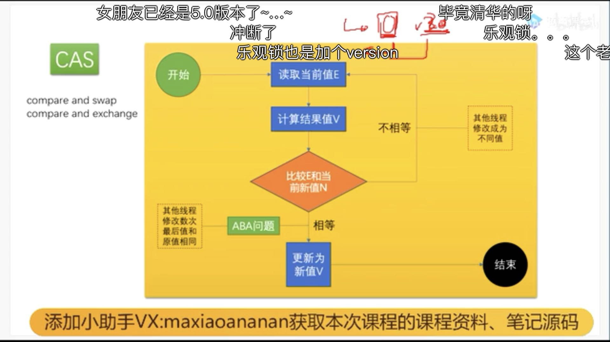

# 一、CAS是什么

CAS：compare and swap | (比较与交换/自旋锁)

- 在没有锁的情况下保证多个线程对同一个值的更新（自旋锁）

```
Java的原子性-> 在没有锁的情况下保证多个线程对同一个值的更新
cas(v,a,b) -- > 变狼v，期待a值，修改b值
读取到E值，要修改为V==> 赋值时，1.先再拿到变量的最新值，2.比较其与E值是否为同一值和版本，3。是则更新为V，4.否则重新读取到给E重新计算V再赋值；
ABA问题：上述步骤2处比较时，A变为B比较时,拿到的比较值A是经过其它线程更新的，但是版本是不一样的
ABA解决：不止比较值还要加版本比较
eg: AtomicInteger.getAndAddInt(while(native compareAndSwapInt(v1,v2,v5,v5+v4))) -- 循环比较
真正比较是在底层(汇编)实现的： lock+cmpxchg(比较)|CAS是汇编级别的，其中的lock来保证原子性
```




```
JVM 是一个标准
有很多实现：Oracle的hotspot(openjdk)
```

# 二、markword是什么

问题：

## 1、Object对象在内存中的布局：

## 2、Object o = new Object() 在内存中占几个字节

工具：JOL=Java Object Layout（Java 对象 布局）

```xml
<groupId>org.openjdk.jol</groupId>
<artifactId>jol-core</artifactId>
<version>0.9</version>
<!-- Object o = new Object()
sout：ClassLayout.parseInstance(o).toPrintable() ;打印o的布局：
布局分成5个部分：
1.markword   	对象头(4字节):位置(0--0+4)  --  对象头
2.markword   	对象头(4字节):位置(4--0+4)  --  对象头
3.classpoint 	对象头(4字节) :位置(8--+4)  == 	类型指针(是哪个类型，被压缩)
4.instance data data (?字节) :位置(12--8+?) 	--  实例数据(所占字节数取决于成员变量) # 由于o为空值此行不存在
5.pading     	补齐(?-8?) :位置(?--?+?)	   -  字节对齐(补成能被8整除)
由于JVM是64位(8个字节)，但开启了压缩模式就变成4个字节
	Java使用压缩指针和压缩普通对象Oops，查看是否开启压缩:java -XX:+PrintCommandLineFlags -version
	-XX:+UseCompressedClassPointers ：压缩类型指针
	-XX:+UseCompressedOops		:	压缩普通类型对象指针
所以Object o = new Object()所占字节数：
markword(8)+classpoint(4)+data(空0)+padding(补齐到被8整除)=16个字节
在未压缩的情况下：
markword(8)+classpoint(8)+data(空0)=16个字节

再=> User u = new User(int,String) 所占字节数：
	markword(8)+classpoint(4)+data(int[4字节]+String[普通对象指针压缩4字节])+padding(补齐4字节被8整除)=24个字节
未压缩情况下：
	markword(8)+classpoint(8)+data(int[4字节]+String[8字节])+padding(补齐4字节被8整除)=32个字节
-->
<!--
eg:查看是否开启压缩命令：java -XX:+PrintCommandLineFlags -version
		 结果示例：
            -XX:InitialHeapSize=260265600 -XX:MaxHeapSize=4164249600 -XX:+PrintCommandLineFlags -XX:+UseCompressedClassPointers -XX:+UseCompressedOops -XX:+UseParallelGC 
            openjdk version "1.8.0_262"
            OpenJDK Runtime Environment (build 1.8.0_262-b10)
            OpenJDK 64-Bit Server VM (build 25.262-b10, mixed mode) 
-->


```
synchronized 与 volatile

- 在synchronized修饰的同步方法块中，正确的说法是：<u>当执行到同步方法时，锁定了对象o</u>，如下代码，对象o的downword头的字节信息发生变化，即：
- 对象<u>锁的信息记录在对象o的markword里面</u>
- synchronized 的优化与markdown息息相关

```java
Object o = new Object();
println(ClassLayout.parseInstance(o).toPrintable()) ; // 打印o的对象布局
synchronized (o) {
    println(ClassLayout.parseInstance(o).toPrintable()); // 此处打印布局的mardword与上面打印字节值已不同，该对象o已加锁；
}
```

markword 包含信息：锁信息，GC标记信息，分代年龄信息等
		分代年龄：一个对象被GC回收几次就是几代(新生代--》老年代)

## 3、无锁，偏向锁，轻量级锁，重量级锁的升级过程

无锁：			new一个普通对象为<u>无锁态</u>
偏向锁：		一般无竞争(一直一个线程-不需等待)-----》<u>偏向锁</u>()	--- 效率高
轻量级锁：	发生了竞争(多线程)-撤销偏向锁态，每个线程有一个LockRecord指针，用该指针标记占有状态，用自旋方式抢占资源[cas原理: 拿不到的话会一直while判断是否能拿到锁 [<u>最终将markword设置为指向自己的LR</u>]]) -- 也叫<u>自旋锁</u>   - 【While会消耗CPU】 效率高
重量级锁：	while次数超过一定数量(10次)就会升级到<u>重量级锁</u> -- 》操作系统内核级处理(处于wait态,等待唤醒) ，处于wait态锁会进入到队列等待中，<u>不消耗CPU资源</u>，【重量级锁资源有限】

```
用户态操作：轻量级锁属于用户态
内核态操作：重量级锁属，硬件级操作
```

