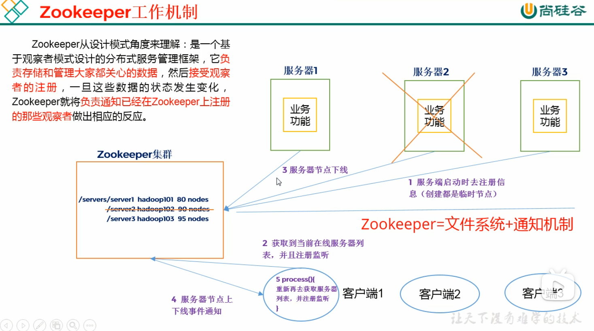
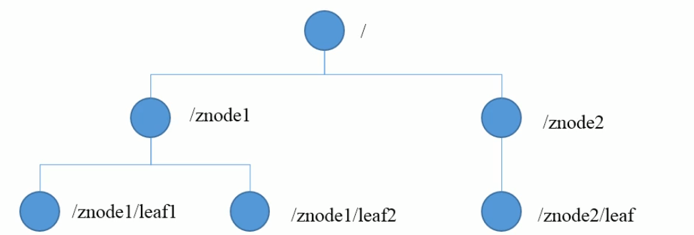
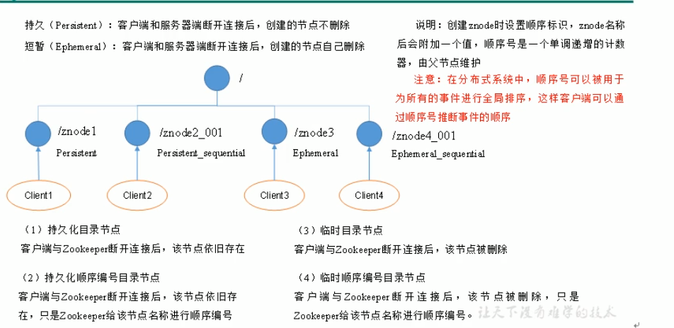

## Zookeeper

### 工作机制

Zookeeper是一个基于观察者模式设计的**分布式服务管理框架**， 





### 特点：

1）Zookeeper：一个领导者（leader），多个跟随着（Follower）组成的集群

2）可靠性：集群中只要有半数以上节点存活，Zookeeper集群就能正常服务

3）全局数据一致：每个server保存一份数据副本，Client无论连接到哪个Server，数据都是一致的；

4）请求顺序进行，来自同一个Client的更新请求**按其发送顺序依次执行**

5）数据更新原子性，一次数据更新要么都成功要么都失败

6）实时性，在一定时间范围内，Client能读到最新数据；


### 数据结构：

* Zookeeper的数据模型结构与Unix文件系统类似，整体一棵树，每个节点称作一个ZNode，每个Znode默认能够存储**1MB**的数据，每个ZNode都可以**通过其路径唯一标识**；
* 每个ZNode既像目录存在，又可以保存数据；
* Znode具有原子性操作
* 每个znode包含3部分：
  * stat：状态信息，描述该znode的版本权限等信息
  * data：该Znode关联的数据
  * children：该Znode下的子节点



### 应用场景：

> 提供服务包括：统一命名服务，统一配置管理，统一集群管理，服务器节点动态上下线，软负载均衡等；

#### 统一命名服务

> > 分布式环境下，通常需要对应用/服务进行统一命名，便于识别；

#### 统一配置管理

1）分布式环境下，配置文件同步非常常见

1. 一般要求一个集群中，所有节点的配置信息都是一致的，比如Kafka集群

2. 对配置文件修改后，要求立刻快速同步到各个节点上；

2）配置管理交由Zookeeper实现

1. 将配置信息写入Zookeeper上的一个Znode；
2. 各个客户端服务器监听这个Znode；
3. 一旦Znode中数据被修改，Zookeeper将通知各个客户端

#### 统一集群管理

> 分布式环境下，实时掌握每个节点的状态非常必要；

1）Zookeeper可实现实时监控节点状态变化、

1. 可将节点信息写入Zk上的一个Znode；
2. 监听这个Znode可获取它的实时状态变化
3. 做出相应调整；

#### 服务器节点动态上下线

1）服务器启动时去注册信息到ZK

2）Client获取到当前在线服务器列表，并监听

3）服务器节点下线

4）通知其它客户端该服务器下线通知；

#### 软负载均衡

1）Zookeeper记录每台服务器的访问数，让访问最少的服务器去处理最新的客户端请求；

## Zookeeper下载与安装

> https://zookeeper.apache.org
>
> https://zookeeper.apache.org/releases.html

### 本地单机安装(测试)

1）安装JDK

2）解压Zookeeper包到目录

```sh
tar -zxvf zookeeper-3.6.2.bin.tar.gz -C /opt/module/
```

3）修改配置

```sh
# 1. 复制conf下的zoo_sample.cfg为zoo.cfg
# 2. 修改zoo.cfg:
dataDir=/opt/module/zookeeper-3.6.2/zkData
admin.serverPort=8887 # zookeeper的jetty默认占用8080
mkdir zkData
```

4）启动zookeeper

```sh
# 在zk目录的bin下
./bin/zkServer.sh start
# jps查看进程是否启动成功
[root@icesummer conf]# jps
2923 QuorumPeerMain
2991 Jps
# 查看状态
bin/zkServer.sh status
    ZooKeeper JMX enabled by default
    Using config: /data/local/zk/apache-zookeeper-3.6.2/bin/../conf/zoo.cfg
    Client port found: 2181. Client address: localhost. Client SSL: false.
    Mode: standalone
```

4）停止Zookeeper

```sh
bin/zkServer.sh stop
```

5）启动/退出客户端

```sh
# 启动客户端
bin/zkCli.sh
# 推出客户端
quit
```

### zoo.cfg配置介绍

> conf/zoo.cfg介绍

```sh
tickTime=2000 # 心跳单位毫秒（2秒钟一个心跳）
initLimit=10  # LF初始通信时限，集群中的follower服务器(F)与leader服务器(L)之间初始连接时能容忍的最多心跳数（tickTime的数量）10个心跳帧
### 此配置表示，允许 follower （相对于 leader 而言的“客户端”）连接 并同步到  leader 的初始化连接时间，它以 tickTime 的倍数来表示。当超过设置倍数的 tickTime 时间，则连接失败。
syncLimit=5 # LF同步通信时限  集群中的follower服务器(F)与leader服务器(L)之间 请求和应答 之间能容忍的最多心跳数（tickTime的数量）。
### 此配置表示， leader 与 follower 之间发送消息，请求 和 应答 时间长度。如果 follower 在设置的时间内不能与leader 进行通信，那么此 follower 将被丢弃。

clientPort=2181 # 客户端连接的端口号
dataDir=/tmp/zkdata # 数据文件目录+数据持久化路径   ### 主要用于保存zk的数据

```

## Zookeeper内部原理

### 集群角色(L,F)

#### Leader

- 集群工作的核心：1. 事务请求（**写操作**）的唯一调度和处理者，**保证集群事务处理的顺序性**；2.集群内部各个服务器的调度者

  对于create，setData，delete的写操作请求，需要统一转发给leader处理，leader需要决定编号，执行操作，这个过程称为一个事务；

#### Follower

- 处理客户端非事务（**读操作**）请求，**转发事务请求给leader**；参与集群leader选举投票。

### 选举机制（重点）

1）半数机制：集群中半数以上机器存活，集群可用；**所以Zookeeper适合安装奇数台服务器**；

2）Zookeeper虽然没有在配置中指定Master和Slave，但是ZK工作时，是有一个节点为Leader，其它均为Follower，Leader是通过内部选举机制临时产生的；

3）**选举过程描述**：

* 每台节点会先将节点投票给自己，如果不符合(**投票数超过半数以上**)就投给id最大的机器：得票最多者胜出作为Leader

> 假设5个节点，同时启动，且都没有历史数据（即存放数据量一样）假设他们依次启动
>
> 1. **服务器1启动**，此时只有一台服务器，它发出去的报文没有任何响应，**它的选举状态一直都是LOOKING状态**
> 2. **服务器2启动**，它与第一台机器通信，相互交换选举结果，由于没有历史数据，id值较大的服务器2胜出，由于没有超过半数以上，LOOKING状态*
> 3. **服务器3启动**，此时机器都会投票给id最大的服务器3，此时投票数超过半数以上，**被选举为Leader*
> 4. 剩余两台启动，此时已经有了Leader，就不在投票了；

### 节点类型四种



> * zk中的节点既像目录一样，又iang文件一样保存数据；
>
> 存在四种类型的Znode节点：

1. Persistent：永久节点
2. Ephemeral：临时节点
3. PERSISTENT_SEQUENTIAL：永久节点-序列化
4. EPHEMERAL_SEQUENTIAL：临时节点-序列化

#### 永久节点(Persistent)

> 持久化目录节点：客户端和服务端断开连接后，创建的节点不删除，不依赖于会话，只能被手动删除
>
> 持久化顺序编号目录节点：客户端和服务端断开连接后，创建的节点不删除；2. 

#### 临时节点(Ephemeral)

> 客户端和服务端断开连接后，创建的节点自动删除
>
> 该节点的生命周期依赖于创建它们的会话，一旦会话结束，临时节点自动被删除，临时节点不允许拥有子节点

```sh
create -s /aaa helloznode
```

#### Znode的序列化

> 节点顺序号：如果创建znode时设置顺序标识，znode名称后会附加一个值，顺序号时一个单调递增的计数器，由父节点维护；
>
> **这样便会记录每个节点创建的先后顺序**，它的格式为“%10d”  (10位数字)

* 在分布式系统中，顺序号可被用于为所有的事件进行全局排序，这样客户端可以通过顺序号推断事件的顺序；

### 节点属性

```sh
## 获取节点属性命令
get /aaa0000000001
## 创建节点
create -s /aaa helloznode
## ls path## 列出所有子节点
## stat path ### 该节点的状态信息
```

* cZxid：Znode创建的事务Id

* mZxid：Znode被修改的事务Id，即每次对Znode的修改都会更新mZxid

  对于zk来说，每次的变化都会产生一个唯一的事务id，zxid(zookeeper transaction Id)，通过zxid可以确定更新操作的先后顺序；

* ctime：Znode创建事务id的时间戳

* mtime：Znode最新的被修改的事务id的时间戳

* dataVersion：数据版本号，每次对节点进行set操作，dataVersion值都会+1，
* cversion：子节点的版本号，当znode的节点有变化时，cversion的值+1；
* aclVersion：ACL的版本号；
* ephemeralOwner：如果该节点为临时节点，ephemeralOwner值表示与该节点绑定的sessionId，如果不是该值为0；

client和server通信之前，首先要建立连接，该链接成为session；当连接超时或关闭，连接便处于close状态，会话结束


### Stat结构体

### 监听器原理（重点）

### 写数据流程

### 集群前的免密登录

### 分布式安装部署

* 先安装jdk
* leader+follower模式集群：

1. 检测集群时间是否同步，（xshell->工具->发送date命令到所有会话->看时间是否一致）---》保证时间同步

2. 防火墙是否例外或关闭

3. 安装过程同@[zk下载与安装](#Zookeeper下载与安装)

4. 配置文件内容zoo.cfg增加以下内容

   ```sh
   server.1=node1:2888:3888 # 1表示服务器编号；node1是主机名，2888心跳端口，3888选举端口
   server.2=node2:2888:3888
   server.3=node3:2888:3888
   ```

5. 在zk的data文件夹下新建文件myid，内容为服务器编号

   ```sh
   ## vim zkdata/myid
   echo 1 > zkdata/myid
   ```

6. 同步节点1的安装包及配置文件分别到2和3节点：

   ```sh
   ## node2节点为例
   scp -r /data/local/zk/zookeeper-3.6.2/ root@node2:/data/local/zk/zookeeper-3.6.2/ # copy到节点2
   ##新建zk数据目录： midir zkdata
   mkdir zk/zkdata
   ## 新建myid文件，内容为节点编号2或3
   echo 2 > zk/zkdata/myid 
   ```

7. 配置zookeeper的环境变量

   ```sh
   ## vim /etc/profile
   export ZOOKEEPER_HOME=/data/local/zk/zookeeper-3.6.2
   export PATH=$PATH:$ZOOKEEPER_HOME/bin
   ## source /etc/profile
   ```

   ```sh
   ## 启动命令
   bin/zkServer.sh start conf/zoo.cfg # 启动node1节点zk
   bin/zkServer.sh start conf/zoo2.cfg
   bin/zkServer.sh start conf/zoo3.cfg
   
   ## 查看启动状态：
   bin/zkServer.sh status [conf/zoo.cfg]
   ```

   

### 客户端命令行操作

https://zookeeper.apache.org/doc/r3.6.2/zookeeperStarted.html

```sh
zkCli.sh -server ip # 连接zk的指定节点（无server表示当前节点）
# 例：./bin/zkCli.sh -server 127.0.0.1:2182
## 1. 创建节点
create [-s] [-e] path data acl
### -s表示节点，-e临时节点，若不指定-e，则表示永久节点，acl用来进行权限控制；
### 创建永久顺序节点 
[zk: localhost:2181(CONNECTED) 7] create -s /hellozk 123
Created /hellozk0000000000
[zk: localhost:2181(CONNECTED) 8] create -s /hellozk 1234
Created /hellozk0000000001
### 创建临时节点
create -e /test-temp 123temp
## 2. 读取节点
ls path [watch]   ### 2.1 列出指定节点下的所有子节点
get [-s] path [watch] ### 2.2 获取指定节点的内容和属性 -s 属性详细
## 3. stat path ### 该节点的状态信息
## 3. 更新节点
### set path  data [version]
## 3. 删除节点	
### delete path  [version]
```

#### quota设定配额

限额：给某个目录指定多少存储空间或者允许创建多少个节点，属于**软性限额**，即如果超出了限额的数量仍然可用，只是会有警告日志发生；	

```
setquota -n|-b val path
```

**参数说明：**

n 指定可以设置多少个子节点

b 指定可以设置多大空间（byte）

var 数值

**示例：**

```sh
setquota -n 5 /zk-123
create  /zk-123/1 1
create  /zk-123/2 2
create  /zk-123/3 3
create  /zk-123/4 4 
create  /zk-123/5 5 
create  /zk-123/6 6
```

**配额的用途：**

限制子节点的创建个数和分配空间的大小，如指定某个session有多少空间可以用

**查看配额**

```sh
listquota path # 查看限额设定和实际数量
```

**删除配额**

```sh
delquota -n|b path
```

**历史命令history与redo**

```sh
history # 查看历史命令记录{命令编号+命令}
redo [no]# 从新执行指定的命令编号
```

### Zk的监听机制(Watcher)

> Zk提供了一套分布式的数据发布/订阅功能；当多个订阅者同时监听一个主题对象时，这个主题对象的变化会通知给所欲订阅者；

> zk引入Watcher负责发布订阅的通知

* ZK允许客户端向服务端注册一个Watcher监听，当服务的服务端的一些事件触发了这个Watcher，那么就会像客户端发送一个事件通知来实现分布式的通知功能；触发事件类型有很多：节点创建，删除，改变，子节点改变

* 即：**客户端向服务端注册Watcher，服务端事件触发Watcher，客户端回调Watcher得到触发事件情况**

#### Watch机制特点

* **一次性触发**

  事件发生触发后监听，一个watching event就会被发送到设置监听的客户端，这种效果是一次性的，**后续再次发生同样的事件，不会再次触发**

* ZK使用**watchedEvent对象**来封装服务端事件并传递；

* watcher的通知事件的发送是**异步的**

* 先注册再触发：ZK中的watch机制，必须客户端先到服务端注册监听，这样事件发送才会触发监听，通知客户端；(连接和断开时自动的无需注册)
#### 通知状态和事件类型
* WatchedEvent包含了每个事件的三个基本属性

  * 通知状态（keeperState），事件类型（EventType），节点路径（path）
  * 同一个事件类型在不同的通知状态中代表的含义有所不同，下图SyncConnected的5个事件类型中的None类型与..Disconnected的None类型

```shell
|KeeperState  |--- EventType --- --- | --- 触发条件   --- --- --- --- --- --- --- |——状态说明
---------------------------------------------------------------------------------------------
SyncConnected|- 1.None(-1)        | --- 客户端与服务端成功建立连接                |—— 户端自动接收事件通知
  	(0)	     |- 2.NodeCreated(1)  | --- Watcher监听的对应数据节点被创建            |—— 同上
             |- 3.NodeDeleted((2) | --- Watcher监听的对应数据节点被删除           |—— 同上
  			 |- 4.NodeDataChanged(3) | --- Watcher监听的对应数据节点的数据发生变更    |—— 同上
  			 |- 5.NodeChildChanged((4)| --- Watcher监听的对应节点的子节点列表发生变更 |—— 同上
---------------------------------------------------------------------------------------------
 Disconnected(0) |- 1.None(-1)     | --- 客户端与ZK服务端断开连接        |—— 客户端自动接收事件通知
---------------------------------------------------------------------------------------------
 Expired(-112)  |- 1.None(-1)     | -- 会话超时   |—— 会话失效SessionExpiredException
---------------------------------------------------------------------------------------------
 AuthFailed(4)  |- 3.None(-1) | -1使用错误的schema进行权限检查;2.SASL权限检查失败|-AuthFaieldException
---------------------------------------------------------------------------------------------
```

#### watcher的shell操作

##### 注册监听

* get [-s] [-w] path

```sh
### 在node1节点端：get注册监听 -w表示watch监听
get -s -w /myzk0000000001/abc
### 在node2节点端：修改path的data
set /myzk0000000001/abc 123
### 在node1节点端会自动触发事件WatchedEvent 提示触发的事件state和type
WatchedEvent state:SyncConnected type:NodeDataChanged path:/myzk0000000001/abc
```

### ZK Java API应用

**org.apache.zookeeper.Zookeeper**

- Zookeeper类是Java中客户端主类，负责建立与zookeeper集群的会话，并提供方法进行操作；

**org.apache.zookeeper.Watcher**

- Watcher接口表示一个标准的事件处理器，其定义了事件通知相关的逻辑，包含KeeperState和EventType两个枚举类，分别代表事件状态和事件类型，同时定义了事件的回调方法：process (WatchedEvent event)；
- process方法是Watcher接口中的一个回调方法，当ZK向客户端发送一个Watcher事件通知时，客户端就会对相应的process方法进行回调，从而实现对事件的处理；

#### 基本使用

```xml
<!-- https://mvnrepository.com/artifact/org.apache.zookeeper/zookeeper -->
<dependency>
    <groupId>org.apache.zookeeper</groupId>
    <artifactId>zookeeper</artifactId>
    <version>3.6.2</version>
</dependency>
```

```java
public ZooKeeper(String connectString, int sessionTimeout, Watcher watcher) throws IOException {
    this(connectString, sessionTimeout, watcher, false);
}
```

```java
public static void main(String[] args)  {
    String connections = "ctos.javazz.com:2181,ctos.javazz.com:2182";
    try {

        Watcher watcher = new Watcher() {
            @Override
            public void process(WatchedEvent watchedEvent) {
                System.out.println(String.format("事件状态：%s",watchedEvent.getState()));
                System.out.println(String.format("事件类型：%s",watchedEvent.getType()));
                System.out.println(String.format("路径：%s",watchedEvent.getPath()));
            }
        };
        // 构造zk客户端
        ZooKeeper zk = new ZooKeeper(connections,20000,watcher);
        List<ACL> acls = new ArrayList<>();

        zk.create("/myzk/01","011".getBytes(), ZooDefs.Ids.OPEN_ACL_UNSAFE, CreateMode.PERSISTENT);// 持久节点
        //zk.setData("/");
        zk.close();
    } catch (Exception e) {
        e.printStackTrace();
    }
}
```


#### 创建zk客户端

#### 
