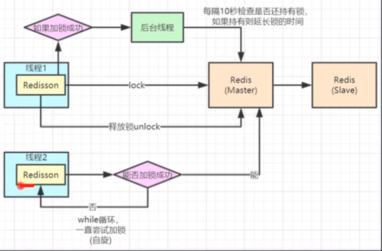
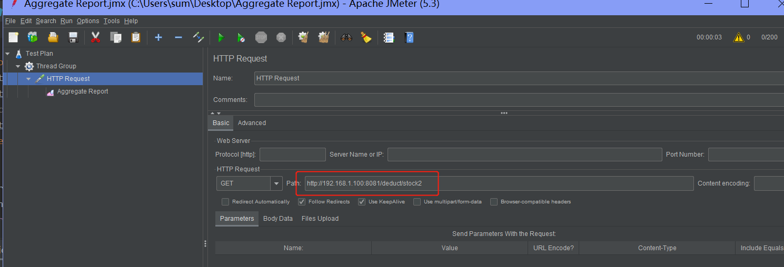
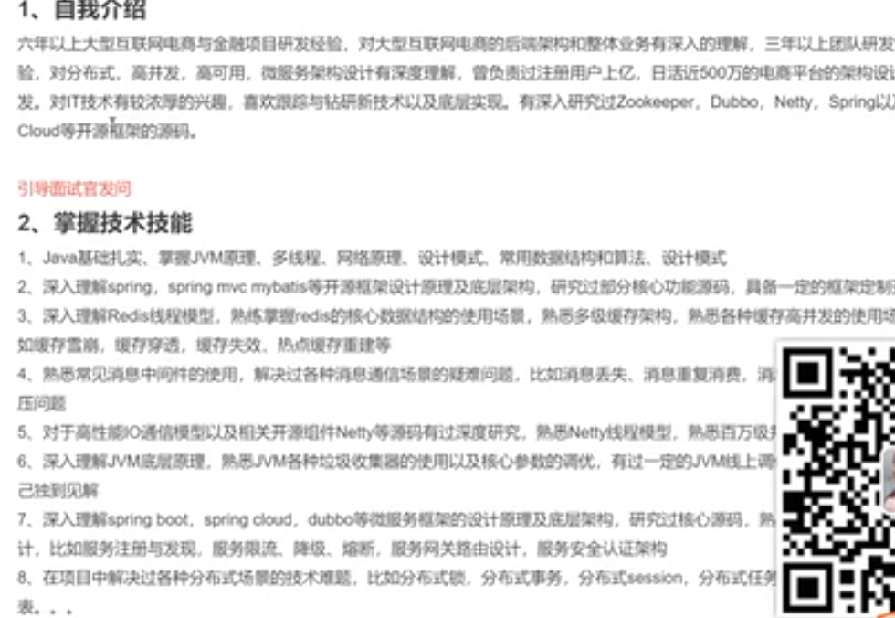

# <center>Redis学习</center>

分布式架构，微服务架构，源码分析，并发，性能优化，数据结构预算法，高并发实战经验，工程

集群，微服务，网格服务，Serverless，

## 一、基础知识

* 官网 www.redis.net.cn
* 基于C语言的 开源的 高性能的 key-value 内存数据库 (Remote Dictionary Server)
* 功用： 1. 内存数据库；2. 消息中间件
* Redis 与其他 key - value 缓存产品有以下三个特点：
  - Redis支持数据的持久化，可以将内存中的数据保存在磁盘中，重启的时候可以再次加载进行使用。
  - Redis不仅仅支持简单的key-value类型的数据，同时还提供list，set，zset，hash等数据结构的存储。
  - Redis支持数据的备份，即master-slave模式的数据备份。
* Redis是单线程：**6.0后支持多线程**
  * Redis是基于内存操作的，不依赖CPU切换所以(其单线程命令)效率很高，其瓶颈跟内存和网络带宽相关
* 支持，事物和磁盘持久化； 集群 > 通过哨兵模式(Sentinel)和自动分区(Cluster)提供分布式

###  1.1 redis自带的压力测试工具 

- redis-benchmark

```shell
# 命令格式： redis-benchmark [option] [option value]
# 该命令是在 redis 的目录下执行的，而不是 redis 客户端的内部指令。
redis-benchmark -n 10000 -c100 -q # -n 指定10000个并发; -c 100个连接数; -q强制退出

```

> ### 实例
>
> 以下实例我们使用了多个参数来测试 redis 性能：
>
> ```json
> $ redis-benchmark -h 127.0.0.1 -p 6379 -t set,lpush -n 10000 -q
> 
> SET: 146198.83 requests per second
> LPUSH: 145560.41 requests per second
> ```
>
> 

### 1.2 基本命令

#### 1.2.1 config配置命令：

> 1）获取redis配置项
>
> ```shell
> # 获取所有配置项 > $ CONFIG GET *
> # 获取某个配置项 > $ CONFIG GET [requirepass]
> # 编辑所有配置项 > $ redis 127.0.0.1:6379> CONFIG SET daemonize "yes" # 改为守护模式
> ```

####  1.2.2  启动服务与连接
```shell
redis-server redis.conf # 启动服务
redis-cli -h host -p port -a password # 客户端连接
```

####  1.2.3  客户端基本操作

> redis默认16个数据库 #配置： databases 16
>
> ```shell
> # 默认使用数据库1 
> select 1 # 切换至第二个数据库
> dbsize # 查看当前数据库db大小
> flushdb # 清空当前数据库数据
> flushall # 清空所有数据库数据
> keys * # 查看当前数据库所有key
> EXISTS keyname # 是否存在key；1存在，0不存在
> del keyname # 移除key
> expire key 10 # 设置10秒到期
> ttl key  # 查看剩余有效期
> type key # 查看key的类型
> append key v2 # 向key的value追加字符串v2;如果key不存在就新建
> rename key newkey # 修改key名
> set key value # 设置key 
> get key # 获取key
> 
> info  # 查看环境信息
> info replication # 查看其中的主从信息
> ```

### 1.3  Redis数据类型

### 1.3.1 五大数据类型

####  1 > String:

> ```mysql
> # 自增自减操作：默认步长为1 
> incr key # 对key值的自增1操作 = v++
> decr key # 对key值的自减1操作 = v--
> incrby key n # 对key值的自增n操作 = v=v+n
> decrby key n # 对key值的自减n操作 = v=v-n
> 
> # 字符串截取：
> getrange key start end # 包含start和end # star或end是负值时表示倒数第几个 0开始
> # 替换字符串：
> setrange key 1 value # 从key值的第0+1个位置开始替换为value，
> 
> # setex和setnx
> setex k seconds v # 表示 将值 v 关联到 k ，并将 k 的过期时间设为 seconds (以秒为单位)
> setnx k v # 表示 只有在k不存在时设置k的值返回1，存在时失败返回0。 （在分布式锁中常常使用）
> 
> # mset和mget批量设置值
> mset k1 v1 k2 v2 ... # 分别设置k1 h2等
> get k1 k2 # 分别设置k1 h2等
> msetnx k1 v1 k2 v2 # k1且k2不存在时设置(原子性)，否则返回0失败
> msetex k1 4 2 k2 2 2 k3 3 3
> 
> # 设置对象
> ### 设置user:1的对象值为json
> mset user:1:name zs user:1:age 19
> get user:1  	-->"{name:zs,age:19}"
> get user:1:name --> "sz"
> 
> # 本地批量删除key 先退出cli,模糊搜索出所有的key，通过xargs命令，将前面查询出来的key作为后面redis的del命令的输入
> ./redis-cli keys "course-*" | xargs ./redis-cli del 
> 	
> # 先获取再插入：
> ### getset k v -> 先get再set; 
> ###  如果k不存在返回nvl，再设置为v
> ###  如果k存在先返回原值v0，再重新设置为新值v（cas原理之比较并交换模型）
> 192.168.1.201:6379> getset aa vr
> (nil)
> 192.168.1.201:6379> get aa
> "vr"
> 
> 192.168.1.201:6379> getset aa vrr
> "vr"
> 192.168.1.201:6379> get aa
> "vrr"
> 
> 
> # 应用
> ```
>
> 

#### 2 > List(链表集合):

```mysql
--- list集合的所有命令一般以L开头 -  
# 插入头/尾命令
##1. LPUSH k v1 v2 v3 ... # 向list集合k中头部放入1个或多个值
##2. RPUSH k v1 v2 v3 ... # 向list集合k中尾部放入1个或多个值
LPUSH k one two three # 向list集合k中放入三个值

# 获取/截取命令Lindex/Lrange
##1. Lindex k [index] # 取出k的角标index位置的值
Lindex k1 -1 # 取出k1的最后一个值
##2. LRANGE k [start] [end] # 取出k的start到end范围的集合
LRANGE k1 0 -1 # 取出k1 从0到倒数第一个(所有)list集合

# 截断Ltrim
ltrim k1 [start] [len] # 截断k1为从start开始长度为len的新集合

# 插入值linsert k before|after v1 v2 # 向k中v1前或后插入v2
linsrt k1 before 2 1 # 在2前面插入1

# 根据下表更新值：
lset k [index] v # 更新k的index位置的值v 

# 集合的长度Llen
llen k1 # 返回k1集合的长度

# 移除命令LPOP/RPOP
LPOP k # 移除集合k的左边第一个，并返回移除的值
RPOP k # 移除集合k的倒数第一个，并返回移除的值

# 移除指定的值Lrem
Lrem k1 2 five # 移除k中值为five的两个值；返回移除的实际数量

# 移动最后元素到另一个集合中
rpopLpush k1 k2 # 移除k1的最后一个元素到集合k2中，(k2不存在则创建)

# 小结
## list实际上是一个链表，在两边插入或更新值操作效率高，相对中间值的操作效率较低
## 场景：消息队列-> 先Lpush(左边插入) 再Rpop(右边移除);  消息栈-> 先lpush(左边入)再lpop(左边取除)
```


#### 3 > Set:

```mysql
### set类型集合是无序不重复，大部分是s开头的命令

# 插入1或多个成员
sadd s1 hello hello2 # 向s1插入两个值(若有重复复值只会插入一个)
# 显示所有成员 
smembers k 
# 是否存在某个值 （# key是否存在用exists k）
sismember k v1 # 1存在；0不存在
# 元素的数量
scard k # 返回元素的数量
# 移除成员
srem k v1 [v2 v3 ..] # 移除k的成员v1 [v2 v3]
# 随机移除成员
spop k # 随机从k中移除一个成员
# 随机取出成员
srandmember k [n] # 随机从k中取出n个元素 没有n默认1

# 移动指定的值到另一个set中
smove k1 k2 v1 # 将k1中的v1移到k2中

# 两个集合的差集sdiff
sdiff k1 k2 # 表示k1中不在k2中存在的成员集合 
sdiff k2 k1 # 表示k2中不在k1中存在的成员集合
# 两个集合的交集sinter 
sinter k1 k2 # 看看k1 k2共同的元素
# 两个集合的并集sunion k
sunion k1 k2 # 并集
### 应用：共同关注，共同爱好，推荐好友，二度好友
```


#### 4 > Hash:

- 类似map集合是 k-v对的map集合  -其实跟String类似(set key map)

```mysql
# 插入
hset key field1 value1 [field2 value2 ... ]
# 批量插入
hmset key field1 value1 [field2 value2 ... ]
# 取值
hget key field1 
# 批量获取
hmget key field1 field2 ...
# 获取所有
hgetall key

# 移除某个field
hdel key field # 移除key中的field对

# 获取集合成员数量
hlen key # 获取key的键值对集合的数量
# 判断成员是否存在
hexists k1 field1 # 1存在 0不存在

# 只获得所有的field
hkeys k1
# 只获得所有的value
hvals k1

# hash的自增自减hincrby 没有hdecrby
hincrby k field1 [n] #让k中的field1自增n
hincrby k field1 [-n] # 让k中field1自减n

# 不存在才新增
hsetnx k field v1 # v1不存在插入键值对，存在不执行

# 应用:存储用户对象
hmset user:1 name zhangsan age 12 addr "河南"  sex 0 # 设置user:1的name，age，addr，sex
hmget user:1 name age add sex # 获取user:1的属性
hincrby user:1 age 1 # 年龄自增1岁
hset user:1 addr "zhengzhou province henan" #更改user:1的地址
```


#### 5 > Zset:

- 有序集合，再set基础上增加了排序号score

```mysql
# 插入新值
## zadd key [NX|XX] [CH] [INCR] score member [score member ...]
zadd zk 1 one 2 two # 在第score=1位置增加one score=2位置增加two

#获取集合
zrange k 0 -1 # 获取所有集合（默认按score升序）

# 升序集合：zrangebyscore key min max [whthscores] [limit offset count]
# ## 可选项 withscore表示附带显示score值，否则不显示
# ## min max=(-inf +inf) 表示负无穷到正无穷排序；若表示负无穷到3000：(-inf 3000)
# ## 如集合salary:2 - > zadd salary:2 5000 zs 3000 ls 3600 ww 2000 zl
zrangebyscore salary:2 -inf +inf # 对salary:2的集合按照score升序排列 - 只显示元素
zrangebyscore salary:2 -inf +inf withscores # 对salary:2的集合按照score升序排列 - 带上score显示

# 降序列表（zrevrangebyscore k max min [withscores]）
zrevrangebyscore salary:2 3000 -inf # 对按照score降序排列查出等低于3000score的集合
zrevrangebyscore salary:2 +inf -inf withscores # 对集合按照score降序排列 - 带上score显示

# 移除元素 zrem k member
zrem salary zs # 移除zs元素

# 获取有序集合总数 zcard
zcard salary:2	
# 统计 zcount k min max # 在score区间的与元素数量
zcount salary:2 3000 5000 # score为3000到5000的数量  无穷(-inf +inf)

# 应用场景
# # # 消息排序，带权重排序，排行榜，工资表，成绩表  Top-N 

```


### 1.3.2 三大特殊类型

#### 1 > geospatial（地理空间）

- 应用： 附近的朋友，打车距离       API: GEO

> - GEOADD 添加地理位置

```shell
# 添加城市坐标：
# geoadd key 经度 纬度 名称
geoadd china:city 116.40 30.90 beijing
geoadd china:city 121.50 31.23 shanghai
geoadd china:city 106.51 29.53 chongqing 114.05 22.52 shenzhen 
geoadd china:city 120.16 30.24 hangzhou 108.96 34.26 xian
```


> - GEODIST 返回两个位置之间的直线距离

```mysql
#### 单位： m（米）、km（千米），mi（英里），ft（英尺）
geodist beijing shanghai km # 北京上海直线距离多少KM 默认m
```

>  GEOHASH 返回一个或多个位置元素的geohash值(11个字符串)

```
geohash china:city beijing hangzhou # [将二维经纬度转为字符串]
```

> GEOPOS 获取指定城市的POS经纬度	

```shell
# 从key里获取定的位置元素的位置
192.168.1.201:6379> geopos china:city beijing shanghai
1) 1) "116.39999896287918091"
   2) "30.90000115730233432"
2) 1) "121.49999946355819702"
   2) "31.22999903975783553"
```

> GEORADIUS # 找出某经纬度为中心的半径内的元素

```shell
# georadius key lng lat km [withcoord] [withdist] [count n]
# withcoord 显示经纬度，withdist显示直线距离，count只显示n条
georadius china:city 116.50 30.39 500 km # 给定经纬度的500km半径内的元素
georadius china:city 116.5 30.39 1500 km withdist withcoord count 2
1) 1) "beijing"
   2) "57.5270"
   3) 1) "116.39999896287918091"
      2) "30.90000115730233432"
2) 1) "hangzhou"
   2) "351.8048"
   3) 1) "120.1600000262260437"
      2) "30.2400003229490224"

```

> GEORADIUSBYMEMBERS # 找出指定元素附近半径范围的元素集合

```shell
georadiusbymember china:city beijing 100 km # 北京100km范围的city元素
```

> GEO底层实现原理就是zset类型，可以使用zset命令操作geo
>
> ```
> # 查看geo元素
> zrange china:city 0 -1
> # 删除geo元素
> zrem china:city shenzhen chongqing # 删除shenzhen和chongqing
> 
> ```


#### 2 > :horse:hyperloglog (2.8.9+)

> 简介

- Redis HyperLogLog 是用来做基数统计的算法
- 什么是基数：`比如数据集 {1, 3, 5, 7, 5, 7, 8}，那么这个数据集的基数集为 {1, 3, 5 ,7, 8}, 基数(不重复元素)为5` 
- 基数估计：`就是在误差可接受的范围内，快速计算基数`

> - 案例：网页UV(unique visitor) ：访问人数 (个人访问多次仍算一次)
>
> - 问题：传统的统计：将访问的userid集合到set中，然后统计set元素数量；但是数据量大耗费内存
>
> - Hyperloglog优点：占用内存小，在 Redis 里面，每个 HyperLogLog 键只需要花费 12 KB 内存，就可以计算接近 2^64 个不同元素的基 数。这和计算基数时，元素越多耗费内存就越多的集合形成鲜明对比。
> - Hyperloglog有一定的容错

> PFADD 放入待统计的元素；
>
> ```shell
> pfadd pf1 a b c d e c a # 创建第一组元素
> pfadd pf2 a c e 1 2 3  # 创建第二组元素
> ```
>
>  PFCOUNT 统计元素数量
>
> ```shell
> pfcount pf1 # --> 结果为5 重复的不统计
> pfcount pf1 pf2 # --> 结果为8 pf1和pf2不重复元素的数量
> ```
>
> PFMERGE 合并元素 （并集）
>
> ```shell
> # 公式： pfmerge destkey sourcekey sourcekey2 # 将souRcekey和sourcekey2合并到detkey中
> pfmerge pfm pf1 pf2
> pfcount pfm # 结果为 8
> ```


#### 3 > bitmaps 位存储

> 位存储

- 问题说明 
  1. 统计疫情感染人数 没有感染 0 感染为1 那么结构就有 0 1 0 0 1 1 0 等
  2.  活跃与不活跃用户，打卡与未打卡(全勤)

> 简介：

- bitmap : 位图结构 (位存储)，都是操作二进制位来进行记录，就只有0 和 1 两个状态，通过位运算表示元素对应的值

> 测试命令

```shell
# setbit key offset value # 给k的偏移位设置value
## 使用bitmap记录周一至周日打卡情况；【用0-6表示星期， 1打卡，0未打卡】
setbit sbemp:1 0 1 # 周日
setbit sbemp:1 1 1 # 周1
setbit sbemp:1 2 0 # 周2
setbit sbemp:1 3 1 # 周3
setbit sbemp:1 4 1 # 周4
setbit sbemp:1 5 0 # 周5
setbit sbemp:1 6 0 # 周6

## 查看周3是否打卡
getbit sbemp:1 3
## 统计打卡的天数 bitcount key [start] [end]
bitcount sbemp:1 0 6 # 统计1的数量
```

## 二、事务

> Redis事务本质：一组命令集合！一个事务中所有命令都被序列化，在事务执行过程中，会按照顺序执行；
>
> - Redis事务没有隔离级别的概念
>
> - Redis单条命令保存原子性，但是**事务不保证原子性** 这是其与mysql等事务的差别
>
> - 编译型异常（代码有问题）所有命令都不能执行
>
> - 运行时异常（事务队列执行中遇到异常，不会影响其它命令执行，错误命令抛出异常）-- [事务的非原子性]
>   如：incr str1 # 而str1不是数字

### 1）操作指令：

```shell
# 1.开启事务(multi)
# 2.命令入队
# 3.取消事务（discard） 
# 4.执行事务（exec） 

```

### 2）监控-watch

> 首先要了解redis事务中watch的作用，watch命令可以监控一个或多个键，一旦其中有一个键被修改（或删除），之后的事务就不会执行。监控一直持续到exec命令（事务中的命令是在exec之后才执行的，所以在multi命令后可以修改watch监控的键值）。假设我们通过watch命令在事务执行之前监控了多个Keys，倘若在watch之后有任何Key的值发生了变化，exec命令执行的事务都将被放弃，同时返回Null multi-bulk应答以通知调用者事务执行失败。

- Redis Watch 命令用于监视一个(或多个) key ，如果在事务执行之前这个(或这些) key 被其他命令所改动，那么事务将被打断

> 悲观锁

- 认为什么时候都出问题，无论什么时候都会加锁

> 乐观锁

- 不会出问题，不上锁，更新的时候判断是否有人修改过，拿到新的修改的version
- 步骤：首先获取version，更新的时候比较version（cas机制）

```shell
watch money # 监控money
multi # 开启事务
# 命令入队，操作命令，
exec # 提交事务  # 运行时异常：如果中间命令有一个出错，则全部操作无效 
unwatch # 撤销监控

```

#### 1.1）Redis监视测试

```bash
127.0.0.1:6379> set money 100 # 账户金额
OK
127.0.0.1:6379> set out 0 # 花费金额
OK
127.0.0.1:6379> watch money # 监视montey对象
OK
127.0.0.1:6379> multi # 开启事务
OK
127.0.0.1:6379> decrby money 20 # 花去20元
QUEUED
127.0.0.1:6379> incrby out 20 # 花费金额+20
QUEUED
127.0.0.1:6379> exec # 事务期间money被其它操作修改此处exec就执行异常：
(nil)
127.0.0.1:6379> 
# 上述操作时单线程执行，不会出问题，但是如果多线程

```
>  以上，由于watch了money，如果事务提交前money的数据被另外改动，就会导致事务执行失败：

## 三、redis与springboot

### 3.1 Jedis

> Jedis: 是Redis官方的java连接工具
>
> ```xml
> <!-- https://mvnrepository.com/artifact/redis.clients/jedis/3.3.0 -->
> <dependency>
>       <groupId>redis.clients</groupId>
>       <artifactId>jedis</artifactId>
>       <version>3.3.0</version>
> </dependency>
> <dependency>
> 	<groupId>com.alibaba</groupId>
> 	<artifactId>fastjson</artifactId>
> 	<version>1.2.71</version>
> </dependency>
> ```
>
> - Jedis集成了redis的所有命令接口
>
>   ```Java
>   Jedis jedis = new Jedis(host,port);
>   jedis.auth(auth);
>   System.out.println(jedis.ping ());
>   String money = jedis.get("money");
>   System.out.println(money);
>   Long l = jedis.hsetnx("myzhifubao","balance","200000");
>   Long l2 = jedis.hsetnx("myzhifubao", "balance", "200000");
>   System.out.println(l);
>   System.out.println(l2);
>   
>   SetParams aa = new SetParams();
>   aa.nx().ex(20);# 超期时间
>   jedis.set("kk","vv",aa);
>   jedis.close();
>   
>   // 地理空间
>   Map<String,GeoCoordinate> m = new HashMap<>();
>   m.put("beijing",new GeoCoordinate(116.40,30.90));
>   m.put("shenzhen",new GeoCoordinate(114.05,22.52));
>   m.put("xian",new GeoCoordinate(108.96,4.26));
>   jedis.geoadd("china:city",m);
>   jedis.geoadd("china:city",121.50 ,31.23,"shanghai");
>   jedis.geoadd("china:city",106.51,29.53,"chongqing");
>   jedis.geoadd("china:city",120.16,30.24,"hangzhou");
>   
>   ```

- jedis操作事务

  ```java
  @Test
  public void testJedisTransaction(){
      Jedis jedis = new Jedis(host,port);
      jedis.auth(auth);
      jedis.select(1);// 选择数据库
      jedis.flushDB();// 选择数据库
      JSONObject json = new JSONObject();
      json.put("hello","world");
      json.put("name","zhangsan");
      // 开启事务
      Transaction multi = jedis.multi();
      String user2 = JSONObject.toJSONString(json);
      // 设置string类型user1和user2
      multi.set("user1",user2);
      multi.set("user2",user2);
  
      // 添加一个zset集合
      multi.zadd("zk1",1,"m1");
      multi.zadd("zk1",2,"m2");
      multi.zadd("zk1",5,"m5");
      multi.zadd("zk1",3,"m3");
      multi.zadd("zk1",6,"m6");
      try {
          int m = 1/0;// 发生异常，执行失败
          multi.exec();
      } catch (Exception e) {
          multi.discard();// 失败放弃事务
          e.printStackTrace();
      } finally {// 是否又数据
          System.out.println("user1："+jedis.get("user2"));
          System.out.println("user2："+jedis.get("user2"));
          System.out.println("zset:排序："+jedis.zrangeByScoreWithScores("zk1","-inf","+inf"));
          multi.clear();
          multi.close();
      }
      jedis.close();
  }
  ```

### 3.2 SpingData+Redis

- [note]: Springboot操作数据库的组件有：spring-[data,jpa-,jdbc,mongodb,redis] !
- spring-boot2.x.x ==默认集成的是lettuce==不是jedis
- spring-boot1.x.x 默认集成的是Jedis

> Jedis：底层采用直连，多个线程操作时不安全的，如果要避免需要用JedisPool连接池，易阻塞
>
> Lettuce：采用netty（高性能的网络框架）连接redis，实例可以在 多个线程中共享，不存在线程不安全（类似）

> 整合
>
> ```xml
> <!--springboot2.x 集成的redis客户端框架Lettuce -->
> <!--
> <dependency>
>   <groupId>io.lettuce</groupId>
>   <artifactId>lettuce-core</artifactId>
>   <version>6.0.1.RELEASE</version>
> </dependency>   
> -->
> 
> <!--lettuce包含在了2.x的data-redis中：-->
> <dependency>
> 	<groupId>org.springframework.boot</groupId>
> 	<artifactId>spring-boot-starter-data-redis</artifactId>
> 	<version>2.4.0</version>
> </dependency>
> ```
> RedisProperties：
> ```properties
> ##SpringBoot都有一个自动配置类
> ### 自动配置类都会绑定一个properties配置文件
> ### redis的自动配置类在2.4.0/spring-boot-autoconfigure-2.4.0.jar!/META-INF/spring.factories!/RedisAutoConfiguration.class
> ### RedisAutoConfiguration找到@EnableConfigurationProperties({RedisProperties.class})
> ### 打开RedisProperties.class既是redis的配置文件类
> 
> spring.redis.host=ctos.javazz.com
> spring.redis.password=123!@#
> spring.redis.port=6379
> ```

> 源码分析

```java
//	RedisAutoConfiguration.class #
@Bean
@ConditionalOnMissingBean(
    name = {"redisTemplate"}
)
@ConditionalOnSingleCandidate(RedisConnectionFactory.class)// 该注解表示我们可以自定义redisTemplate替换默认
public RedisTemplate<Object, Object> redisTemplate(RedisConnectionFactory redisConnectionFactory) {
   // 默认的redisTemplate没有过多的设置，redis对象都是需要序列化的
    // 两个泛型都是Object，我们使用时需要强转为<String,Object>
    RedisTemplate<Object, Object> template = new RedisTemplate();
    template.setConnectionFactory(redisConnectionFactory);
    return template;
}

@Bean
@ConditionalOnMissingBean// String类型时最长使用的类型，Spring单独提出了该方法 ，直接使用不用转换类型
@ConditionalOnSingleCandidate(RedisConnectionFactory.class)
public StringRedisTemplate stringRedisTemplate(RedisConnectionFactory redisConnectionFactory) {
    StringRedisTemplate template = new StringRedisTemplate();
    template.setConnectionFactory(redisConnectionFactory);
    return template;
}
```

> 整合测试

- 1. 导入依赖

     ```xml
     <!--springboot-data2.x 集成的redis客户端框架Lettuce -->
     <dependency>
     	<groupId>org.springframework.boot</groupId>
     	<artifactId>spring-boot-starter-data-redis</artifactId>
     	<version>2.4.0</version>
     </dependency>
     ```

     

  2. 配置连接<spring.redis开头>

     ```properties
     // 由RedisProperties.class可知 配置是以spring.redis前缀的
     @ConfigurationProperties(prefix = "spring.redis")
     public class RedisProperties {
         private int database = 0;
         private String url;
         //... more 
     }
     
     ##SpringBoot都有一个自动配置类
     ### 自动配置类都会绑定一个properties配置文件
     ### redis的自动配置类在2.4.0/spring-boot-autoconfigure-2.4.0.jar!/META-INF/spring.factories找!/RedisAutoConfiguration.class
     ### RedisAutoConfiguration找到@EnableConfigurationProperties({RedisProperties.class})
     ### 打开RedisProperties.class既是redis的配置文件类
     spring.redis.host=ctos.javazz.com
     spring.redis.password=123!@#
     #spring.redis.port=6379 # 默认配置不用写
     #spring.redis.database=0 # 默认配置不用写
     # 连接池配置,尽量使用lettuce的配置，Jedis也兼容
     #spring.redis.lettuce.pool.max-active=8 # 默认配置不用写
     #spring.redis.lettuce.pool.max-wait=-1ms
     #spring.redis.lettuce.pool.max-idle=8
     #spring.redis.lettuce.pool.min-idle=0
     ```
     
3. 测试
  
   ```java
     @SpringBootTest
     @RunWith(SpringRunner.class)
     public class Redis201ApplicationTests {
         @Autowired
         private RedisTemplate redisTemplate;
     
         @Test
         public void contextLoads(){
             //redisTemplate
                 //opsForValue()
                 //opsForList()
                 //opsForSet()
                 //opsForHash()//
                 //opsForZSet()//
                 //opsForGeo()
             //multi();// 开启事务操作
             //exec();//
             //RedisConnection connection = redisTemplate.getConnectionFactory().getConnection();
             //connection.flushAll();// 刷新
             //connection.flushDb();//
             redisTemplate.opsForValue().set("lettuce","2.4.1");
             System.out.println(redisTemplate.opsForValue().get("lettuce"));
         }
     
     }
   ```

> 对象序列化
>
> - 默认的序列化为RedisTemplate<Object, Object> 和StringRedisTemplate 
>   //实际开发需要配置为RedisTemplate<String, Object>
> - 配置具体的序列化方式：
>
> ```java
> 
> @Configuration
> public class RedisConfig {
>     // 默认的配置是在类RedisAutoConfiguration的RedisTemplate<Object, Object>
>     @Bean(name = "redisTemplate")
>     public RedisTemplate<String, Object> redisTemplate(RedisConnectionFactory redisConnectionFactory) {
>         // 1. 改成RedisTemplate<String, Object>的序列化
>         RedisTemplate<String, Object> template = new RedisTemplate();
>         // 2. value使用Jackson2的序列化器
>         Jackson2JsonRedisSerializer<Object> jackson2JsonRedisSerializer = new Jackson2JsonRedisSerializer<>(Object.class);// json解析任意对象
>         ObjectMapper om = new ObjectMapper();// ObjectMapper进行转义
>         om.setVisibility(PropertyAccessor.ALL, JsonAutoDetect.Visibility.ANY);
>         //om.enableDefaultTyping(ObjectMapper.DefaultTyping.NON_FINAL);
>         om.activateDefaultTyping(om.getPolymorphicTypeValidator(),ObjectMapper.DefaultTyping.NON_FINAL);
>         //bugFix Jackson2反序列化数据处理LocalDateTime类型时出错
>         om.disable(SerializationFeature.WRITE_DATE_KEYS_AS_TIMESTAMPS);
>         // java8 时间支持
>         om.registerModule(new JavaTimeModule());
>         jackson2JsonRedisSerializer.setObjectMapper(om);
> 
>         // 3. key使用String的序列化器
>         StringRedisSerializer stringRedisSerializer = new StringRedisSerializer();
> 
>         // 4. 设置key和value的序列化配置
>         template.setKeySerializer(stringRedisSerializer);// key采用String序列化
>         template.setHashKeySerializer(stringRedisSerializer);// hashKey采用String序列化
>         template.setValueSerializer(jackson2JsonRedisSerializer);// value使用Jackson2序列化
>         template.setHashValueSerializer(jackson2JsonRedisSerializer);// HashValue采用Jackson2序列化
>         template.afterPropertiesSet();// set进去
> 
>         template.setConnectionFactory(redisConnectionFactory);
>         return template;
>     }
> 
> }
> 
> 
> @Autowired
> @Qualifier("redisTemplate")// 指定自定义注入的bean,可不加
> private RedisTemplate redisTemplate;
> 
> @Test
> public void testSerial() throws JsonProcessingException {
>     User u = new User("张三",3);//
>     User u2 = new User("李四",9);//
>     // 将user序列化
>     //String jsonUser = new ObjectMapper().writeValueAsString(u);
>     //redisTemplate.opsForValue().set("user",jsonUser);
>     // 使用自定以序列化器
>     redisTemplate.opsForValue().set("user",u);
>     redisTemplate.delete("users");
>     redisTemplate.opsForList().leftPush("users",u);
>     redisTemplate.opsForList().leftPush("users",u2);
>     redisTemplate.opsForList().remove("users",1,u);
>     System.out.println(redisTemplate.opsForValue().get("user"));
>     System.out.println(redisTemplate.opsForList().range("users",0,-1));
> }
> ```
>
> - 以上操作api比较繁琐，可以手写优化相关写法

#### Redis工具类

```java

```


---


# 高级篇：

## 一、Redis.conf详解

> - 配置文件大小写不敏感

- 使用 ：include 包含子配置文件

  ```bash
  include /path/to/local.conf
  ```

- 网络：

  ```shell
  bind 127.0.0.1 192.168.1.100 # 绑定的ip
  protected yes # 保护模式 默认yes
  port 3679 # 端口设置
  ```

  

- 通用配置 [GENERATE]

  ```shell
  daemonize no # yes守护进程运行
  pidfile /var/run/redis_3679.pid # daemonize yes 时需要指定的pid进程文件
  loglevel notice # 日志级别，debug,verbose,notice,warning;# notice适用生产环境，warning重要信息时
  logfile "" # 日志输出的文件名，为空表示标准输出
  databases 16 # 默认的数据库数量16个
  ```

- 复制配置 [Replication] -- 主从复制相关  [Redis主从复制](#四redis主从复制)

  ```shell
  info replication # 查看主从信息
  ```

- 安全 [Security]

  ```shell
  requirepass foobared #客户端连接密码
  ```

- Client限制[Limit]

  ```shell
  maxclients 10000 # 最大的客户端连接数
  maxmemory <bytes> # redis设置的最大内存容量 设置为 0, 则表示不进行内存限制
  maxmemory-policy noeviction # 内存达到最大值的处理策略
  	# 1. noeviction:默认策略,不淘汰,如果内存已满,添加数据是报错
  	# 2. allkeys-lru:在所有键中,选取最近最少使用的数据抛弃
  	# 3. volatile-lru:在设置了过期时间的所有键中，选取最近最少使用的数据抛弃
  	# 4. allkeys-random: 在所有键中，随机抛弃。
  	# 5. volatile-random: 在设置了过期时间的所有键，随机抛弃。
  	# 6. volatile-ttl:在设置了过期时间的所有键，抛弃存活时间最短的数据。
  ```

- 快照配置 [SNAPSHOTTING] -- 持久化相rdb关配置

  - 在规定时间内执行了多少操作，则会持久化到文件
  - 持久化文件：.rdb和.aof两种

  ```bash
  save 900 1 # 如果900秒内，有一个key进行修改，就进行持久化操作
  save 300 10 # 如果300秒内，至少10个 key进行修改，进行持久化操作
  save 60 10000 # 如果60秒内，10000个 key进行修改，也进行持久化操作
  
  stop-writes-on-bgsave-error yes # 持久化出错是否继续工作
  rdbcompression yes # 是否压缩rdb文件，默认开启 耗cpu
  rdbchecksum yes # 是否校验文件 如果出错是否自动修复
  dbfilename dump.rdb # rdb持久化数据文件
  dir ./ # rdb文件保存目录
  ```

- APPEND ONLY模式相关配置-（ 持久化模式之aof的配置）

  ```shell
  appendonly no # 默认不开启aof模式，默认使用的时rdb的方式
  appendfilename "appendonly.aof" # aof持久化文件名
  appendfsync everysec # 同步模式，默认每秒同步一次，always:每次修改都会同步，no:不同步 # 
  auto-aof-rewrite-percentage 100 # aof文件增长比例，超过比例就重写
auto-aof-rewrite-min-size 64mb# aof重写最小的文件大小
  ```

- Cluster

  ```shell
  cluster-enabled yes # 开启集群
  ```

  

## 二、Redis持久化

> Redis时内存数据库，需要将需要的数据从内存中的数据保存在硬盘中，才能不会因重启等因素而消失；
>
> redis默认支持rdb和aof两种持久化方式，默认开启rdb，aof关闭
>
> 再主从复制中，rdb通常用来备份数据

### RDB（Redis Database）

> 在指定时间触发持久化(save 900 1),Redis单独fork一个子进程先将内存中的数据集写入快照(磁盘临时文件)，之后再将临时文件替换掉上次持久化好的文件，此时主进程不进行任何IO 效率高；
>
> 如果需要进行大规模数据恢复，且对于数据恢复完整性要求不敏感那么RDB比AOF方式更加高效；	 
>
> - 最后==保存的文件名为dump.rdb==
> - 相关配置：见[快照配置 [SNAPSHOTTING] ](#快照配置 [SNAPSHOTTING] )可以修改save 900 1（900s内由数据触发一次）测试
> - 缺点：
>   - 需要一定的时间间隔持久化，最后一次持久化后的数据可能会丢失
>   - fork新的子进程，会占用一定的内存空间
> - 优点：
>   - 几乎不需要修改配置即可；
>   - (子进程处理)效率高；
>   - 适合大规模的数据恢复 (数据完整性要求不高时)
> - 生产环境一般需要对持久化文件dump.rdb进行备份

> 触发规则

```bash
1. 配置的save规则满足的情况下自动触发、
2. 执行flushdb/flushall命令时，也会触发	
3. 退出redis(关闭redis服务，linux关机)也会产生
```

> 恢复rdb数据

~~~bash
# 只需要将rdb放到redis的启动目录之下,启动即可自动加载数据
# 查看数据存放位置命令：config get dir
~~~

### AOF（Append Only File）

将我们的所有命令都记录下来，history，恢复时把

> 以日志的形式记录每个操作，将Redis执行的所有记录记录下来(读写=的不记录)，只许追加不许改写，Redis启动之初会读取该文件重新构建数据，	（也即，redis重启就根据日志文件的内容将指令从前到后执行一次以完成数据恢复工作）
>
> - 保存的==文件名为 appendonly.aof== 
> - 默认不开启 ： appendonly no # yes为开启
> - appendfsync everysec # 持久化规则 参考[APPEND ONLY模式相关配置](#APPEND ONLY模式相关配置)
> - 优点：
>   - 每次修改都同步，文件完整性会更好
>   - 默认使用的是每秒同步，可能会丢失1s的数据
> - 缺点：
>   - aof文件远大于rdb，修复速度也比rdb慢
>   - Aof运行效率也慢(IO读写操作)

>  触发规则

```sh
appendfsync everysec # 同步模式，默认每秒同步一次，always:每次修改都会同步，no:不同步 # 
```

> ==appendonly.aof文件修复==

```sh
# 如果appendonly.aof文件出问题，会导致无法启动redis，使用redis-check-aof自动修复aof文件
redis-check-aof --fix appendonly.aof
```

> 重写规则说明

- aof默认就是文件的无限追加，文件会越来越大，需要处理

```sh
auto-aof-rewrite-percentage 100 # aof文件增长比例，指当前aof文件比上次重写的增长比例大小。aof重写即在aof文件在一定大小之后，重新将整个内存写到aof文件当中，以反映最新的状态(相当于bgsave)。这样就避免了，aof文件过大而实际内存数据小的问题(频繁修改数据问题).
auto-aof-rewrite-min-size 64mb# aof重写最小的文件大小，如果大于这个就fork新进程来重写一个新文件
```

### 持久化建议

> 1. rdb更适合数据备份，2. aof数据相对更完整
> 2. 只做缓存使用时不需要开启持久化
> 3. 同时开启rdb和aof两种
>    1. 会优先载入aof文件恢复数据 ，rdb作为备份数据配合使用
> 4. 因为把RDB作为i备份用途，建议旨在slave上持久化rdb文件，15分钟备份一次，只保留save 900 1 触发规则
> 5. 如果开启aof，尽可能保证了数据完整，代价是带来了持续的IO，rewrite新数据到新文件则会造成阻塞，AOF重写的基础大小64M应该为至少5G
> 6. 禁用aof模式 只用rdb 代价是master/slave同时挂的话会损失几分钟的数据；(微博使用此种架构)

## 三、Redis发布订阅

> 消息队列

​	redis 发布订阅(pub/sub)是一种消息通信模式：发送者(pub)发送消息到channel，订阅者(sub)订阅该频道接收消息
​    redis客户端可以订阅任意数量的频道channel

```mermaid
graph LR
  	pA[消息发布者] -.发布消息--> 1[RedisServer]
  	1[RedisServer]  -.抢-->A[消息订阅者]
  	1[RedisServer]  -.抢-->B[消息订阅者]
  	
  	pA[消息发布者] -.redis-cli-.- pA[消息发布者]
  	1[RedisServer] -.队列-.- 1[RedisServer]
  	A[消息订阅者] -.redis-cli-.- A[消息订阅者]
  	B[消息订阅者] -.redis-cli-.- B[消息订阅者]
```


### 命令

> 这些命令被广泛用于即时通信应用，(网络聊天，实时广播，实时提醒)

```sh
# PSUBSCRIBE pattern [patterm...]
# 订阅一个或多个符合给定模式的频道

# PUNSUBScribe [pattern[pattern...]]
# 退订所有给定模式的频道

# PUBSUB subcommand[args...]
# 查看订阅与发布系统状态

# PUBLISH channel message  
# 将信息发送到指定频道(此处channel是频道名)

SUBSCRIBE channel [channel...]
# 订阅指定的一个或多个频道信息(此处channel是频道名)

UNSUBSCRIBE channel [channel...]
# 撤退订阅的一个或多个频道
```

> 测试

```sh
# 发布者发布消息
127.0.0.1:6379> publish kss "nihao dajia hao " #发布消息到频道kss
(integer) 1
127.0.0.1:6379> publish kss "wo hen hao "
(integer) 1
127.0.0.1:6379> publish kss "bu yong dan xin "
(integer) 1
127.0.0.1:6379> publish kss "changlianxi "
(integer) 1
127.0.0.1:6379> publish kss "zaijian"
(integer) 1
127.0.0.1:6379> publish kss "baibai"
(integer) 1
127.0.0.1:6379> publish kss "baibai forever"
(integer) 1

# 订阅者接收消息
127.0.0.1:6379> subscribe kss #订阅频道kss
Reading messages... (press Ctrl-C to quit)
1) "subscribe"
2) "kss"
3) (integer) 1
1) "message"
2) "kss"
3) "nihao dajia hao "
1) "message"
2) "kss"
3) "wo hen hao "
1) "message"
2) "kss"
3) "bu yong dan xin "
1) "message"
2) "kss"
3) "changlianxi "
1) "message"
2) "kss"
3) "zaijian"
1) "message"
2) "kss"
3) "baibai"
1) "message"
2) "kss"
3) "baibai forever"
```


## 四、Redis主从复制

- 主从复制就是将一台Redis节点的数据复制到其它Redis服务器，前者为主节点(master/leader),后者为从节点(slave/follower)
  master以写为主，slave以读为主，读写分离，通常一主多从，80%的操作都是读操作，减轻了服务器的压力；

> 主要作用：
>
> 1 数据冗余：实现了数据的热备份，是持久化之外的一种数据冗余方式
>
> 2 故障恢复：主节点故障时，可以从子节点提供服务，实现快速的故障恢复
>
> 3 负载均衡：读写分离，主节点提供写服务，从节点读服务，分担服务器负载；尤其是写少读多的情况下
>
> 4 高可用基石：主从复制时哨兵和集群能够实施的基础，是Redis实现高可用架构的基础
>
> - ###### ==主节点只能写，从节点只能读==

> 环境配置

### 1）一主二从集群配置

- 配置主从，只需要配置从节点即可（所有没配的都是主节点）

```powershell
# 查看当前主从信息
127.0.0.1:6379> info replication
# Replication
role:master # 当前角色
connected_slaves:0 # 从机数量
master_repl_offset:0
repl_backlog_active:0
repl_backlog_size:1048576
repl_backlog_first_byte_offset:0
repl_backlog_histlen:0
127.0.0.1:6379>

127.0.0.1:6379> info replication
# Replication
role:master
connected_slaves:1
slave0:ip=172.19.0.1,port=6379,state=online,offset=28,lag=1
master_replid:1687683f6908dd9d171ed976f957126de857bb9c
master_replid2:93c96b12fdcf8279e5cfa49cc921f2e2a3619512
master_repl_offset:28
second_repl_offset:15
repl_backlog_active:1
repl_backlog_size:1048576
repl_backlog_first_byte_offset:1
repl_backlog_histlen:28
```

1. 复制配置文件redis.conf 为  redis6379.conf/redis6380.conf/redis6381.conf

2. 修改redis6379.conf: 

   ```shell
   # port 6379
   # pidfile /var/run/redis_6379.pid
   # daemonize yes # 守护进曾启动
   # logfile "6379.log"
   # dbfilename dump6379.rdb # 持久化文件	
   ```

3. 同理修改redis6380.conf和redis6381.conf

4. 启动3个redis服务（此时是3个master主机）

   ```shell
   redis-server redis6379.conf
   redis-server redis6380.conf
   redis-server redis6381.conf
   ```

5. 配置6379为Master，6380，6381为从节点

   - 通过命令配置（临时生效）

   ```shell
   #进入redis-cli -p 6380
   slaveof 127.0.0.1 6379 # 表示6380作为6379的从节点，重启后会失效
   #进入redis-cli -p 6381
   slaveof 127.0.0.1 6379 # 表示6381作为6379的从节点
   # info replication #查看主从信息
   
   slaveof no one # 表示取消自己的从节点《自己变成主节点》
   ```

   - 通过修改配置文件（永久生效）

   ```shell
   # redis6380.conf文件中：
   # slaveof <masterip> <masterport>
   slaveof 127.0.0.1 6379 # 配置主节点为6379
   masterauth <master的auth密码>  # 如果主机设置了密码，该项配置
   ```

> 细节说明

1. 搭配了主从后，==主机只能写，从机只能读==
2. 主机宕机，从机仍然连接到master上，但是不能进行写操作，master再启动，才可继续写（没开启哨兵）
3. 从机宕机，再重启或重新配置为从机仍然能够读取到master节点的数据

> 主从复制原理

- Slave启动连接到master后会发送一个sync同步命令，
- Master接到命令，启动后台的存盘进程，同时收集所有接收到的用于修改数据集的命令，在后台进程执行完毕后，==Master将传送整个数据文件到slave，并完成一次完全同步==；
- 全量复制：而Slave节点在接收到数据文件数据后，将其存盘并加载达到内存中；
- 增量复制：Master继续将新的所有收集到的修改命令依次传给Slave，完成同步；但只要是从新连接到Master，一次完全同步会自动执行；

> 6380设置为6379的从节点，6381设置为6380的从节点，此时6380角色仍然是从节点(只读)

```
Node1->Node2->Node3 # 
```

### 2）槽点

- 6383个槽点

### 3）哨兵模式Sentinel (自动主从切换)

> 一旦主节点宕机，人工主从切换比较繁琐，Redis从2.8开始提供了Sentinel模式
>
> Redis提供了哨兵命令，是一个独立的进程其原理是：Sentinel通过发送命令，等待Redis服务器响应，从而监控运行的多个Redis实例；==Sentinel能够监控主机是否故障，如果故障根据投票数将从机转换为主Master== 

> 哨兵作用

1. 通过发送指令，让Redis服务器返回监控其运行状态，包括Master和Cluster节点；
2. 当哨兵监测到Master宕机，会自动将Slave切换为Master，然后通过==发布订阅模式==通知其他节点，修改配置，让其切换Master；

> ==多哨兵模式==：-- 然而一个哨兵进程对Redis服务器进行监控，可能会出现问题，因此使用多哨兵模式，各个哨兵之间也会进行监控-形成了多哨兵模式；

- ###### 当哨兵1检测到Master宕机，系统不会马上进入Failover过程，当其它哨兵也检测到不可用，且==达到一定数量时，哨兵之间就会进行一次投票，投票结果由一个哨兵发起，进行failover故障转移操作==；切换成功后，通过发布订阅模式，让各个哨兵把自己监控的从服务器进行切换Maser实现自动的主从切换，如果原先的主机重启后变为从机。

- 优点：

  - 主从可以切换，故障可以转移，很好的系统可用性
  - 哨兵模式就是主从模式的升级，是自动化主从切换

- 缺点：

  - Redis不好在线扩容，集群一旦上限
  - 哨兵配置比较麻烦

> 哨兵配置文件(sentinel.conf)
>
> ```sh
> # vim sentinel.conf
> 1.port 26379 # sentinel监听端口，默认是26379，可以修改。
> 
> 2.sentinel monitor <master-name> <ip> <redis-port> <quorum>
> # 监听地址为ip:port的一个master; quorum是数字，指明当有多少个sentinel认为一个master失效时，master才算真正失效
> sentinel monitor mymaster 192.168.0.5 6379 2 # 配置示例
> 
> 3.sentinel auth-pass <master-name> <password>
> # 设置连接master和slave时的密码
> sentinel auth-pass mymaster 0123passw0rd # 配置示例 
> 
> 4.sentinel down-after-milliseconds <master-name> <milliseconds> 
> #这个配置项指定了需要多少失效时间，一个master才会被这个sentinel主观地认为是不可用的。 单位是毫秒，默认为30秒
> sentinel down-after-milliseconds mymaster 30000   # 配置示例
> 
> 7.sentinel的notification-script和reconfig-script是用来配置当某一事件发生时所需要执行的脚本，可以通过脚本来通知管理员，例如当系统运行不正常时发邮件通知相关人员。对于脚本的运行结果有以下规则：
>         若脚本执行后返回1，那么该脚本稍后将会被再次执行，重复次数目前默认为10
>         若脚本执行后返回2，或者比2更高的一个返回值，脚本将不会重复执行。
>         如果脚本在执行过程中由于收到系统中断信号被终止了，则同返回值为1时的行为相同。
>         一个脚本的最大执行时间为60s，如果超过这个时间，脚本将会被一个SIGKILL信号终止，之后重新执行。
> 1).sentinel notification-script <master-name> <script-path> 
>  sentinel notification-script mymaster /var/redis/notify.sh #  配置示例
>  
> 2).sentinel client-reconfig-script <master-name> <script-path>
>  当一个master由于failover而发生改变时，这个脚本将会被调用，通知相关的客户端关于master地址已经发生改变的信息。以下参数将会在调用脚本时传给脚本:
>        <master-name> <role> <state> <from-ip> <from-port> <to-ip> <to-port>
>   sentinel client-reconfig-script mymaster /var/redis/reconfig.sh # 配置示例
> ```
>
> * 启动哨兵进程
>
> ```sh
> redis-sentinel ./sentinel.conf
> ```
> 

> 哨兵投票算法


## 五、Redis集群

### 1）集群概述()

redis集群节点中，彼此互联，(ping-pong机制)，不需要连接所有节点，可连接集群中人一个可用节点

Redis集群最少需要6个节点，3主3从，可以分布在一台或者多台主机上

> slot槽点存储说明：

redis-cluster把==所有的物理节点映射到[0~16383]的slot点==上，cluster负责维护  (slot是逻辑概念)

```sh
redis集群中内置了16384个哈希槽，当需要在redis集群总设置一个key/value,redis先对key进行crc16算法算出一个结果，然后把结果对16384求余数，这样每个key都会对应一个编号在0~16383之间的哈希槽，redis会根据节点数量大致均等的将哈希槽映射到不同的节点
eg: set k xxx
会计算k的hash值,例如hash槽值为100，那么100在master1节点上所以k就放在master1的机器上上
```

> redis-cluster投票容错机制

```sh
当检测到一个master节点down机时不会直接认为其宕机，如果半数以上的master节点与其通信超时则才会认为该节点down掉了；
什么时候集群整体不可用：
	1. 任意一个master节点挂掉(说明solt映射不完整)，且该master没有主从切换，fail状态
	2. 集群中超过半数的master节点挂掉，无论是否有slave进入为master都是fail状态
   当fail状态时，对集群的所有操作不可用 the cluster is down
```

### 2）集群搭建

- redis4.x版本参考：[redis4.x以下rubby搭建](./Redis4.x-cluster-build.md)

- redis5+参考：[网上案例](https://www.cnblogs.com/sanduzxcvbnm/p/11300942.html)

---


## 六、Redis缓存穿透和雪崩

- 缓存穿透，雪崩，击穿
### 1）缓存穿透

> 概念
>
> 查询未命中：redis缓存内一直没有该数据，数据库内也没有，业务需要就会一直查询持久层数据库，造成持久层数据库压力大增；


### 1.1. 布隆过滤器-解决

> 布隆过滤器是一种数据结构，==对所有可能查询的参数以hash形式存储==，当有请求时先控制层先进行校验，不符合则丢弃，避免了对底层存储的压力；

3.centos安装redis的bloomfilter插件

[*https://blog.csdn.net/u013030276/article/details/88350641*](https://blog.csdn.net/u013030276/article/details/88350641)

4.bloomfilter使用

4.1 bf.add

语法：*[bf.add  key  options]*

```
127.0.0.1:6379> bf.add users user3
(integer) 1
```

4.2 bf.exists

语法：*[bf.exists  key  options]*

```
127.0.0.1:6379> bf.exists users user1
(integer) 1
127.0.0.1:6379> bf.exists users user3
(integer) 0
```

4.3 bf.madd

语法：*[bf.add  key  ...options]*

```
127.0.0.1:6379> bf.madd users user4 user5 user6 user7

1) (integer) 1

2) (integer) 1

3) (integer) 1

4) (integer) 1
```

4.4 bf.mexists

语法：*[bf.add  key  ...options]*

```
127.0.0.1:6379> bf.mexists users user4 user5 user6 user7 user8

1) (integer) 1

2) (integer) 1

3) (integer) 1

4) (integer) 1

5) (integer) 0
```

4.5 bf.reserve创建Filter

语法：*[bf.reserve  key  error_rate initial_size]*

```
127.0.0.1:6379> bf.reserve books 0.001 10000
OK
```

5.代码实现

### 1.2. 缓存空对象-解决

> 当数据存储层也不命中后，==以空对象将其缓存起来，同时设置一个过期时间==，时间内从缓存获取的都是空值，保护后端数据
>
> 问题：
>
> 	1. 增加耗费的内存空间
>
>  	2. 容易导致数据不一致，过期时间内有数据不会立即查出；

### 2）缓存击穿

> 概念：
>
> 热点key平时抗有高并发，某一时刻该key失效(如过期)，会有大量并发在该时间点集中访问，导致数据库瞬间压力大增；
>
> - 缓存击穿与缓存穿透到区别是，穿透是未查询到数据就一直查，击穿是瞬间查询到次数太多；

> 解决方案：

### 2.1. 热点key永不过期

-  

### 2.2. 加互斥锁-

- 分布式锁：使用==分布式锁(setnx等)==，保证每个key同一时间只有一个线程取查询后端服务；这样将高并发的压力转移到了发呢不是所，因此对分布式锁的高并发考验也很大；
- 分布式锁方案1：JUC并发编程》》》 Redisson

### 3）缓存雪崩

> 概念：
>
> 在某一时刻，缓存集中过期失效或Redis宕机，造成大批量数据集中访问后端数据库，压垮数据库；

### 3.1. 解决方案

1. Redis高可用集群

2. 降级限流

   当缓存失效后，通过加锁或队列控制数据写缓存的 线程数量，限制对某个key的使用使用；

   微服务架构中SpringCloud的Hystrix或或AlibabaSentinel等方案

3. 数据预热

   warmup，AlibabaSentinel

---


## 七、分布式事务锁

==常规本机事务处理无法解决跨系统服务的事务一致性问题==

- 本机事务锁只能保证本机多线程处理下事务的一致性；如果集群或分布式环境下操作同一数据资源仍会出现数据安全问题：如商品超卖等；
- 需要一个全局的分布式事务锁

[Redisson 实现分布式锁](https://mp.weixin.qq.com/s/yB_Sz9_XfLMG7PZhIJS6mA)

### 1）setnx在分布式锁中的基本应用

- redis解决事务问题的基本原理是利用setnx的存在就false的原理设计；

- setnx key value :

  将key值设为value，当前仅当key不存在时(set if not exists==if absent)；

  若给的的key已存在，则setnx不进行任何操作；

> 解决的基本思路：
>
 - 先用setnx在业务执行正式开始前加锁：(即设置一个代表该业务的key到redis中)

 1. 加锁成功在执行完整个业务前其它线程不能获取到锁，直到业务完毕释放该锁
 2. 如果setnx加锁不成功说明锁已存在，需要等待释放该锁；

```java
String lockKey = "1:stockLockKey";
String lockValue = Thread.currentThread().getId()+
    UUID.randomUUID().toString().replaceAll("-","");
System.out.println(lockValue);
// 该方法设置值并加有效期，内部用lua脚本实现保证了数据的原子性
boolean ifabsent =  redisTemplate.opsForValue().setIfAbsent(lockKey,lockValue,30,TimeUnit.SECONDS);
// 下面方法与设置有效期的代码分开不保证原子性问题
// boolean absent = redisTemplate.opsForValue().setIfAbsent(lockKey,lockValue);
// redisTemplate.expire(lockKey,30,TimeUnit.SECONDS)
if(!absent){// false 已存在
    res = "系统繁忙，请稍后再试~";
    return res;
}
// 加锁成功：进行减库存操作
try {
    int stock = (int) redisTemplate.opsForValue().get(stockKey);
    if(stock>0){
        long realStock = redisTemplate.opsForValue().decrement(stockKey);// 库存-1
        res = String.format("扣减库存成功，剩余库存：%d",realStock);
    }else{
        res = String.format("库存不足，剩余库存：%d",stock);
    }
} catch (Exception e) {
    e.printStackTrace();
} finally {
    // 防止锁提前失效，而释放了别的线程创建的锁
    if(lockValue.equals(redisTemplate.opsForValue().get(lockKey))){
        redisTemplate.delete(lockKey);// 无论如何释放锁
    }
}
```


> 需要解决的问题：
>
 1. 锁无法释放的可能：

    如果setnx加锁成功但被释放前，系统故障退出，此时锁还未释放，就会一直存在

- 解决：给该锁加上有效期，如30s内该锁自动失效；

  

2. 业务执行时间大于锁的有效期问题：

   如果第一个线程还未执行完，锁到了有效期自动释放，此时其它线程就会拿到该锁:

   2.1 导致不同步：第一个线程要处理的数据可能先被第二个线程改变

   2.2 锁失效：不止会自动失效，还会：由于第一个线程锁已提前失效，等到执行释放锁时，就会把第二个线程的锁删掉(del key),然后第三个线程拿到锁，再被第二个释放..依次往后；

- 解决：

  2.3.1 只释放自己的锁，判断该锁是否当前线程创建的：

  ​	创建锁时，锁key的value值设为当前线程的thread-id；释放锁时，判断该锁的value是否与当前线程一致；

   细节：key的设置尽量细粒度：即只需要能锁到一行数据就行，如商品id，不影响其它商品

  2.3.2 加一个延期机制：锁到期时打听线程是否仍在执行，如果是，就给锁延期；

  

  2.3.3 但是解决起来非常麻烦，如果咱们自己实现需要处理的问题很多；通常我们用成型的解决方案Redisson

> 幂等性操作


### 2）Redisson实现分布式锁方案

#### 1、加锁机制

> [redisson官网](https://redisson.org)
>
> [Lock](https://github.com/redisson/redisson/wiki/8.-distributed-locks-and-synchronizers/#81-lock)
> [FairLock](https://github.com/redisson/redisson/wiki/8.-distributed-locks-and-synchronizers/#82-fair-lock)
> [MultiLock](https://github.com/redisson/redisson/wiki/8.-distributed-locks-and-synchronizers/#83-multilock)
> [RedLock](https://github.com/redisson/redisson/wiki/8.-distributed-locks-and-synchronizers/#84-redlock)
> [ReadWriteLock](https://github.com/redisson/redisson/wiki/8.-distributed-locks-and-synchronizers/#85-readwritelock)
> [Semaphore](https://github.com/redisson/redisson/wiki/8.-distributed-locks-and-synchronizers/#86-semaphore)
> [PermitExpirableSemaphore](https://github.com/redisson/redisson/wiki/8.-distributed-locks-and-synchronizers/#87-permitexpirablesemaphore)
> [CountDownLatch](https://github.com/redisson/redisson/wiki/8.-distributed-locks-and-synchronizers/#88-countdownlatch)
>
> redis操作是单例但非原子性的，但redis利用lua脚本实现原子性操作：
>
> - 线程去获取锁，获取成功: 执行lua脚本，保存数据到redis数据库。操作业务-> 释放锁  -> 完成
> - 线程去获取锁，获取失败: 一直通过while循环尝试获取锁，获取成功后，执行lua脚本，保存数据到redis数据库。

#### 2、集成SpringData

```xml
<dependency>
    <groupId>org.redisson</groupId>
    <artifactId>redisson-spring-boot-starter</artifactId>
    <version>3.13.6</version>
</dependency>
```


```java

@Bean
public Redisson redisson(){
    Config config = new Config();
    config.useSingleServer().setAddress("redis://ctos.javazz.com:6380").setDatabase(0);// 单机模式
    RedissonClient redisson = Redisson.create(config);// 默认连接地址 127.0.0.1:6379
    return (Redisson) Redisson.create(config);
}
@Autowired
private Redisson redisson;

https://gitee.com/moujing/redisson/blob/master/DistributedLockAspect.java
```

分布式锁代码示例：

```java
String stockKey = "1:stock";// 库存key
String lockKey = "1:stockLockKey";
RLock redissonLock = redisson.getLock(lockKey);// 获取锁对象
try {
    redissonLock.lock(); // 相当于 setIfAbsent(lockkey,lockvalue,expire,TimeUnit);
    int stock = (int) redisTemplate.opsForValue().get(stockKey);
    if(stock>0){
        long realStock = redisTemplate.opsForValue().decrement(stockKey);// 库存-1
        res = String.format("redisson 扣减库存成功，剩余库存：%d",realStock);
    }else{
        res = String.format("redisson 库存不足，剩余库存：%d",stock);
    }
} catch (Exception e) {
    e.printStackTrace();
} finally {
    redissonLock.unlock();// 释放锁
}
```

#### 3、Redisson分布式锁实现原理|源码|自动延期机制

- 线程1加锁成功，其它线程就一直while自旋询问直到获取到锁；
- 自动延期：加锁后，watch dog会每隔有效期的1/3时间判断是否还持有锁，是则执行延期（watch dog自动延期机制）




- redisonLock.lock() 部分源码：

```java
// 依次进入：
//    lock(.tryAcquire(.tryAcquireAsync(.tryLockInnerAsync()的方法底层调用lua脚本执行加锁和有效期(原子性)
// 依次进入：
//    lock(.tryAcquire(.tryAcquireAsync(.tryLockInnerAsync().onComplete()的方法是加锁的回调函数
private void lock(long leaseTime, TimeUnit unit, boolean interruptibly) throws InterruptedException {
    long threadId = Thread.currentThread().getId();
    // 从此处进入核心：--------
    Long ttl = tryAcquire(-1, leaseTime, unit, threadId);
    // lock acquired
    if (ttl == null) {
        return;
    }
    // 略。。。
}

 private Long tryAcquire(long waitTime, long leaseTime, TimeUnit unit, long threadId) {
     return get(tryAcquireAsync(waitTime, leaseTime, unit, threadId));
 }

private <T> RFuture<Long> tryAcquireAsync(long waitTime, long leaseTime, TimeUnit unit, long threadId) {
    // 执行加锁的核心代码:加锁延时
    if (leaseTime != -1) {
        return tryLockInnerAsync(waitTime, leaseTime, unit, threadId, RedisCommands.EVAL_LONG);
    }
    // 执行加锁的核心代码: 加锁，定时器询问延时========================
    RFuture<Long> ttlRemainingFuture = tryLockInnerAsync(waitTime, internalLockLeaseTime,
                                                         TimeUnit.MILLISECONDS, threadId, RedisCommands.EVAL_LONG);
    ttlRemainingFuture.onComplete((ttlRemaining, e) -> {// 回调函数
        if (e != null) {
            return;
        }
        // lock acquired
        if (ttlRemaining == null) {
            // 定时器执行询问是否延期========================查看renewExpirationAsync(xx)方法
            scheduleExpirationRenewal(threadId);
        }
    });
    return ttlRemainingFuture;
}
// 核心代码：
<T> RFuture<T> tryLockInnerAsync(long waitTime, long leaseTime, TimeUnit unit, long threadId, RedisStrictCommand<T> command) {
    internalLockLeaseTime = unit.toMillis(leaseTime);
	// 此处调用lua脚本执行批量的redis命令，来保证原子性====================================
    return evalWriteAsync(getName(), LongCodec.INSTANCE, command,
                          "if (redis.call('exists', KEYS[1]) == 0) then " +
                          "redis.call('hincrby', KEYS[1], ARGV[2], 1); " +
                          "redis.call('pexpire', KEYS[1], ARGV[1]); " +
                          "return nil; " +
                          "end; " +
                          "if (redis.call('hexists', KEYS[1], ARGV[2]) == 1) then " +
                          "redis.call('hincrby', KEYS[1], ARGV[2], 1); " +
                          "redis.call('pexpire', KEYS[1], ARGV[1]); " +
                          "return nil; " +
                          "end; " +
                          "return redis.call('pttl', KEYS[1]);",
                          Collections.singletonList(getName()), internalLockLeaseTime, getLockName(threadId));
}

// 定时任务延时相关代码
protected RFuture<Boolean> renewExpirationAsync(long threadId) {
    return evalWriteAsync(getName(), LongCodec.INSTANCE, RedisCommands.EVAL_BOOLEAN,
                          "if (redis.call('hexists', KEYS[1], ARGV[2]) == 1) then " +
                          "redis.call('pexpire', KEYS[1], ARGV[1]); " +
                          "return 1; " +
                          "end; " +
                          "return 0;",
                          Collections.singletonList(getName()),
                          internalLockLeaseTime, getLockName(threadId));
}

```


#### 3.1、Redisson的CAP原则：AP原则（缺点）

> ==Redisson只要满足Master节点加锁成功就返回可用,效率高,符合高可用原则但,不符合强一致性==

- 主从模式下锁失效问题：

  针对主节点加的锁，如果没有同步到从节点，主节点就宕机了，主从切换后会因锁的消失而锁失效；

- 矛盾()：我们期望==同步到Slave节点后再返回成功来保证数据强一致性，但同步数据效率低，不符合高并发的初衷==；

> 如果需要符合CP原则：可以配合RedLock实现：

#### 3.2、Redis主从架构锁失效问题和Redlock详解

- 原理：在获取分布式锁的过程中，==Master节点加锁成功且要满足一半以上的Slave节点同步到该锁==才能返回持有该锁成功；
  - 性能受到限制，不建议

```java
RLock rLock1 = redisson.getLock(lockKey);// 获取锁对象
RLock rLock2 = redisson.getLock(lockKey);// 获取锁对象
RLock rLock3 = redisson.getLock(lockKey);// 获取锁对象
// 根据多个RLock对象构建RedissonRedLock:关键
RedissonRedLock  redLock = new RedissonRedLock(rLock1,rLock2,rLock3);
/**
  * waitTime：尝试获取锁的最大等待时间，超过这个时间认为获取锁失败
  * leaseTime：锁的持有时间，超过这个时间会自动失效，(租约期限)
  */
boolean getLock = redLock.tryLock(10,30,TimeUnit.SECONDS);
if(getLock){
    redLock.unlock();// 释放
}
```

#### 4、分布式锁的原则

- 锁的粒度足够细，比如商品库存，以包含商品id的锁定义，行级锁，该锁只会影响到商品该id的库存对其它商品不影响；
- 

# 相关延申

> 文章参考

- <a target="_blank" href="https://blog.csdn.net/weixin_47701015/article/details/106608651" >JUC并发编程</a>
- [JUC并发编程](https://blog.csdn.net/weixin_47701015/article/details/106608651)

- [Netty线程模型,并发实战]()
- 分布式解决方案：
  - 分布式锁，(Mysql,Redis实现，Zookeeper实现)
  - 分布式事务
    - (2pc/3pc实现的的Atomic框架；消息队列实现的Rabbitmq和RocketMq，蚂蚁金服TCC方案：Bytetcc和Tcc-Transaction；基于Alibaba的Seata方案)
  - 分布式调度中心，
  - 分布式配置中心：Nacos，Config，Apollo
  - 分布式服务熔断降级：Hystrix，Alibaba-Sentinel
  - 分布式全局序列号，雪花算法，Redis实现
  - 分布式Session，SpringSession；SpringRedisSession
  - 海量数据分库分表
- 虚拟容器技术：
  - Docker：Docker镜像仓库容器，Dockerfile，docker-compose，Docker服务编排
  - Kubernetes：

- JVM-->Mysql-->并发-->Redis-->Netty-->Zookeeper-->设计模式-->


## Zookeeper分布式锁

- Zookeeper与Kafka(消息队列，依赖Zk)，与Dubbo(RPC框架)

> Zookeeper：

- 一个分布式协调框架，主要用来解决分布式应用中的经常遇到的数据管理问题：如，统一命名服务，状态同步服务，集群管理，分布式应用配置项管理

- 是一个文件系统的数据结构 - (树形结构)

> 六种类型

1、持久化节点

- 创建之后持久存在

2、临时节点

- session超时，会被服务器删除

3、持久化顺序节点

- 持久化节点的基础上自带顺序

4、临时顺序节点

- 临时节点的基础上自带顺序

5、容器节点 3.5+

- 当没有子节点时，未来会被服务器删除

6、TTL节点  3.5+

- 过了TTL指定的时阅时，被服务器删除

## Kafka

- Kafka是一个分布式的基于发布/订阅模式的消息队列(Message queue)，主要用于大数据实时处理领域；


-- -


## end


jemeter压测工具




优化建立：




