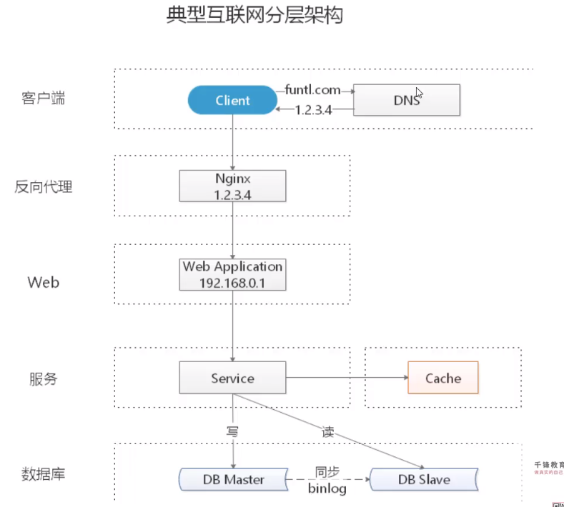
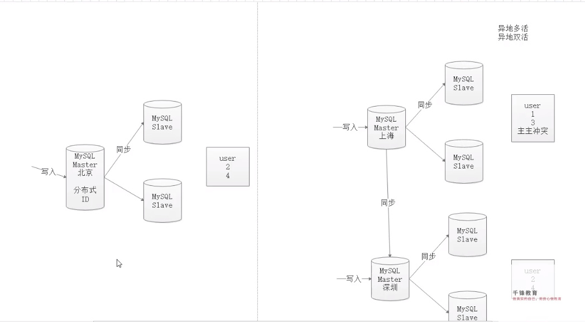

# 微服务


云计算+微服务+服务网格+云架构（serverless）+区块链+大数据+人工智能

## CAP定理

> 一个分布式系统==最多只能同时满足一致性,可用性和分区容错性三项中的两项==；

- 一致性(Consistency)：更新操作成功并返回客户端后，所有节点再同一时间的数据完全一致；
- 可用性(Availability)：  服务一直可用，而且是正常的响应时间；
- 分区容错性(Partition tolerance)：分布式系统遇到某节点或网络分区故障时，仍能够对外界提供满足一致性和可用性的服务
  - 通常系统涉及 要么符合CP, 要么符合AP两种原则；

## BASE理论

> 是CAP理论的眼神，核心思想是：即使无法达到强一致性，但应用可以采用适合的方式达到最终一致性；(本质是追求高可用)

- 基本可用(Basically Available): 指分布式系统出现故障，**允许损失部分可用性，即保障核心功能可用**；如电商大促时，为了应对访问量激增，部分用户可能被引导到降级页面，损失部分可用性的体现
- 软状态(Soft state): 指允许系统存在中间状态，而该中间状态不影响系统可用性；分布式存储中一般一份数据至少会有3个副本；允许不同节点间副本同步的延时就是软状态的体现
- 最终一致性(Eventual Consistency): 指系统中的所有数据副本经过一定时间后，最终能够达到一致性的状态(弱一致性)


ACID和BASE

### 什么是高并发

- 响应时间：快，
- 吞吐量：大，单位时间(日,时,分,秒)内的请求数量
- QPS：多，每秒响应请求数，与吞吐量性质差不多
- 并发用户数：同时承载的正常使用系统的用户数量，


- 如何针对下图典型的分层架构展开水平扩展：每一层都可进行水平扩展；




### 数据层的高可用

```sh
通过水平拆分扩展数据库性能：		# 增强数据库的吞吐量
通过主从同步读写分离扩展数据库性能：# 减轻单数据存储压力
```

> 数据层扩展

- 数据库层水平扩展：

  1. 范围拆分模式：每一个数据服务存储一定的数据范围(分区分表)：user0库存储uid为1-1kw的数据，user1库存储uid为1kw-2kw的数据
     - 优点：1 规则简单，只需要判断以下uid范围就能路由到对应的存储服务，2数据均衡存储，3容易扩展
     - 缺点：数据访问呢的负载不一定好，新数据的活跃性可能更高，但他们在固定的数据服务上
  2. Hash拆分：每个数据库存储某个key值hash的部分数据(uid%n),或user0存储奇数uid的数据user1存储偶数uid;
     - 优点：规则简单，均衡性好，访问数据分布均匀性好
     - 缺点：不易扩展

- 数据库的主从同步：

  减轻单数据存储压力

> 实战理论：

- 分库，分表，表分区
  - uid倒数第二个数是0的进入0库，尾数是1的进入0库的user0表,1的进入0库的1表 B-tree

### 异地多活场景：(分布式ID的诞生)

- Mysql在多主多备的模式下，主键id的分配就不能纯粹的使用自增id；主主同步会有主键冲突；
- 分布式ID解决主键问题；




## 微服务架构

- 微服务架构是一种架构思想，目的是为了解耦(将主业务逻辑与交叉业务分离，提高灵活性)，实际开发中采用分布式系统开发
- 实现高性能，高并发，高可用
- 三个标准：提高敏捷性，用户体验，降低成本

>微服务架构解决的问题：
>
>1. API Gateway（网关解决客户端访问问题）
>2. 服务间的通信
>3. 服务发现(服务治理)
>4. 服务容错
>5. 服务部署
>6. 数据调用y


## 分布式事务协议

> 背景
> 在分布式系统里，每个节点都可以知晓自己操作成功还是失败，却无法知道其它节点，当一个事务跨多个节点时，为了保持事务的原子性和一致性，而引入一个协调者来统一掌管所有参与者的操作结果，并决定将操作结果进行最终的提交或者回滚

### 二阶段提交: (Two-phase commit,即 2pc )

> 2PC 是常用的分布式事务解决方案，即将事务提交过程分为两个阶段进行处理：

* 两个阶段：1 准备阶段，2 提交阶段
* 角色：协调者(事务发起者)，参与者(事务执行者)

> 第一阶段(voting phase -投票阶段) 

* 1 协调者向参与者发送事务内容，询问是否可以提交事务(即能否顺利执行)，并等待答复

* 2 各参与者执行事务，将undo和redo信息记入事务日志(但不提交事务)

* 3 如参与者执行成功，给协调者反馈同意，否则反馈中止；

  ```mermaid
  graph LR
  	pA[事务发起者] -.发起请求--> 1[协调者MQ]
  	1[协调者MQ]  -.询问同意?.->A[参与者A] -.订单服务.创建订单.-A[参与者A] -.uncommit.unlog.->C[DB-订单]
  	1[协调者MQ]  -.询问同意?.->B[参与者B] -.库存服务.减库存 .-B[参与者B] -.uncommit.unlog.->D[DB-库存]
  	
  ```
  
  法
  
  

> 第二阶段(commit phase -提交执行阶段 )

* 当协调者节点从所有参与者节点获得的对应消息都是**<u>同意</u>**时：

  1. 协调者节点向所有参与者节点发送**正式提交(commit)**请求；
  2. 参与者正式完成commit操作，并释放整个事务期间内占用的资源；
  3. 参与者向协调者发送ack完成消息；
  4. 协调者收到所有参与者返回的ack完成消息后，完成事务；

-- 最终提交

```mermaid
    graph LR
  	pA[参与者A] -.同意--> 1[协调者MQ]
  	pB[参与者B] -.同意--> 1[协调者MQ]
  	1[协调者MQ]  -.都同意-->A[参与者A] -.commited.->2[协调者MQ] 
  	1[协调者MQ]  -.都同意-->B[参与者B] -.commited.->2[协调者MQ] -.->C[完成事务]
```
-- 回滚

```mermaid
    graph LR
  	pA[参与者A] -.不同意或无响应--> 1[协调者MQ]
  	pB[参与者B] -.同 -意--> 1[协调者MQ]
  	1[协调者MQ]  -.不同意请回滚.->A[参与者A] -.回滚ACK.->2[协调者MQ] 
  	1[协调者MQ]  -.不同意请回滚.->B[参与者B] -.回滚ACK.->2[协调者MQ] -.->C[取消事务]	
```

- 优点：最大可能保证了数据的强一致性，
- 缺点：牺牲可用性，对性能影响较大，不适合高并发场景


### 三阶段提交: (Three-phase commit,即 3pc )

>  是对二阶段协议的改进版本，包含两个方面

 1. 在协调者和参与者中都引入超时机制

 2. 在第一阶段和第二阶段中插入一个准备阶段，保证了在最后提交阶段之前各个参与节点状态一致

     也就是把2pc的准备阶段再次一分为二，形成了3PC：

    - CanCommit	询问参与者是否可以执行
    - PreCommit	协调者接受到可以，向参与者发送预执行请求，但不commit  (undo提交，记录到事务日志)
    - DoCommit	根据参与者返回的ack结果，协调者向参与者发出或参与者自动事务提交commit 或取消
      - 问题：在第3docommit阶段，如果协调者发出abort中断事务指令，但其中一个参与者未收到依然发送commit会出现脏数据；


## 分布式事务解决方案

- TCC
- 全局消息
- 基于可靠消息服务的分布式事务
- 最大努力通知


### TCC模式（事务补偿）

Try Confirm OR Cancel

TCC方案是一种应用层面侵入业务的两阶段提交，是目前最火的一种柔性事务方案，其核心思想是**针对每个操作都要注册一个与其对应的确认和补偿(撤销)操作**

1. 第一阶段

   TRy(尝试)：主要对业务系统做检测及资源预留（加锁资源）

   2. 第二阶段

      根据第一阶段的结果，决定是执行confirm(真正提交业务)还是cancel   释放资源

      Confirm（确认）：执行真正的业务提交，执行业务释放锁

      Cancel   （取消）：是对预留资源的取消，出问题释放锁

#### ByteTCC

byteTcc是TCC方案的一个开源实现

https://github.com/liuyangming/ByteTCC

* ByteTCC特性
\* 1、支持Spring容器的声明式事务管理；
\* 2、支持普通事务、TCC事务、业务补偿型事务等事务机制；
\* 3、支持多数据源、跨应用、跨服务器等分布式事务场景；
\* 4、支持长事务；
\* 5、支持dubbo服务框架；
\* 6、支持spring-cloud；

- 故障恢复 

  *任意时刻*因*任意故障*（包括但不限于：业务系统/RDBS服务器宕机；网络故障；断电等）造成的事务中断，ByteTCC均有相应机制予以恢复，保证全局事务的最终一致性。

- 幂等性

  ByteTCC<u>在框架层面提供对Confirm/Cancel业务逻辑的幂等性保障</u>，业务系统仅需关注自身业务本身，无需为幂等性问题而烦恼。

- 案例

  简化的电商下单步骤：1 扣减库存，2 创建订单，库存服务和订单服务分别在不同的服务器节点上；

  假设商品库存微100，购买数量2，检查和更新库存时，<u>冻结用户购买数量的库存，同时创建订单，订单状态微待确认</u>。

  1. )try阶段

  1.1 完成业务检查(强一致性)，1.2 预留必须业务资源(准备隔离性)  1.3 Try尝试执行业务

  ​	预更新库存为98(冻结2库存)；尝试创建订单(待确认)

  ​	协调器

  ​	2.) Confirm

  ​	当Try阶段服务全部正常执行，执行确认业务逻辑操作


### AT模式

- 无侵入自动补偿事务模式

### SAGA模式

- 为长事务提供有效解决方案

### XA模式


## 