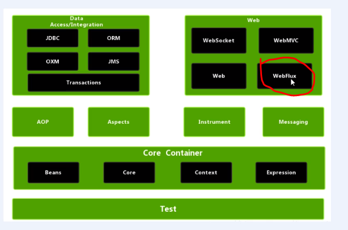
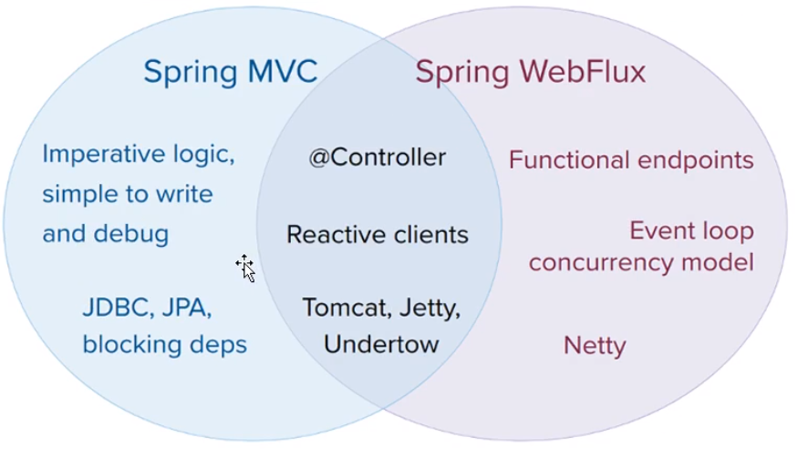

# Spring5.x

## 一、核心介绍

### 核心部分

1. **IOC(核心)**: 控制反转，把创建对象过程交给Spring管理
2. **AOP(核心)**:  面向切面，不修改源代码的情况下，进行功能的增强织入；

### 特点

1. 方便解耦，简化开发
2. 支持Aop编程
3. 方便整合其它框架
4. 方便进行事务操作
5. 降低API开发难度
6. 方便程序测试

### 官网

```sh
#https://spring.io/projects/spring-framework
#下载地址：
https://repo.spring.io/release/org/springframework/spring/
#SpringBoot下载
https://repo.spring.io/release/org/springframework/boot/spring-boot/

# Spring四个核心jar包
1. spring-beans-xx.jar
2. spring-core-xx.jar
3. spring-context-xx.jar
4. spring-expression-xx.jar
# 1个依赖jar包
5. commons-logging-1.xx.jar
```


## 二、Spring IOC容器

## 2.1 底层原理

1. IOC思想基于IOC容器完成，IOC容器就是对象工厂

   * 通过对象工厂加载配置用反射创建对象
   * 对象间调用的过程都交给Spring管理

2. Spring提供IOC容器两种实现方式

   2.1 BeanFactory 

   ​	(IOC容器的基本实现，spring内部使用的接口)

   ​	加载对象：加载配置bean文件时不创建对象，使用时创建对象

   2.2 ApplicatonContext( BeanFactory 的子接口)

   ​	面向开发者扩展使用  new ClassPathXmlApplicationContext()

   ​	加载对象：加载配置bean文件时就创建对象

   **两种方式都是通过加载配置文件 用工厂模式创建对象** 

3. ApplicatonContext实现类

   FileSystemXmlApplicationContext impl AbstractApplication

   ClassPathXmlApplicationContext impl AbstractApplication

   AnnotationConfigApplicationContext


## 2.2 IOC容器Bean管理

>  Bean管理包含：
>
> 1. Spring创建对象
> 2. Spring注入属性

>  实现方式：
>
> 1. 基于Xml的实现
> 2. 基于注解的实现


## 2.2.1 IOC操作bean管理(Xml)

### .1 基于Xml创建对象和注入属性

```xml
<!--创建对象beanId,注入属性beanId2基于DI(依赖注入)，就是注入属性-->
<!--基于set/get管理-->
<bean id="beanId" class="xxx.">
    <property name=“beanId2” ref="beanId2" | value="value11" />
</bean>
<!--或者：(需开启p命名空间约束 xmlns:p)-->
<beans xmlns="http://www.springframework.org/schema/beans"
       xmlns:p="http://www.springframework.org/schema/p"
       xmlns:xsi="...."....>
    <bean id="beanId" class="xxx." p:beanId2="beanId2">
	</bean>
</beans>

<!--基于构造管理-->
<bean id="beanId" class="xxx.">
    <contructor-arg name=“prop1” value="value11" />
    <contructor-arg name=“prop2” value="value22" />
</bean>

<!--字面注入-null值注入-->
<bean id="beanId" class="xxx.">
    <property name=“address” >
        <null/>
    </property>
</bean>

<!--字面注入-转义特殊符号(<<我们是南京将>>)-->
<bean id="beanId" class="xxx.">
    <property name=“address” >
        <value>
        	<![CDATA[ <<我们是南京将>>]]
        </value>
    </property>
</bean>
<!--xml注入数组,list，set，map-->
<bean id="beanId2" class="xxx.">
    <property name=“address” >
        <array>
        	<value>我们是南京将</value>
   			<value>我是北京</value>
        </array>
    </property>
	<property name=“list” >
        <list>
        	<value>我们是南京将</value>
   			<value>我是北京</value>
        </list>
    </property>
    <property name=“sets” >
        <set>
        	<value>我们是南京将</value>
   			<value>我是北京</value>
        </set>
     </property>
	<property name=“maps” >
        <map>
            <entry key="addr" value="中国"></entry>
			<entry key="name" value="张三"></entry>
        </map>
     </property>
</bean>
```


```xml
<!--注入外部集合-->
<beans xmlns="http://www.springframework.org/schema/beans"
       xmlns:p="http://www.springframework.org/schema/p"
       xmlns:util="http://www.springframework.org/schema/util"
       xmlns:xsi="...."
       xsi:schemalLocation="http://www.springframework.org/schema/util http://www.springframework.org/schema/util/spring-util.xsd"
       ....>
    <util:list id="bookList" >
        <value>易筋经</value>
        <value>九阳神功</value>
    </util:list>
	<bean id = "book" class="xx">
        <property name="books" ref = "bookList"></property>
    </bean>
</beans>
    
```

### .2 FactoryBean与Bean

> Spring有两种类型Bean，
>
> 1. 普通Bean
>
> 2. FactoryBean(工厂Bean)
>
>    配置文件定义Bean类型可以和返回类型不一致

* FactoryBean

```java
// 1 创建类作为工厂Bean，实现接口FactoryBean
import com.jz201.study.domain.User;
import org.springframework.beans.factory.FactoryBean;

public class MyFbean implements FactoryBean<User> {
    @Override
    public User getObject() throws Exception {
        User user = new User();
        user.setUsername("Hanmeimei");
        user.setAge(19);
        return user;
    }

    @Override
    public Class<User> getObjectType() {
        return User.class;
    }
}
/** 
<bean id = "myFbean" class="com.jz201.study.domain.MyFbean">
</bean>
*/
test(){
  ApplicationContext context = new ClassPathXmlApplicationContext("beans.xml");
  User user = context.getBean("myFbean",User.class);
}
    
```


### .3 Bean的作用域(Scope)

> **Spring中设置创建Bean实例时单例还是多例**

* Spring(FactoryBean)中默认创建是单例(Singleten,)

* Scope属性设置单例或多例：

  ```xml
  <!-- Scope：
  	1. 默认singleton,单实例对象
  	2. prototype，表示多实例对象
  	3. request    创建的对象会放到request中
  	4. session    创建的对象会放到session中
  -->
  <bean id = "myFbean" class="com.jz201.study.domain.MyFbean" Scope="prototype">
  </bean>
  ```

* scope: singleton  时，加载spring配置时就创建对象，
* scope: prototype时，加载spring配置时不创建对象，在调用getBean时创建多实例对象

### .4 Bean的生命周期

> Bean创建到销毁的过程 5个步骤
>
> 1. 通过构造器创建Bean实例(无参)； 1
>
> 2. 为Bean的属性设值 和 对其它Bean的引用(调set)；2
> 3. 初始化前置调用
> 4. 调用Bean的初始化方法(自设置) 3
> 5. 初始化后置调用
> 6. 使用Bean 4
> 7. 容器关闭，调用Bean的销毁方法(自配置) 5

```xml
<!-- 
init-method 指定自定义的初始化方法
myBeanPost 实现了BeanPostProcessor 定义了初始化方法的前后置处理方法，对所有Bean都适用
destroy-method 指定自定义的注销方法
-->
<bean id = "myOrder" class="com.jz201.study.domain.MyOrder" init-method="initMethod" destroy-method="destroyMethod">
    <property name="oname" value="手机"></property>
</bean>
<!--初始化处理器对象实例bean（第3步前置处理，第5步后置通知）-->
<bean id="myBeanPost" class="com.jz201.spring.context.domain.MyBeanPost"></bean>

System.out.println("Bean生命周期开始：");
ClassPathXmlApplicationContext context = new ClassPathXmlApplicationContext("bean2.xml");
MyOrder myOrder = context.getBean("myOrder",MyOrder.class);
System.out.println("第6步：方法调用："+ myOrder.getOname());
context.close();// 第7步：调用destroy-method方法

System.out.println("Bean生命周期结束；");

结果：
Connected to the target VM, address: '127.0.0.1:63506', transport: 'socket'
Bean生命周期开始：
第1步：通过构造器创建Bean实例(无参)
第2步：为Bean的属性设值 和 对其它Bean的引用
第3步：初始化之前置处理
第4步：初始化方法调用
第5步：初始化之后置处理
第6步：方法调用：手机
第7步：实例销毁调用destroy-method
Bean生命周期结束；
Disconnected from the target VM, address: '127.0.0.1:63506', transport: 'socket'
```

### .5 Bean自动装配

> 1. 根据name自动装配(byName)
> 2. 根据类型自动装配(byType)
>
> ```xml
> <!-- dept作为emp的属性Bean-->
> <bean id = "dept" class="com.jz201.study.domain.Dept"></bean>
> 
> <!--byName根据属性名注入：emp类的属性名和注入之bean的Id保持一致-->
> <bean id = "emp" class="com.jz201.study.domain.Emp" autowire="byName">
>     <!-- 自动装配不需要配置这个
> 		<property name="dept" value="财务"></property> 
> 	-->
> </bean>
> 
> <!--byType 根据属性类型注入：-->
> <bean id = "emp" class="com.jz201.study.domain.Emp" autowire="byType">
>     <!-- 自动装配不需要配置这个
> 		<property name="dept" value="财务"></property> 
> 	-->
> </bean>
> 
> ```
>
> 

### .6 Bean管理-外部属性文件

1）可以直接在xml中配置

```xml
<bean id = "myOrder" class="com.alibaba.druid.pool.DruidDataSource">
    <property name="driverClassName" value="com.mysql.jdbc.Driver"/>
    <property name="url" value="jdbc:mysql///userDb"/>
    <property name="username" value="root"/>
    <property name="password" value="root"/>
</bean>
```


2）通过加载properties文件配置

```properties
jdbc.driverClass=com.mysql.jdbc.Driver
jdbc.url=jdbc:mysql///userDb
jdbc.username=root
jdbc.password=root
```

```xml
<!--1. 引入名称空间context-->
<beans xmlns="http://www.springframework.org/schema/beans"
       xmlns:p="http://www.springframework.org/schema/p"
       xmlns:util="http://www.springframework.org/schema/util"
       xmlns:context="http://www.springframework.org/schema/context"
       xmlns:xsi="...."
       xsi:schemalLocation="http://www.springframework.org/schema/beans 
                            http://www.springframework.org/schema/beans/spring-beans.xsd
                            http://www.springframework.org/schema/util 
                            http://www.springframework.org/schema/util/spring-util.xsd
                            http://www.springframework.org/schema/context 
                            http://www.springframework.org/schema/context/spring-context.xsd
                            "
       ....>
<!--2. 引入外部属性文件-->
<context:property-placeholder location="classpath: jdbc.properties" /> 
<!--3. 注入配置连接-->
<bean id = "myOrder" class="com.alibaba.druid.pool.DruidDataSource">
    <property name="driverClassName" value="${jdbc.driverClass}"/>
    <property name="url" value="${jdbc.url}"/>
    <property name="username" value="${jdbc.username}"/>
    <property name="password" value="${jdbc.password}"/>
</bean>
```


## 2.2.3 IOC容器bean管理(注解)

> 目的：简化xml配置

### 1. Spring类扫描注解解析器

> 1. @Component
> 2. @Service
> 3. @Controller
> 4. @Repository
>
> * 四个注解功能一样的

#### Spring类扫描注解使用：

1. 依赖jar包：

```java
spring-aop-5.3.1.jar
```

2. 开启组件扫描包：

```xml
1.引入名称空间：xmlns:content(参考前例)
<beans xmlns:context="http://www.springframework.org/schema/context"
xsi:schemalLocation="http://www.springframework.org/schema/context 
                            http://www.springframework.org/schema/context/spring-context.xsd .../>
2.配置扫描的包(多个逗号隔开)
<content:component-scan base-package="com.jz201.study"/>

```

3. 在配置包相关类下即可使用注解@

```java
@Component(value="userService")
// 3.1 该注解等价于 <bean id="userService" />
// 3.2 value可不写，默认为类名称首字母小写
```

#### 组件扫描包的特殊处理

1. 示例1：配置**只扫描**指定注解的类

```xml
<!-- 示例1：
	use-default-filters="false" 表示不适用默认扫描所有的过滤器
	<content:include-filter 该例指定只扫描使用了 注解为Controller的类
-->
<content:component-scan base-package="com.jz201.study" use-default-filters="false">
    <content:include-filter type="annotation" expression="org.springframework.stereotype.Controller"/>
</content:component-scan>
```

2. 示例2：配置**不扫描**指定注解的类

```xml
<!-- 示例1：
	<content:exclude-filter 该例指定不扫描使用了 注解为Controller的类
-->
<content:component-scan base-package="com.jz201.study">
    <content:exclude-filter type="annotation" expression="org.springframework.stereotype.Controller"/>
</content:component-scan>
```

### 2. Spring属性注入注解解析

* 依赖注入的注解解析器

#### 1）@Autowired

> 根据**属性类型**自动注入 类似 <bean xxx autowire="byType"
>
> * 适用于注入的属性有一个实现类的情况《原因参考下面@Qualifier说明》

#### 2）@Qualifier

> 根据**属性名称**自动注入 类似 <bean xxx autowire="byName"
>
> * 该注解要和@Autowired一起使用，因为@Autowired根据属性类型注入，当该属性有多个实现时无法区分用哪个注解
>
>   此时用@Qualifier("指定bean名称")
>
> ```java
> @Autowired // 根据类型注入，但UserDao有多个实现时，需要用@Qualifier配合
> @Qualifier("userDaoImpl") // 根据名称注入
> private UserDao userDao;
> ```

#### 3）@Resource

> 根据属性名称或类型名称都可以 
>
> * 不是spring内置的，时Javax扩展包的注解，@Resource在java11已废弃
> * 如果**不指定resource的name属性表示根据类型注入**
>
> ```java
> // @Resource // 默认表示根据类型注入
> // @Resourcer(name = "userDaoImpl") // 指定根据名称注入
> private UserDao userDao;
> ```

#### 4）@Value

> 注入普通类型属性
>
> ```java
> @Value(value = "abc")
> private String uname;
> ```

### 3. 完全注解开发

1）创建配置类代替xml配置文件

```java
@Configuration// 作为配置类，替代配置文件
@ComponentScan(basePackages = {"com.jz201.study"}) // 代替 <content:component-scan base-package配置
public class SpringConfiguration{
    
}
```

2）测试类

```java
public static void main(String[] args) {
    ApplicationContext context = new AnnotationConfigApplicationContext(SpringConfiguration.class);
    UserService userServicer = context.getBean("userService",UserService.class);
    System.out.println("方法调用："+ userServicer.doOname());
}
```


## 三、AOP面向切面

概念：

1）面向切面编程，是OOP的延申；不改变源代码的情况下对代码增强处理；

2）利用AOP可以对业务逻辑的各个部分进行隔离，从而实现业务逻辑各部分间耦合度降低，提高可重用性，提高开发效率

主要适用：日志记录，性能统计，安全控制，事务处理，异常处理等等

主要特点：将日志记录，性能统计，安全控制，事务处理，异常处理等代码从业务逻辑中划分出来，独立于业务逻辑之外，不影响业务逻辑的代码；


## 3.1 Spring AOP底层原理

### AOP底层使用动态代理

> 两种动态代理
>
> 1. JDK动态代理 （没有接口时情况）
>
>    创建接口的实现类代理对象，增强类方法
>
> 2. CGLIB动态代理（有接口时的情况）
>
>    创建子类的代理对象，增强类方法

### AOP（JDK动态代理）

1. JDK动态代理，使用Proxy类里面的方法创建动态代理；(参考API:)

    java.lang.reflect.Proxy中的方法：newProxyInstance

```java
Proxy.newProxyInstance(target.getClass().getClassLoader(),target.getClass().getInterfaces(),invocationHandle);
/**
第一个参数：目标对象的类加载器
第二个参数：目标对象的所有的接口，增强方法所在的类要实现的接口们
第三个参数：拦截器接口InvocationHandle，此处要实现这个接口，创建代理对象，写增强的方法
			代理对象的方法实际上是拦截器中invoke方法体中的内容
*/
```

   

```java
// 1 创建接口和实现类
public interface UserDao {
    public int add (int a,int b);
    public int sub(int a,int b);
}

public class UserDaoImpl implements UserDao {
    @Override
    public int add(int a, int b) {
        System.out.println("被代理的方法执行了...");
        return a+b;
    }
    @Override
    public int sub(int a, int b) {
        System.out.println("被代理的方法执行了...");
        return a-b;
    }
}

// 2 使用Proxy类创建接口代理对象
public class JDKProxy {
    public static void main(String[] args) {
        UserDaoImpl userDaoimpl = new UserDaoImpl();
        Class<?>[] interfaces = userDaoimpl.getClass().getInterfaces();
        UserDao userDao = (UserDao)Proxy.newProxyInstance(JDKProxy.class.getClassLoader(), interfaces, new UserDaoProxy(userDaoimpl));
        int res = userDao.add(5,5);
        System.out.println("输出执行结果："+res);
    }
}

// 3 创建代理对象的代码
class UserDaoProxy implements InvocationHandler {
    private Object obj;

    public UserDaoProxy(Object obj) {
        this.obj = obj;
    }

    @Override
    public Object invoke(Object proxy, Method method, Object[] args) throws Throwable {
        // 执行方法之前的增强代码
        System.out.println(String.format("增强方法之前执行...%s: 传递的参数：%s",method.getName(), Arrays.toString(args)));

        // 执行方法
        Object result = method.invoke(obj, args);

        // 执行方法之后的增强代码
        System.out.println(String.format("增强方法之后执行... %s: ",obj));
        //System.out.println((proxy instanceof UserDao));
        return result;
}
```


​		特点：代理对象和目标对象实现了共同的接口


		代理对象的方法实际上是拦截器中invoke方法体中的内容
### AOP（CGLIB动态代理）待续

```tex
1、目标类
		
2、拦截器   实现了MethodInterceptor接口

3、代理类

Enhancer enhancer = new Enhancer();//Enhancer  加强
enhancer.setSuperclass(PersonDaoImpl.class);//给要动态产生的代理类设置父类
enhancer.setCallback(this);//回调函数  拦截器的对象
return enhancer.create();//产生代理对象

特点：代理类与目标类是继承关系    目标类是父类   代理类是子类

代理类的方法中的内容是由拦截器中的intercept方法体组成的
```


## 3.2 AOP的概念术语

1）连接点：被代理的类中要增强的目标方法(如上例userDao的add(),sub())

2）切入点：被代理的类中**实际被增强的方法**

3）通知(增强)：实际增强的相关逻辑部分就是通知

​	通知的类型：

		1. 前置通知：在被增强方法**之前执行**
  		2. 后置通知：在被增强方法**之后执行**
                		3. 环绕通知：在被增强方法**之前后执行**
            		4. 异常通知：在被增强方法**异常时执行**
                      		5. 最终通知：在被增强方法执行后**无论如何都会执行finally **

4）切面：(动作) 把相关**通知应用到切入点**的过程就是切面（织入）

## 3.3 AspectJ实现AOP介绍

#### AspectJ介绍：

> AspectJ不是Spring组成部分，是独立的AOP框架，一般通过Spring+AspectJ实现基于AOP的操作；
>
> 实现方式：
>
> 1. 基于注解的AOP实现
> 2. 基于XML的AOP实现

> 依赖的jar
>
> 五个核心包外+
>
> spring-aop-5.3.1.jar
>
> com.springsource.net.sf.cglib-2.2.0.jar
>
> com.springsource.org.aopalliance-1.0.jar
>
> com.springsource.org.aspectj.weaver-1.6.10.RELEASE.jar

#### 切入点表达式

> ```xml
> execution([权限修饰符] [返回类型] [类全路径].[方法名称]([参数列表]))
> // 权限一般省略，表示任意类型的访问权限 可取值public等
> // 返回类型 * 表示匹配任意类型的返回值
> // 方法名称：*表示所有方法
> // 参数列表：()没有任何参数；(*)只有一个参数，但是这个参数的类型可以是任意类型
>     		(*,String) 两个参数，第一个参数任意类型  第二个参数是String类型
>     		(..)  任意多个参数个数  任意类型
> execution(* cn.jz201.spring.aopxml.PersonDaoImpl.*(..))
> execution(* cn.jz201.spring.aopxml.PersonDaoImpl.add(Object,*))
> ```

## 3.3.1 AspectJ实现AOP(注解实现)

1. Spring开启注解扫描和开启生成代理对象

   ```java
   @Configuration
   @ComponentScan({"com.jz201.spring.context.aop.annotation"})
   @EnableAspectJAutoProxy //开启生成代理对象
   public class SpringScanConfiguration {
   }
   ```

2. 使用注解创建User和UserProxy的对象

   ```java
   @Component
   public class User {
       public void add (){
           System.out.println("user add ...");
       }
   }
   // 注解实现的增强类
   @Component
   @Aspect // 切面注解
   public class UserProxy {
       // 前置通知
       public void before(){
           System.out.println("UserProxy before ...");
       }
   }
   ```

3. 在增强类UserProxy增加注解@Aspect

   ```java
   @Component
   @Aspect // 切面注解
   public class UserProxy {
   ```

   

4. 配置不同的通知

   * 在增强类的通知的方法上添加通知类的注解；
   * 在注解上描写切入点表达式

   ```java
   @Component
   @Aspect // 切面注解
   @Order(1)// 多个代理同时对相同的方法声明Aop增强时，配置优先级，越小有优先
   public class UserProxy {
       // 配置切入点
       @Pointcut("@Class(com.jz201.spring.context.aop.annotation.User)")
       public void logPointCut(){
       	
       }
       // 前置通知：不管是否异常都执行
       @Before(value = "logPointCut()")
       public void before(){
           System.out.println("UserProxy before通知 ...");
       }
   
       // 后置通知：不管是否异常都执行
       @After(value = "logPointCut()")
       public void after(){
           System.out.println("UserProxy after通知 ...");
       }
       // ***可以直接写切入点表达式execution***
   	// 环绕通知：异常时只执行环绕前代码
       @Around(value = "execution(* com.jz201.spring.context.aop.annotation.User.add(..))")
       public void doAround(ProceedingJoinPoint proceedingJoinPoint) throws Throwable {
           System.out.println("UserProxy 环绕前 ...");
           // 被增强方法执行：
           proceedingJoinPoint.proceed();
           System.out.println("UserProxy 环绕后 ...");
       }
       
       /**
        * //@param 撒joinPoint 切点
        * //@param jsonResult
        */
       // 后置通知：接收有返回值，但是异常时不执行（返回通知）
       @AfterReturning(pointcut = "logPointCut()", returning = "jsonResult")
       public void doAfterReturning(Object jsonResult){
           System.out.println("UserProxy afterReturn通知 ..."+jsonResult);
   
       }
       @AfterThrowing(value = "execution(* com.jz201.spring.context.aop.annotation.User.*(..))")
       public void doAfterThrowing(){
           System.out.println("UserProxy AfterThrowing通知 ..."+1);
       }
   
   }
   ```

6. 测试

   ```java
   public static void main(String[] args) {
       ApplicationContext context = new AnnotationConfigApplicationContext(SpringScanConfiguration.class);
       User user = context.getBean("user",User.class);
       user.add(1,6);
       //System.out.println("结果："+res);
   }
   ```

   结果：
	* 正常时的通知
    ```sh
    UserProxy 环绕前 ...
    UserProxy before通知 ...
    user add ...
    UserProxy afterReturn通知 ...null
    UserProxy after通知 ...
    UserProxy 环绕后 ...
    ```
	* 异常时会执行的通知
    ```sh
    UserProxy 环绕前 ...
    UserProxy before通知 ...
    UserProxy AfterThrowing异常通知 ...1
    UserProxy after通知 ...
    Exception in thread "main" java.lang.ArithmeticException: / by zero
    ```
   
6. 当多个代理同时对一个方法增强时，设置优先级@Order

* Order的值越小优先级越高

```java
@Component
@Aspect // 切面注解
@Order(2)// 多个代理同时对相同的方法声明Aop增强时，配置优先级，越小有优先
public class PersonProxy {}
UserProxy的优先级要大于PresonProxy
    
```

## 3.3.2 AspectJ实现AOP(XML实现)

1. 创建增强类Book和被增强类BookProxy，创建buy方法

   ```java
   // 被增强类
   public class Book {
       public String buy(int c){
           String res = String.format("买了%d本书",c);
           System.out.println(res);
           return res;
       }
   }
   // 增强类
   public class BookProxy {
       public void before(JoinPoint joinPoint) throws Throwable {
           System.out.println("[xml] BookProxy before通知：参数-"+ Arrays.toString(joinPoint.getArgs()));
       }
       public void afterReturn(JoinPoint joinPoint,Object result) throws Throwable {
           System.out.println("[xml] BookProxy after-returning通知：参数-"+ Arrays.toString(joinPoint.getArgs())+",调用结果："+result);
       }
   }
   ```

2. xml引入名称空间xmlns:aop和配置aop增强

   ```xml
   <?xml version="1.0" encoding="UTF-8"?>
   <beans xmlns="http://www.springframework.org/schema/beans"
          xmlns:xsi="http://www.w3.org/2001/XMLSchema-instance"
          xmlns:aop="http://www.springframework.org/schema/aop"
          xsi:schemaLocation="http://www.springframework.org/schema/beans http://www.springframework.org/schema/beans/spring-beans.xsd
                             http://www.springframework.org/schema/aop http://www.springframework.org/schema/aop/spring-aop.xsd">
   
       <!--创建对象-->
       <bean id = "book" class="com.jz201.spring.context.aop.xml.Book"></bean>
       <bean id = "bookProxy" class="com.jz201.spring.context.aop.xml.BookProxy"></bean>
       <!--配置aop增强-->
       <aop:config>
           <!--切入点-->
           <aop:pointcut id="point" expression="execution(* com.jz201.spring.context.aop.xml.Book.buy(..))"/>
           <!--配置切面 orde表示优先级 -->
           <aop:aspect order="1" id="bookProxy" ref="bookProxy">
               <!--配置通知-->
               <aop:before method="before" pointcut-ref="point"/>
               <aop:after-returning method="afterReturn" pointcut-ref="point" returning="result"/>
           </aop:aspect>
       </aop:config>
   </beans>
                        
   ```

3. 测试

   ```java
   public static void main(String[] args) {
       ApplicationContext context = new ClassPathXmlApplicationContext("classpath*:bean3Aop.xml");
       Book book = context.getBean("book",Book.class);
       book.buy(5);
   }
   ```

4. 结果：

   ```sh
   [xml] BookProxy before通知：参数-[5]
   买了5本书
   [xml] BookProxy after-returning通知：参数-[5],调用结果：买了5本书
   ```


## 四、JdbcTemplate

> Spring框架对jdbc封装，使用JdbcTemplate实现对数据库的操作；

	#添加新依赖
	spring-jdbc.5.3.1.jar
	spring-tx.5.3.1.jar
	spring-orm.5.3.1.jar
	mysql-connector-java.8.0.21.jar
	druid-1.1.22.jar

> 配置相关

```xml
 <!-- 开启组件扫描 -->
<context:component-scan base-package="com.jz201.spring.context"/>
<!--2. 引入外部属性文件-->
<context:property-placeholder location="classpath: jdbc.properties" />
<!--3. 注入配置连接-->
<bean id = "druidDataSource" class="com.alibaba.druid.pool.DruidDataSource">
    <property name="driverClassName" value="${jdbc.driverClass}"/>
    <property name="url" value="${jdbc.url}"/>
    <property name="username" value="${jdbc.username}"/>
    <property name="password" value="${jdbc.password}"/>
    <property name="maxPoolPreparedStatementPerConnectionSize" value="5"/>
</bean>
<!--4. 配置jdbcTemplate-->
<bean id="jdbcTemplate" class="org.springframework.jdbc.core.JdbcTemplate">
    <property name="dataSource" ref="druidDataSource"/>
</bean>
<!--5. 新建entities 数据表实体Bean-->
<!--6. 新建UserDao 注入jdbc和依赖 编写insert,update操作-->
<!--7. 新建UserService接口和实现 注入userDao依赖-->
<!--
@Service
public class UserDao {
    @Autowired
    private JdbcTemplate jdbcTemplate;
    public int insert(User u){
        String sql = "insert into user values(?,?)";
        return  jdbcTemplate.update(sql,u.getUsername(),u.getAge() );
    }
 	public User findUserById(Long id){
        String sql = "select * from user where id =? ";
        return  jdbcTemplate.queryForObject(sql,new BeanPropertyRowMapper<User>(User.class),id);
    }
	// 批量操作
	public int[] insertBatch(List<Object[]> args){
        //["张三",30]
        //["李四",31]
        //["王五",32]
        String sql = "insert into user values(?,?) ";
        return  jdbcTemplate.batchUpdate(sql,args);
    }
    public int[] updateBatch(List<Object[]> args){
        //["张三",30,1]
        //["李四",31,2]
        //["王五",32,3]
        String sql = "update user set username=? and age=? where id=? ";
        return  jdbcTemplate.batchUpdate(sql,args);
    }
}
-->
```


## 五、Spring事务	

### 事务概念

> 事务是数据库操作基本单元，要么都成功，或都失败

事务四个特性（ACID）

1. 原子性A

   ```要么都成功要么都失败```

2. 一致性C

   ```操作前和操作后的数据不会异常```

3. 隔离性I

   ```多个操作同一条记录互不影响```

4. 持久性D

   ```持久性```

### Spring事务管理介绍

> Spring事务管理
>
> 两种方式：
>
> 1. 编程式事务管理
>
>    try{业务处理，提交事务}
>
>    catch{出现异常，编码实现回滚}
>
> 2. 声明式事务管理（推荐）
>
>    基于注解的声明式事务
>
>    基于XML的声明式事务

### 声明式事务管理

> 声明式事务管理，底层使用的式AOP原理

### Spring事务管理API

1、事务管理器，提供的一个接口，针对不同的框架提供不同的实现类

```java
interface PlatformTransactionManager extends TransactionManager
//  常用实现：
    JpaTransactionManager，
    DataSourceTransactionManager(jdbc)
    HibernateTransactionManager
    JdbcTransactionManager implements ResourceTransactionManager
```

### Spring声明式事务操作

> DataSourceTransactionManager的注解实现

1. xml配置事务<开启注解>

```xml
<!--引入事务名称空间 tx -->
<?xml version="1.0" encoding="UTF-8"?>
<beans xmlns="http://www.springframework.org/schema/beans"
       xmlns:xsi="http://www.w3.org/2001/XMLSchema-instance"
       xmlns:context="http://www.springframework.org/schema/context"
       xmlns:tx="http://www.springframework.org/schema/tx"
       xsi:schemaLocation="http://www.springframework.org/schema/beans http://www.springframework.org/schema/beans/spring-beans.xsd
                         http://www.springframework.org/schema/context http://www.springframework.org/schema/context/spring-context.xsd
                         http://www.springframework.org/schema/tx http://www.springframework.org/schema/tx/spring-tx.xsd">
    
    <!--2.配置事务管理器-->
    <bean id="transactionManager" class="org.springframework.jdbc.datasource.DataSourceTransactionManager">
        <property name="dataSource" ref="druidDataSource"/>
    </bean>
    <!--3.开始事务注解-->
    <tx:annotation-driven transaction-manager="transactionManager"/>
</beans>
<!--
4.使用事务注解
@Service
@Transactional(propagation=Propagation.REQUIRED,isolation = Isolation.REPEATABLE_READ)
public class UserService {
	xxx
}

-->
```

完全注解的配置代替xml

```java
@Configuration
@ComponentScan(basePackages = {"com.jz201.spring.context.tx"})
@EnableTransactionManagement// 开启事务
@PropertySource(value = { "classpath:jdbc.properties" })
public class TransactionConfig {
    @Value("${jdbc.driverClass}")
    private String driverClassName;
    @Value("${jdbc.url}")
    private String url;
    @Value("${jdbc.username}")
    private String username;
    @Value("${jdbc.password}")
    private String password;
    // 配置i数据库连接数据源
    @Bean
    public DruidDataSource getDruidDataSource(){
        DruidDataSource druidDataSource = new DruidDataSource();
        druidDataSource.setDriverClassName(driverClassName);
        druidDataSource.setUrl(url);
        druidDataSource.setUsername(username);
        druidDataSource.setPassword(password);
        return druidDataSource;
    }
    // 配置JdbcTemplate对象  Qualifier根据名称找注解
    @Bean
    public JdbcTemplate getJdbcTemplate(DataSource dataSource){
        JdbcTemplate jdbcTemplate = new JdbcTemplate();
        jdbcTemplate.setDataSource(dataSource);
        return jdbcTemplate;
    }

    // 配置事务管理器
    @Bean
    public DataSourceTransactionManager getDataSourceTransactionManager(DataSource dataSource){
        DataSourceTransactionManager transactionManager = new DataSourceTransactionManager();
        transactionManager.setDataSource(dataSource);
        return transactionManager;
    }
}
```


### @Transactional(参数说明)

>Propagation // 事务传播行为
>
>isolation // 事务隔离级别
>
>readOnly // 是否只读
>
>timeout // 超时时间
>
>rollbackFor // 回滚
>
>noRollbackFor // 不会滚

1. Propagation // 事务传播行为

```java
enum Propagation {    
	REQUIRED(0), // 1 如果当前方法a本身有事务，调用其他方法b时，b使用a的事务；2 如果a没有事务，调用b后创建新的事物
    SUPPORTS(1),
    MANDATORY(2),
    REQUIRES_NEW(3),
    NOT_SUPPORTED(4),
    NEVER(5),
    NESTED(6);
// 多事务方法之间的调用
}
```

2. isolation // 事务隔离级别

> 事物的隔离特性要求多事务操作不产生影响；
>
> 如果不考虑隔离性：
>
> 1. 脏读：一个未提交的事物读取到另一个未提交的事务；
>
> 2. 不可重复读：一个未提交的事务读取到另一个已提交的事务
> 3. 虚读：一个未提交的事务读取到另一个已提交的增加的数据

```sh
public enum Isolation {
    DEFAULT(-1),
    READ_UNCOMMITTED(1), // 读未提交的（有脏读，不可重复读，虚读）
    READ_COMMITTED(2), // 读已提交的（无脏读，可能有不可重复读，虚读）
    REPEATABLE_READ(4),// 可重复读（无脏读，无不可重复读，有虚读）
    SERIALIZABLE(8);	// 串行化（无脏读，无可能有不可重复读，无虚读）
}
```
```java
@Transactional(propagation=Propagation.REQUIRED,isolation = Isolation.REPEATABLE_READ)
```

|                                | 脏读 | 不可重复读 | 虚读 |
| ---------------- | ---- | ---------- | ---- |
| READ_UNCOMMITTED(1) <br />读未提交 | 有   | 有         | 有   |
| READ_COMMITTED(2)<br />读已提交 | 无   | 有         | 有   |
| REPEATABLE_READ(4)<br />可重复读 <**Mysql默认的隔离级别**> | 无   | 无         | 有   |
| SERIALIZABLE(8)       <br />串行化 | 无   | 无         | 无   |

3. readOnly // 是否只读

   默认false：查询修改删除都可以

   true:		只能查询操作，不能update

4. timeout // 超时时间
   * 事务在一定时间内没有提交，则会事务回滚；
   * 默认-1 不超时，单位秒

rollbackFor // 回滚：针对哪些异常回滚

noRollbackFor // 不会滚：针对哪些异常不回滚

```java
@Transactional(propagation=Propagation.REQUIRED,isolation = Isolation.REPEATABLE_READ,
        timeout = 10,readOnly = false,rollbackFor = NumberFormatException.class,noRollbackFor = Exception.class)
```

### XML配置事务方式

```xml
<!--0. 引入名称空间-->
<!--1. 配置事务管理器-->
<!--2. 配置通知-->
<!--3. 配置切入点和切面-->

<!--1。 配置事务管理器-->
<bean id="transactionManager" class="org.springframework.jdbc.datasource.DataSourceTransactionManager">
    <property name="dataSource" ref="druidDataSource"/>
</bean>

<!--xml方式：2. 配置事务通知-->
<tx:advice id="txAdvice">
    <tx:attributes>
        <!--在那种规则的方法上添加事务-->
        <tx:method name="accountDel" propagation="REQUIRED" isolation="REPEATABLE_READ" timeout="-1" read-only="false" no-rollback-for="Exception.class" />
        <tx:method name="accountUpdate*"/>
    </tx:attributes>
</tx:advice>
<!--xml方式：3. 配置切入点和切面-->
<aop:config>
    <!--配置切入点-->
    <aop:pointcut id="accountPoint" expression="execution(* com.jz201.spring.context.jdbc.service.UserService.*(..))"/>
    <!--配置切面-->
    <aop:advisor advice-ref="txAdvice" pointcut-ref="accountPoint" />
</aop:config>

```


## 六、Spring5新特性

> 正个Spring5框架基于Java8，删除了许多不建议的类和方法
>
> 核心特性：
>
> 1. 自带通用的日志封装	
> 2. spring-jcl替代了通用的日志，仍支持可重写
> 3. 自动检测log4j 2.x,SLF4j,JUL(java.util.logging)
> 4. ......

### Spring5整合日志Log4j2

> Spring5移除了Log4jConfigListener，官方建议用Log4j2版本自动检测

1. 引入jar

```xml
<dependency>
    <groupId>org.apache.logging.log4j</groupId>
    <artifactId>log4j-core</artifactId>
    <version>2.13.3</version>
</dependency>
<dependency>
    <groupId>org.apache.logging.log4j</groupId>
    <artifactId>log4j-jul</artifactId>
    <version>2.13.3</version>
</dependency>
<dependency>
    <groupId>org.apache.logging.log4j</groupId>
    <artifactId>log4j-slf4j-impl</artifactId>
    <version>2.13.3</version>
</dependency>
<dependency>
    <groupId>org.slf4j</groupId>
    <artifactId>jul-to-slf4j</artifactId>
    <version>1.7.30</version>
</dependency>

<!--或 -->
<dependency>
    <groupId>org.springframework.boot</groupId>
    <artifactId>spring-boot-starter-log4j2</artifactId>
    <version>2.3.5.RELEASE</version>
</dependency>
```

2. 配置log4j2.xml

```xml
<?xml version="1.0" encoding="UTF-8" ?>
<!--日志级别优先级：OFF,FATAL,ERROR,WARN,INFO,DEBUG,TRACE,ALL-->
<!-- configuration的status设置log4j2的自身内部信息输出，可不设置，当设置成trace时，可以看到log4j2内部各种详细输出-->
<configuration status="INFO">
    <!--定义所有的appender-->
    <appenders>
        <!--输入日志信息到控制台-->
        <console name="Console" target="SYSTEM_OUT">
            <!--控制日志输出格式-->
            <PatternLayout pattern="%d{yyyy-MM-dd HH:mm:ss.SSS} [%t] %-5level %logger{36} -%msg%n"/>
        </console>
    </appenders>

    <!--定义Logger，并引入Appender，使Appender生效
        Root表示指定项目的根日志，如果没有单独指定logger，则会root作为默认输出
    -->
    <loggers>
        <root level="info">
            <appender-ref ref="Console"/>
        </root>
    </loggers>
</configuration>
```
* 测试：
```sh
ApplicationContext context = new AnnotationConfigApplicationContext(TransactionConfig.class);
UserService userService = context.getBean("userService", UserService.class);
userService.updateUser(user);

2020-12-02 13:05:11.096 [main] INFO  com.alibaba.druid.pool.DruidDataSource -{dataSource-1} inited
2020-12-02 13:05:15.271 [Druid-ConnectionPool-Create-14633842] ERROR com.alibaba.druid.pool.DruidDataSource -create connection SQLException, url: jdbc:mysql:///userDb, errorCode 0, state 08S01
com.mysql.cj.jdbc.exceptions.CommunicationsException: Communications link failure
```

### Spring5的@Nullable注解

```java
@Nullable// 表示被注解的属性，方法的反回值或参数可以为空

@Nullable // userDao可以Null
private UserDao userDao;
@Nullable // updateUser()返回值可以Null
public Object updateUser(User u){
}
// 参数beanName可以Null
public <T> void registerBean(@Nullable String beanName, Class<T> beanClass, @Nullable Supplier<T> supplier, BeanDefinitionCustomizer... customizers) {
    this.reader.registerBean(beanClass, beanName, supplier, customizers);
}
```


### Spirng5的函数式注册对象

> Spring5核心容器支持函数式风格GenericApplicationContext

```java
// 使用函数式风格创建对象，交给Spring管理
@Test// 5.7.0
public void test(){
    GenericApplicationContext context = new GenericApplicationContext();
    context.refresh();
    // 将User对象注册进Spring，未指定beanName，用全路径名获取
    context.registerBean(User.class,() -> new User(1L,"我",13));//lambda表达式
    User user = context.getBean("com.jz201.study.domain.User", User.class);
    System.out.println(user);
    // 将User对象注册进Spring，指定beanName，用beanName获取
    context.registerBean("user1",User.class,() -> new User(2L,"你",13));//lambda表达式
    User user1 = context.getBean("user1", User.class);
    System.out.println(user1);
}
/*输出结果：
User(id=1, username=我, age=13)
User(id=2, username=你, age=13)
*/
```

### Spirng5整合JUnit5

#### Junit4的整合（注解）

> 1. 引入spring-test-5.2.6.RELEASE.jar
>
>    ```xml
>    <dependency>
>        <groupId>org.springframework</groupId>
>        <artifactId>spring-test</artifactId>
>        <version>5.2.6.RELEASE</version>
>    </dependency>
>    <dependency>
>        <groupId>junit</groupId>
>        <artifactId>junit</artifactId>
>        <version>4.12</version>
>        <scope>compile</scope>
>    </dependency>
>    ```
>
>    
>
> 2. 测试类,使用注解配置测试代码
>
> ```java
> @RunWith(SpringJUnit4ClassRunner.class)// 指定单元测试的框架版本
> @ContextConfiguration(value = "classpath:bean2.xml")// 加载配置文件
> public class Test4 {
>     @Autowired
>     private MyOrder myOrder;
>     @Autowired
>     private User myFbean;
>     @org.junit.Test // 是JUnit4的Test
>     public void test(){
>         System.out.println(myOrder.getOname());
>         System.out.println(myFbean.getUsername());
>     }
> }
> ```
>
> 

#### JUnit5的整合

> 完成了对JUnit5's Juptier编程和拓展

```xml
<dependency>
    <groupId>org.junit.jupiter</groupId>
    <artifactId>junit-jupiter</artifactId>
    <version>5.7.0</version>
    <scope>compile</scope>
</dependency>
```

> 配置Junit5的测试
>
> @SpringJUnitConfig复合注解替代RunWith和ContextConfiguratio 简化测试配置
>
> @ org.junit.jupiter.api.Test代替Test4的

````java
//@ExtendWith(SpringExtension.class)// 指定单元测试的框架版本
//@ContextConfiguration(value = "classpath:bean2.xml")// 加载配置文件
@SpringJUnitConfig(locations = "classpath:bean2.xml") // 复合注解===等于===上面两行代码
public class TestJUnit5 {
    @Autowired
    private MyOrder myOrder;
    @Autowired
    private User myFbean;

    // org.junit.Test 是JUnit4的Test
    // org.junit.jupiter.api.Test 是JUnit5的Test
    @org.junit.jupiter.api.Test
    public void test(){
        System.out.println(myOrder.getOname());
        System.out.println(myFbean.getUsername());
    }

}
````


## 七、Spring5-WebFlux	




### WebFlux概念

> Spring5新模块，用于Web开发，**基于响应式编程思想的异步非阻塞框架**   
>
> 异步非阻塞框架
>
> * 传统Web框架基于Servlet容器，早版本的servlet不支持异步非阻塞，Servlet3.1后才支持
>
> * Webflux是一种**异步非阻塞的框架**
>
> 核心是基于Reactor Statck的相关API实现
>
> * Reactor是Reactive响应式编程的实现框架
> * 既支持Servlet容器类框架(Tomcat) 又支持Netty等框架


> 异步非阻塞概念
>
> * 异步：一个请求不用等待响应就可去做其它事情
> * 非阻塞： 收到请求后先反馈，再处理指令就是非阻塞；相反先执行完后再给出反馈就是阻塞

> Spring Webflux特点：

* 非阻塞式：lessMemory 在有限资源下，提高系统吞吐量 ,以Reactor为基础实现响应式编程
* 函数式编程：Spring5基于java8，可以使用java8函数式编程方式实现路由请求

> SpirngWebflux与SpringMVC



### 响应式编程

> 面向数据流和变化传播的编程范式

观察者模式的两个类Observer和Observable（Jdk8及以前版本）

```java
import java.util.Observable;

public class ObserverDemo extends Observable {
    public static void main(String[] args) {
        ObserverDemo demo = new ObserverDemo();
        // 添加观察者
        demo.addObserver((o,arg) -> {
            System.out.println("发生变化");
        });
        demo.addObserver((o,arg) -> {
            System.out.println("手动被观察者通知，准备改变");
        });

        demo.setChanged();// 设置数据已变化
        demo.notifyObservers(); // 通知变化
    }
}
C:\bing\Java\jdk1.8.0_172\bin\java.exe 
手动被观察者通知，准备改变
发生变化的
```

> 观察者模式的类Flow（Jdk9+版本）
>
> Flow是真正响应式编程类
>
> publish和subscribe（发布订阅）

#### Recator实现响应式编程

> Recator两个核心类Mono和Flux，都实现了接口 publisher
>
> 1. Mono impl publisher
>
>    Mono实现发布者，**返回0或1个元素**
>
> 2. Flux    impl publisher
>
>    Flux对象实现发布者，**返回N个元素**
>
> Flux和Mono都是数据流的发布者，都可发出**三种数据信号**
>
> 1. 元素值(1,2,3)
> 2. 错误信号(终止信号)  #  终止数据流，同时将错误信息传给订阅者
> 3. 完成信号(终止信号)  #  终止数据流，告诉订阅者数据流结束了
>
> * 错误信号和完成信号不能共存；

```xml
 <!--reactor依赖-->
<dependency>
    <groupId>io.projectreactor</groupId>
    <artifactId>reactor-core</artifactId>
    <version>3.2.11.RELEASE</version>
</dependency>
```
* Flux，Mono
```java
// 测试数据流声明和订阅
public static void main(String[] args) {
    // just可以直接声明相关元素
    // just声明数据流，subscribe订阅数据流
    Flux.just(1,2,3,5).subscribe(System.out::println);// 调用subscribe订阅方法的输出到控制台
    Mono.just(1).subscribe(System.out::println);// Mono返回0或1个元素
    // 其它元素声明:数组，集合，Stream流元素
    Integer[] arry = new Integer[]{1,2,3};
    Flux.fromArray(arry);
    List<Integer> list = Arrays.asList(arry);
    Flux.fromIterable(list);
    Stream<Integer> stream = list.stream();
    Flux.fromStream(stream).subscribe(System.out::println);
}
```

操作符

* 对数据流进行的一道道操作，称为操作符 ：
* map 把元素映射为新的元素
  * 把元素加工称新的元素
* 和flatMap，把元素映射为大的流，heihei
  * 把每个元素转为流，在把多个流合并为大流

### WebFlux原理,流程,核心API

> 基于响应式的编程模型
>
> **默认容器时Netty**，高性能的NIO框架(异步非阻塞框架)
>
> BIO(阻塞)：请求，建立连接，发送请求，等待响应，阻塞中，开始执行，
>
> NIO(非阻塞)：请求-进入channel通道，

### SpringWebFlux的具体实现

> 执行过程和SpringMVC相似，
>
> **SpringWebflux核心控制器DispatchHandler**，实现接口WebHandler
>
> ```java
> // WebHandler实现的源码
> public interface WebHandler {
>     Mono<Void> handle(ServerWebExchange var1);
> }
> // 一个实现方法
> public Mono<Void> handle(ServerWebExchange exchange) {// ServerWebExchange放http的请求响应信息
>         return this.handlerMappings == null ? this.createNotFoundError() : Flux.fromIterable(this.handlerMappings).concatMap((mapping) -> {
>             return mapping.getHandler(exchange);// 根据请求地址获取对应的Mapping
>         }).next().switchIfEmpty(this.createNotFoundError()).flatMap((handler) -> {
>             return this.invokeHandler(exchange, handler);// 调用具体的业务方法
>         }).flatMap((result) -> {
>             return this.handleResult(exchange, result);// 处理结构的返回
>         });
>     }
> ```

> SpringWebflux的DispatchHandler负责请求处理
>
> * HandlerMapping // 根据请求映射到具体的执行方法
> * HandlerAdapter // 真正负责请求处理
> * HandlerResultHandler    // 响应结果并处理

> SpringWebflux的实现分布式编程的两个API接口
>
> RouterFunction，路由处理
>
> HandlerFunction：相应函数处理

#### SpringWebflux基于注解实现

> 把依赖配置到项目中，Spring'Boot自动配置相关容器，默认使用Netty服务器
>
> SpringBoot2.x默认使用Spring5+

1. 创建SpringBoot引入webflux依赖

```xml
<dependency>
    <groupId>org.springframework.boot</groupId>
    <artifactId>spring-boot-starter-webflux</artifactId>
</dependency>
```

2. 创建实体类User，和UserService接口

```java
public interface UserService {
    Mono<User> getUserById(Integer id);// 获取单个User对象用Mono（返回0或1个元素）
    Flux<User> getAllUser();// 获取列表User对象用Flux（返回多个元素）
    Mono<Void> saveUser(Mono<User> u);// 保存单个User
}
```

3.  UserServiceImpl

```java
@Service
public class UserServiceImpl implements UserService {
    private static Map<Integer,User> users = new HashMap<>();
    static {
        users.put(1,new User(1,"lucy","women",20));
        users.put(2,new User(2,"lily","women",20));
        users.put(3,new User(3,"tom","man",30));
        users.put(4,new User(4,"jucy","women",40));
    }
    @Override
    public Mono<User> getUserById(Integer id) {
        return Mono.justOrEmpty(users.get(id));
    }

    @Override
    public Flux<User> getAllUser() {
        return Flux.fromIterable(users.values());
    }

    @Override
    public Mono<Void> saveUser(Mono<User> userMono) {
        return userMono.doOnNext(user -> {
            // 向users中push进新的user
            users.put(user.getId(),user);
        }).thenEmpty(Mono.empty());// 清空触发终止信号，结束数据流
    }
}
```

4. Controller

```java
@RestController
public class UserController {
    @Autowired
    private UserService userService;
    // id查询
    @GetMapping("/user/{id}")
    public Mono<User> getUser(@PathVariable("id") Integer id){
        Mono<User> userMono = userService.getUserById(id);
        return userMono;
    }
    // 查询所有
    @GetMapping("/users")
    public Flux<User> users(){
        Flux<User> users = userService.getAllUser();
        return users;
    }
    // 添加User
    @RequestMapping("/user/save")
    public Mono<User> saveUser(@RequestBody User user){
        Mono<User> monoUser= Mono.just(user);
        userService.saveUser(monoUser);
        Mono<User> userMono = userService.getUserById(user.getId());
        return userMono;
    }
}
```

* SpringMVC的实现方式，同步阻塞方式，基于SpringMVC+Servlet+Tomcat
* SpringWebflux实现方式：异步非阻塞，基于SpringWebflux+Reactor+Netty

#### SpringWebflux基于函数式编程模型实现

> 需要自己初始化服务器
>
> 基于函数式编程实现，又两个核心接口：
>
> 1. **RouterFunction**(实现路由功能，请求转发给对应的Handler)
> 2. **HandlerFunction**(处理请求生成响应的函数)
>
> * 两个接口任务：定义两个函数式接口的实现，并启动需要的服务器

> **请求响应不再是ServletRequest和ServletResponse对象处理**、而是：
>
> **ServerRequest和ServerResponse**

> 编码实现：创建Module：spring5-webflux-func

1. 创建HandlerFunction：handler.UserHandler

```java
// 
public class UserHandler {
    private final UserService userService;

    public UserHandler(UserService userService){
        this.userService=userService;
    }
    // 根据Id查询User
    public Mono<ServerResponse> getUserById(ServerRequest request){
        Integer id = Integer.valueOf(request.pathVariable("id"));
        Mono<ServerResponse> notFoundMono = ServerResponse.notFound().build();
        Mono<User> userMono = this.userService.getUserById(id);
        // Mono<User>对象转为流的形式返回
        // 使用Reactor操作符flatMap转为流
        Mono<ServerResponse> body = userMono
                .flatMap(user -> ServerResponse.ok().contentType(MediaType.APPLICATION_JSON).body(BodyInserters.fromValue(user))
                )
                .switchIfEmpty(notFoundMono);// 如果获取的user是空返回notFoundMono
        // 下面处理也行：
        // Mono<ServerResponse> body = ServerResponse.ok().contentType(MediaType.APPLICATION_JSON).body(userMono, User.class);
        return body;
    }
    // 查询所有
    public Mono<ServerResponse> getAllUser(ServerRequest request){
        Flux<User> users = this.userService.getAllUser();
        Mono<ServerResponse> body = ServerResponse.ok().contentType(MediaType.APPLICATION_JSON).body(users, User.class);
        return body;
    }
    // 添加保存User 第三种返回值
    public Mono<ServerResponse> saveUser(ServerRequest request){
        Mono<User> u = request.bodyToMono(User.class);// Mono.just(u2);//
        Mono<ServerResponse> body = ServerResponse.ok().build(this.userService.saveUser(u));
        return body;
    }
}
```

2. 初始化服务器，编写Router和ReactorServer：创建路由+完成适配+创建服务器

> 设置router和handler的对应关系：适配器

```java

public class Server {
    // 1.创建Router路由
    public RouterFunction<ServerResponse> routingFunction(){
        UserService userService = new UserServiceImpl();
        UserHandler userHandler = new UserHandler(userService);
        // 设置路由
        return RouterFunctions
                .route(
                        // 根据id查询
                        GET("/users/{id}").and(accept(MediaType.APPLICATION_JSON)),
                        userHandler::getUserById)
                .andRoute(
                        // 查询所有
                        GET("/users").and(accept(MediaType.APPLICATION_JSON)),
                        userHandler::getAllUser)
                .andRoute(
                        // 保存新增
                        POST("/user/save").and(accept(MediaType.APPLICATION_JSON)),
                        userHandler::saveUser)
                ;
    }
    // 创建服务器：完成适配
    public void createReactorServer(){
        // 路由和handler的适配
        RouterFunction<ServerResponse> router = routingFunction();
        HttpHandler httpHandler = RouterFunctions.toHttpHandler(router);// 存储请求的相关信息
        ReactorHttpHandlerAdapter handlerAdapter = new ReactorHttpHandlerAdapter(httpHandler); // handler适配器
        // 创建服务器，完成适配；
        HttpServer httpServer = HttpServer.create().port(8182);
        httpServer.handle(handlerAdapter).bindNow().port();
    }

}
```

3. 开始启用Server

```java
public static void main(String[] args) throws IOException {
    Server server = new Server();
    server.createReactorServer();
    System.out.println("enter to exit please!");
    int read = System.in.read();
    System.out.println(read);
}

```

4. 浏览器或CURL请求测试调用

```sh
// 测试保存新User：/user/save方法:
curl -H "Content-Type:application/json" -X POST --data "{\"id\": 5, \"name\": \"aa\", \"gender\": \"nv\", \"age\": 11}" http://localhost:8182/user/save
// 根据Id查看User：
http://localhost:8182/users/5
```

5. 使用WebClient测试调用

```java
 public static void main(String[] args) {
     WebClient webClient = WebClient.create("http://localhost:8182");
     // 测试 根据Id查看User
     User user = webClient.get().uri("/users/3").accept(MediaType.APPLICATION_JSON).retrieve()//
                .bodyToMono(User.class).block();
     System.out.println(user);

     // 测试 查询所有
     Flux<User> users = webClient.get().uri("/users").accept(MediaType.APPLICATION_JSON).retrieve()// 初始化
         .bodyToFlux(User.class);
     users.map(u -> u.getName()).buffer().doOnNext(System.out::println).blockFirst();
     User userA = users.blockFirst();
     System.out.println(userA);
     // 测试 插入新User
     User a = new User(6,"王武","man",19);
     /**webClient.post().uri("/user/save")
     .accept(MediaType.APPLICATION_JSON).body(BodyInserters.fromValue(a));*/// 初始化
     WebClient.RequestHeadersSpec<?> body = webClient.method(HttpMethod.POST).uri("/user/save")
         .body(BodyInserters.fromValue(a));
     body.retrieve().bodyToMono(User.class).block();
 }
```


